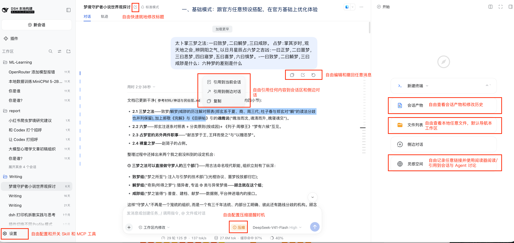
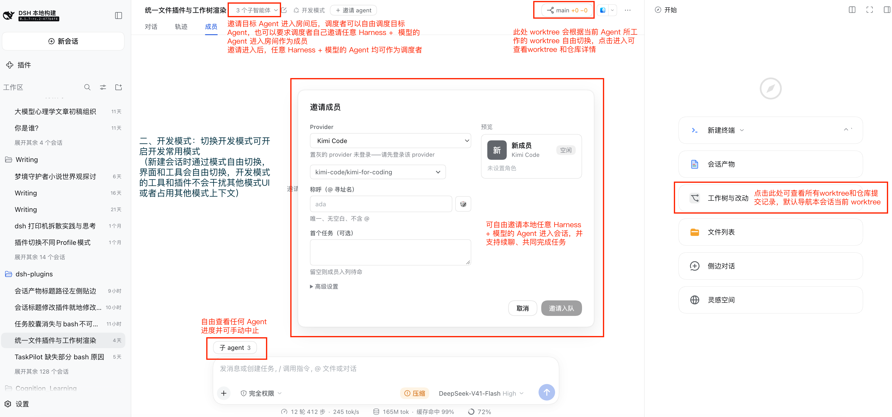

# dsh-plugins

English | [中文](README.md)

The community plugin monorepo for the **dsh** (DeepSeek Harness) ecosystem: **40 purely additive plugin packages, 29 of them published on npm**. Every package integrates through official extension points only — slots, commands, Remote services, session projections. No official package is modified, no official UI slot is replaced, no core service is hacked; when an optional capability is absent the plugin degrades silently instead of failing the boot. The whole set is designed for coexistence: install, uninstall, or toggle any combination without interference, and the production instance runs the full stack long-term.

> This page lists only **published** packages. Package counts, shapes, and profile membership follow the machine-generated [authoritative package map](docs/packages.md); per-package versions and the host-compatibility matrix follow the [release status](docs/release-status.md) (regenerated after every publish wave). The repository is also the development workspace — see the [install & development guide for agents](#install-dev-guide) at the end.

## Profile packs: four ready-to-run experiences

The default install unit is a complete profile (a pack), not a single package. Its `dependencies` decide which packages get installed and its `dsh.profile.bundles` decides which self-mounting rows get activated. Four packs, one per mode:

| Pack | Mode | What it contains | GitHub |
| --- | --- | --- | --- |
| **dsh-basic** | Everyday mode | The experience layer on top of official dsh-web: edit or withdraw sent messages, one-click session rename, artifact preview and local file browsing, the capability catalog, mobile presentation, background-task status, completion chimes, shortcuts, and the ops guard | [Khorsheed/dsh-basic](https://github.com/Khorsheed/dsh-basic) |
| **dsh-dev** | Dev mode | The development-workflow set: everything in basic, plus delegation to local coding agents (Kimi / Codex / Claude Code / DSH), live worktree state, and room multi-agent collaboration — ships the "dev mode" preset | [Khorsheed/dsh-dev](https://github.com/Khorsheed/dsh-dev) |
| **dsh-eval** | Eval mode | The evaluation-workflow set: datasets, conditions, and plans reviewed in git, deterministic orchestration — ships the "eval mode" preset | being polished, coming soon |
| **dsh-writing** | Writing mode | The writing-workflow set: canvas co-writing, a link reader, in-conversation card rendering — ships the "writing mode" preset | being polished, coming soon |





The first two are standalone repositories: clone, run two scripts, and the running instance hands over on the same port — see their READMEs. The eval and writing modes are currently maintained in this repo as [profiles/web-eval](profiles/web-eval) / [profiles/web](profiles/web), with standalone GitHub repos being polished and coming soon. Single-package install is the advanced path; see the [install & development guide for agents](#install-dev-guide) at the end.

## Capability map

Each package's full feature list, configuration, and screenshots live in its own directory README (follow the directory link). Copy the "Install spec" cell straight into the host's Add-plugin dialog; the "Ships with" column says which mode's pack installs it by default (basic / dev / writing / eval never overlap); packages marked "standalone" ship with no pack and install individually with `dsh plugin add`.

### Conversation control

| Package | What it does | Install spec | Host | Ships with |
| --- | --- | --- | --- | --- |
| [`message-tools`](packages/message-tools) | **In-place edit / true withdraw / restore** for user messages — the only plugin here that changes what the model sees, using the same mechanism as official compaction | `@khorsheed/dsh-client-message-tools` | ≥ 0.1.5-rc.1 | basic |
| [`message-timeline`](packages/message-timeline) | A floating **message timeline** on the conversation's left edge; click to jump to any user message | `@khorsheed/dsh-message-timeline` | ≥ 0.1.2-rc.1 | basic |
| [`session-title-edit`](packages/session-title-edit) | **Inline rename** of the session title in the chat header; user-set titles are pinned against auto-generation | `@khorsheed/dsh-client-session-title-edit` | ≥ 0.1.2-rc.1 | basic |
| [`quote`](packages/quote) | Select any text for a floating **quote action menu** (quote into the composer / side chat / copy); other plugins can register their own actions | `@khorsheed/dsh-quote` | ≥ 0.1.5-rc.1 | basic |

### Files and artifacts

| Package | What it does | Install spec | Host | Ships with |
| --- | --- | --- | --- | --- |
| [`file-preview`](packages/file-preview) | The session "**Artifacts**" tab plus its host service in one package: the products tab, per-turn change cards, the detail-view preview drawer, and the read-only file-preview Remote service (two rows merged into one since 0.4.0) | `@khorsheed/dsh-file-preview` | ≥ 0.1.5-rc.1 | basic |
| [`local-files`](packages/local-files) | A **local file browser** in the right sidebar: lazy file tree plus structured HTML/Markdown/JSON/CSV/image previews | `@khorsheed/dsh-local-files` | ≥ 0.1.5-rc.1 | basic |

### Tasks and ambience

| Package | What it does | Install spec | Host | Ships with |
| --- | --- | --- | --- | --- |
| [`taskpilot`](packages/taskpilot) | **Background-task / sub-agent pills** above the composer: live timers, stop/interrupt, and a detail drawer replaying the execution trace | `@khorsheed/dsh-taskpilot` | ≥ 0.1.5-rc.1 | basic |
| [`context-guard`](packages/context-guard) | A **one-click compact reminder** on the composer once context usage crosses your configured threshold | `@khorsheed/dsh-context-guard` | ≥ 0.1.2-rc.1 | basic |
| [`whalesong`](packages/whalesong) | Task ambience: the whale spouts, the favicon animates, completion/blocking chimes (auto-muted under `prefers-reduced-motion`) | `@khorsheed/dsh-whalesong` | ≥ 0.1.2-rc.1 | basic |

> **One-command install for the conversation toolbox**: the everyday pieces from "Conversation control" and "Tasks and ambience", plus inline-html-render, install in one command via the meta package [`bundle-conversation-toolbox`](packages/bundle-conversation-toolbox) — `dsh plugin add @khorsheed/dsh-bundle-conversation-toolbox`, covering message-tools, message-timeline, session-title-edit, quote, context-guard, taskpilot, and inline-html-render (7 packages).

### Experience and efficiency

| Package | What it does | Install spec | Host | Ships with |
| --- | --- | --- | --- | --- |
| [`ui-shortcuts`](packages/ui-shortcuts) | **Rebindable shortcuts** (pause / steer-send / new session) plus a `ctx.shortcuts` action registry any plugin can register into; the host ships built-in shortcuts since 0.1.7-rc.2, so this package is expected to retire gradually | `@khorsheed/dsh-ui-shortcuts` | ≥ 0.1.2-rc.1 | basic |
| [`inline-html-render`](packages/inline-html-render) | Renders agent-authored ```` ```dsh-card ```` HTML as **sandboxed interactive cards** inline in the conversation | `@khorsheed/dsh-inline-html-render` | ≥ 0.1.2-rc.1 | basic |
| [`dsh-reader`](packages/dsh-reader) | A **link reader** tab: RSS/Atom subscriptions plus pasted article links, a card feed with a readable detail view | `@khorsheed/dsh-reader` | ≥ 0.1.5-rc.1 | writing |
| [`mobile`](packages/mobile) | **Mobile presentation** and an iOS bridge | `@khorsheed/dsh-mobile` | ≥ 0.1.5-rc.1 | basic |

### Development collaboration

| Package | What it does | Install spec | Host | Ships with |
| --- | --- | --- | --- | --- |
| [`worktrees`](packages/worktrees) | A per-session **repo/worktree badge** in the session header plus a change drawer: uncommitted/committed file trees, diffs, commit history; the model tool rides the package's `./tool` subpath row, granted per session by a preset | `@khorsheed/dsh-worktrees` | ≥ 0.1.5-rc.1 | dev |

### Local multi-agent

Delegate subtasks to coding-agent CLIs installed on your machine — each with its own context, its own accounting, and cross-turn resume. Every harness runs under its own scoped home (`$DSH_HOME/local-agent/<name>`, mode 0700) and **never touches the private config and credentials in your user directory**.

How this differs from the official version: the developer can appoint the main agent to invite any custom harness to complete a target task — arrange it to your own taste, e.g. advise the main agent to invite Kimi for frontend work, Codex / Claude Code for overall task orchestration, and DSH for the concrete coding, and so on.

| Package | What it does | Install spec | Host | Ships with |
| --- | --- | --- | --- | --- |
| [`local-agent`](packages/local-agent) | The family **core**: harness registry, scoped-home provisioning, the `/<harness> login|sessions|status|logout` command family | `@khorsheed/dsh-local-agent` | ≥ 0.1.5-rc.1 | dev |
| [`local-agent-kimi`](packages/local-agent-kimi) | **Kimi Code** harness: `kimi -p` delegation, resume, accounting | `@khorsheed/dsh-local-agent-kimi` | ≥ 0.1.5-rc.1 | dev |
| [`local-agent-codex`](packages/local-agent-codex) | **Codex** harness: `codex exec` delegation, resume, accounting | `@khorsheed/dsh-local-agent-codex` | ≥ 0.1.5-rc.1 | dev |
| [`local-agent-claude-code`](packages/local-agent-claude-code) | **Claude Code** harness: `claude -p` delegation, resume, accounting | `@khorsheed/dsh-local-agent-claude-code` | ≥ 0.1.5-rc.1 | dev |
| [`local-agent-dsh`](packages/local-agent-dsh) | **dsh self-delegation** harness: use dsh itself as a local CLI | `@khorsheed/dsh-local-agent-dsh` | ≥ 0.1.5-rc.1 | dev |
| [`local-agent-dsh-headless`](packages/local-agent-dsh-headless) | (composition component) The **headless sub-profile** patch for dsh delegation | `@khorsheed/dsh-local-agent-dsh-headless` | ≥ 0.1.5-rc.1 | mounted by its provider |
| [`local-agent-tool-subagent`](packages/local-agent-tool-subagent) | (composition component) The family's shared **delegation tool row**, with a `resume` parameter | `@khorsheed/dsh-local-agent-tool-subagent` | ≥ 0.1.2-rc.1 | dev |

> **One-command install for local multi-agent**: the core plus all four providers via the meta package [`bundle-local-agent`](packages/bundle-local-agent) — `dsh plugin add @khorsheed/dsh-bundle-local-agent`.

### Multi-agent collaboration

| Package | What it does | Install spec | Host | Ships with |
| --- | --- | --- | --- | --- |
| [`room`](packages/room) | **Room conversations**: invite several agents into one session — member roster tab, @ dispatch, task board, notification gate; the model tools ride the package's `./tool` subpath row, granted per session by a preset | `@khorsheed/dsh-room` | ≥ 0.1.5-rc.1 | dev |

### Capability and infrastructure

| Package | What it does | Install spec | Host | Ships with |
| --- | --- | --- | --- | --- |
| [`capability-catalog`](packages/capability-catalog) | A **capability catalog**: every skill and tool in the running instance with its registration channel, a three-column settings grid with detail modals | `@khorsheed/dsh-capability-catalog` | ≥ 0.1.5-rc.1 | basic |
| [`typesafe`](packages/typesafe) | (experimental) **TypeSafe decision primitives** as a host service: powered by TypeSafe's System One models (the flagship is Jev) for fast model-decision scenarios, typed noul/choice/score judgements with circuit breaker, cache, and decision logs | `@khorsheed/dsh-typesafe` | ≥ 0.1.5-rc.1 | standalone |
| [`typesafe-tool`](packages/typesafe-tool) | (experimental, companion tool row) The typesafe model tool, granted per session by a preset | `@khorsheed/dsh-typesafe-tool` | ≥ 0.1.5-rc.1 | standalone |
| [`capture`](packages/capture) | A **rendered-fetch** Remote: a managed headless Chrome renders a URL and returns the serialized page with styles inlined | `@khorsheed/dsh-capture` | ≥ 0.1.5-rc.1 | standalone |

### Operations guard

| Package | What it does | Install spec | Host | Ships with |
| --- | --- | --- | --- | --- |
| [`ankh-guard`](packages/ankh-guard) | A **safety gate for self-modification restarts**: a green-build credential bound to the git HEAD, a composition preflight, and watchdog rollback — let the AI change its own code and restart itself without taking the service down | `@khorsheed/dsh-ankh-guard` | ≥ 0.1.5-rc.1 | basic |

## Agent preset design

The packs deliver more than plugins — they ship **per-session-granted agent presets**. Three design rules:

1. **Tools are granted per session.** Model tool rows never mount at the profile root: each tool surface splits into a core (global service/UI) plus a companion `-tool` package (the model tool row only), and a preset composition references the companion row by name — a session gets the tool set exactly when it runs on that preset, and every other session's tool surface stays clean. With the companion's core absent the row stays pending and never crashes the host.
2. **UI hides itself with the grant.** Surfaces whose content binds to the session (session tabs, header badges) show or hide with the preset grant — a session that was never granted the preset never sees the entry point. Cross-session deployment surfaces get no runtime switch: whether they exist is the profile's install-layer decision. The full convention lives in [docs/plugin-visibility.md](docs/plugin-visibility.md).
3. **Purely additive declarations.** Each preset re-bases verbatim on the official "standard mode" composition and only appends community tool rows at the end — no official row is modified.

The three community presets:

| Preset | What it is | Community tools granted | Install spec | Host |
| --- | --- | --- | --- | --- |
| **Dev mode** (dev) | Everything in the official standard mode, plus local delegation, live git state, and room collaboration | `subagent_kimi / subagent_codex / subagent_claude_code`, `worktrees`, `room_invite / room_task / room_message`, `typesafe_judge` | `@khorsheed/dsh-presets` (landing in the next publish wave; on the 0.1.5 line the [dsh-dev](https://github.com/Khorsheed/dsh-dev) scripts install it directory-style) | ≥ 0.1.5-rc.1 |
| **Eval mode** (dsh-eval) | A read-only + delegation eval composition — no shell, no workflows | dataset authoring tools, eval execution tools | being polished, coming soon | being polished, coming soon |
| **Writing mode** (dsh-writing) | A writing flow including the canvas agent row | `canvas/agent` | being polished, coming soon | being polished, coming soon |

> The preset delivery mechanism moves with the host line: on the 0.1.5 line the packs install directory-style presets (`$DSH_HOME/.agent-presets/<id>/`); from 0.1.7-rc.1 presets become declarative bundle rows ([`packages/presets`](packages/presets) in this repo — one package declares all three presets, landing in the next publish wave). A preset that references a companion module which is not installed stays on the roster with a diagnostic and does not affect the other presets.

## Model-impact summary

| Plugin | Model context | Tokens | KV cache |
| --- | --- | --- | --- |
| message-tools (edit/withdraw) | Yes — a surface replacement masks the range | Range tokens removed, small placeholders added | Prefix invalidated from the replacement point (same trade-off as official compaction) |
| message-tools (restore) | Yes — tail replay | Replayable tokens added | Tail extension only, no rewrite |
| local-agent delegation (sub-session) | Independent child context | Billed independently in the child, never enters the parent | Independent of the parent |
| All other plugins | None | None | None |

<a id="install-dev-guide"></a>
<details>
<summary><b>Install &amp; development guide for agents</b> (single-package install, uninstall, developing plugins in this repo — click to expand)</summary>

### Install

Prerequisite: a dsh host (each package's version requirement is in the capability map's Host column and the package README's Compatibility section; the coexistence design and ankh-guard's duplicate-row exception live under [Operations guard](#operations-guard) and the [ankh-guard README](packages/ankh-guard/README.md)). **The recommended path is a profile pack** (see [Profile packs](#profile-packs-four-ready-to-run-experiences) above); single-package install is the advanced path for trimming or debugging.

On host ≥ 0.1.7-rc.2, single-package install needs no command line: **Settings → Plugins → Add plugin**, enter the npm package name (e.g. `@khorsheed/dsh-whalesong`), then enable/restart as prompted. Note that this entry installs **single plugin packages only** — pasting this monorepo's or a pack repo's GitHub URL is rejected and rolled back (the official installer only takes the package at a repository root and does not reach into subdirectories); for a pack, use its repo's install scripts.

```sh
# Install one package by npm name (self-mounting packages mount their own loader row — no hand-editing of cordis.yml)
dsh plugin --profile web add @khorsheed/dsh-whalesong

# Install a whole family in one command (meta packages)
dsh plugin --profile web add @khorsheed/dsh-bundle-conversation-toolbox
dsh plugin --profile web add @khorsheed/dsh-bundle-local-agent

# Installing local-agent pieces individually: the core and each harness go in explicitly together
dsh plugin --profile web add @khorsheed/dsh-local-agent
dsh plugin --profile web add @khorsheed/dsh-local-agent-kimi   # or -codex / -claude-code / -dsh
```

Restart the web instance afterwards. Composition-component packages (`*-tool`, `local-agent-dsh-headless`, `ui-content-preview`) are not mounted by `dsh plugin add` — they land through a profile's preset rows or a provider patch; see the [authoritative package map](docs/packages.md) for the full topology.

### Uninstall

```sh
dsh plugin --profile web remove @khorsheed/dsh-<name>
```

General rules:

- **Uninstalling restores exactly.** No plugin modifies or replaces official files, so removing one returns the composition to precisely its previous state.
- **User data is deliberately kept.** The local-agent family keeps each harness's scoped directory (`$DSH_HOME/local-agent/<name>`) so a reinstall needs no fresh login; ankh-guard keeps the state under its `stateDir` (credentials, restart records, interrupted-session snapshots); ui-shortcuts keybindings stay in `$DSH_HOME/settings.yaml`. No uninstall touches session logs — the audit trail of edits and withdrawals staying in the log is intentional.
- **Family rows follow.** Remove the local-agent core while harnesses are still installed and the harness rows stay **pending, never crashing** — reinstalling the core restores them.
- **`enabled: false`** disables a row without uninstalling — a deployment-layer operation, not a code change.

### Development

A standalone pnpm monorepo; every package publishes as `@khorsheed/dsh-*`.

```
packages/   one directory per publishable plugin
profiles/   the packs (basic / dev / web-eval and the production web)
build/      shared build/test presets (tsdown client bundle, vitest source-plane config)
scripts/    repo tooling (pack-dist, gen-typert, mirror sync, gate checkers)
```

```sh
pnpm install
pnpm run build      # pnpm -r --if-present run build
pnpm run test       # pnpm -r --if-present run test
pnpm run typecheck  # pnpm -r --if-present run typecheck
```

Tests must run through the root `pnpm test` or `pnpm --filter <pkg> test` — bare `vitest run packages/xxx` bypasses each package's vitest config (the source-plane alias preset) and fails with misleading resolution errors.

**The dev-time dependency on a harness checkout.** Two mechanisms resolve against a local deepseek-harness clone (env `DSH_HARNESS`, default `~/code/deepseek-harness`) that the published npm artifacts alone cannot satisfy:

- `scripts/gen-typert.mts` regenerates the `lib/typert.*` artifacts (for packages with `./typert`/`./remote` exports) against the harness checkout; full builds are freshness-cached and only regenerate when inputs or outputs change (`GEN_TYPERT_FORCE=1` forces).
- `build/vitest.ts` (the shared vitest preset) maps platform imports onto the harness's `tsconfig.base.json` paths — published packages carry no `src/`, and their `/client` entry is a loader-wrapped browser bundle that explodes under a bare import.

CI note: clone deepseek-harness next to this repo and set `DSH_HARNESS` before `pnpm test`; a stale harness checkout means the API surface under test may lag the production host. Publishing goes through `scripts/pack-dist.ts` (`--family` rewrites peer-dependency scopes); verify the tarball before `npm publish`. The full repository discipline lives in [AGENTS.md](AGENTS.md).

</details>
