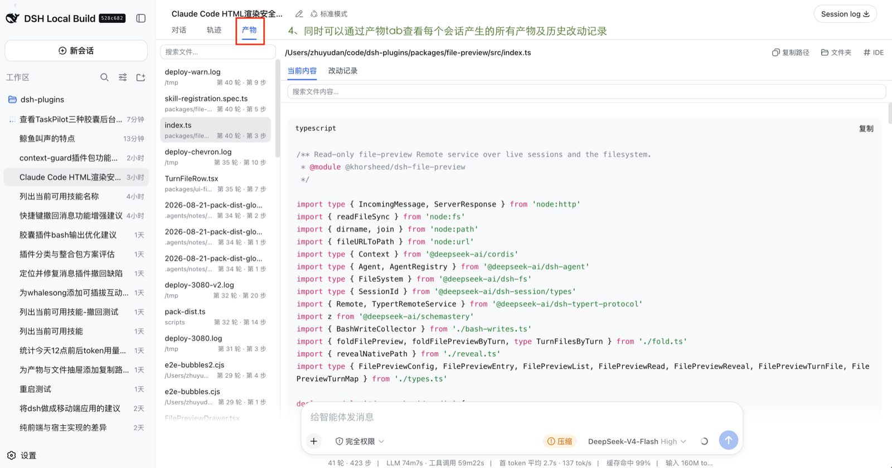
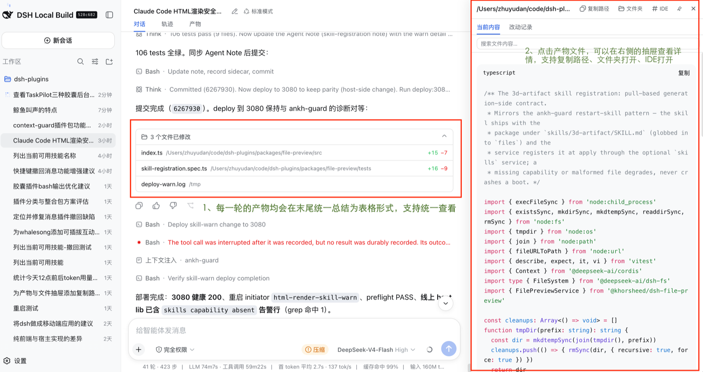
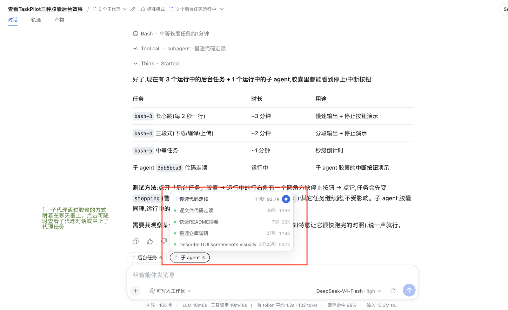
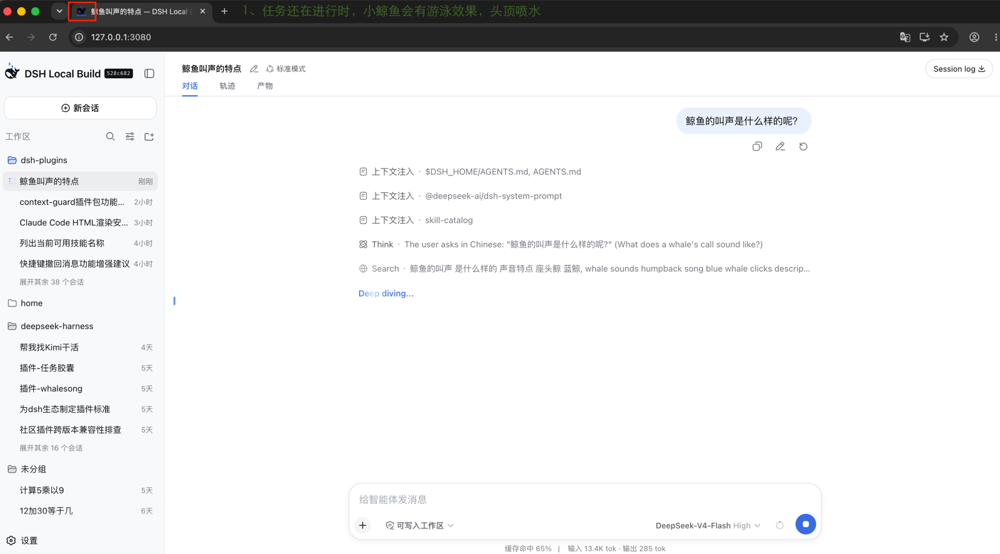
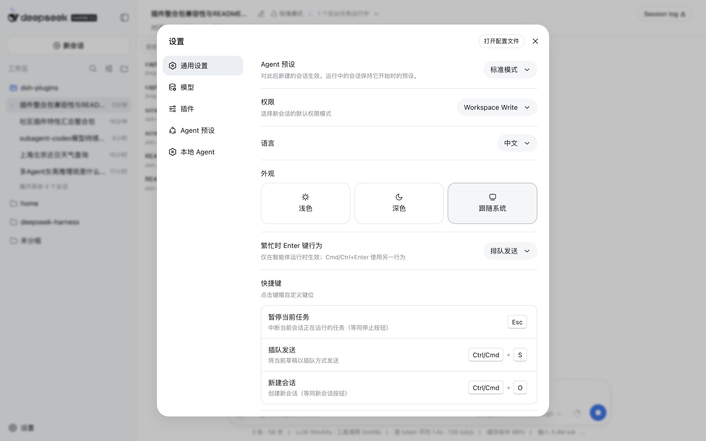

# dsh-plugins

[English](README.en.md) | 中文

**dsh**(DeepSeek Harness)生态的社区插件 monorepo:**14 个纯增量插件**。其中 13 个是自挂载 bundle——一个命令装一个、一个命令卸一个,每个只挂自己的 loader 行,全部走官方扩展点(slots、commands、Remote 服务、会话镜像)接入,不修改任何官方包、不替换官方 UI 槽位、不 hack 核心服务;第 14 个(local-agent 家族的委派工具)随 harness 挂载、随 harness 卸载。整套 13 个 bundle 已经同时跑在生产 profile 上,卸载即精确还原。

本文档即插件目录:每个插件能做什么、怎么装、怎么卸。仓库同时是开发工作区,开发相关内容见[开发](#开发)。

## 全家桶速览

| 包名(npm) | 面 | 行 id | 一句话特性 |
| --- | --- | --- | --- |
| `@khorsheed/dsh-client-message-tools` | host + client | `message-tools` | 用户消息**编辑 / 真撤回 / 恢复重放** |
| `@khorsheed/dsh-message-timeline` | client | `message-timeline` | 会话左缘悬浮**历史消息时间轴**,点击跳转任意用户消息 |
| `@khorsheed/dsh-client-session-title-edit` | client | `session-title-edit` | 聊天区标题**内联编辑重命名**会话 |
| `@khorsheed/dsh-file-preview` | host | `file-preview` | 宿主侧只读**文件预览 Remote 服务**(列表 + 内容 + diff) |
| `@khorsheed/dsh-client-ui-file-preview` | client | `ui-file-preview` | 会话「产物」tab、回合变更卡片、文件预览抽屉 |
| `@khorsheed/dsh-local-agent` | host + client | `local-agent` | 本地编码 Agent 家族**核心**:作用域 home、登录/会话命令族、委派 registry |
| `@khorsheed/dsh-local-agent-kimi` | host | `local-agent-kimi` | **Kimi Code** harness:`kimi -p` 委派、续聊、记账 |
| `@khorsheed/dsh-local-agent-codex` | host | `local-agent-codex` | **Codex** harness:`codex exec` 委派、续聊、记账 |
| `@khorsheed/dsh-local-agent-claude-code` | host | `local-agent-claude-code` | **Claude Code** harness:`claude -p` 委派、续聊、记账 |
| `@khorsheed/dsh-local-agent-tool-subagent` | host(工具) | *(随 harness 挂载)* | 家族自有委派工具,带 `resume` 续聊参数 |
| `@khorsheed/dsh-taskpilot` | host + client | `taskpilot` | 聊天框上方**后台任务/子 Agent 胶囊**,停止/中断 + 详情抽屉 |
| `@khorsheed/dsh-whalesong` | client | `whalesong` | 任务氛围:鲸鱼喷水、favicon 动画、完成/阻塞提示音 |
| `@khorsheed/dsh-ui-shortcuts` | client | `ui-shortcuts` | 可自定义键位的**快捷键**:暂停、插队发送、新建会话 |
| `@khorsheed/dsh-ankh-guard` | host | `ankh-guard` | 自修改重启的**安全门禁**:绿色凭证 + preflight + watchdog 回滚 |

版本为仓库内当前发布线,以 npm 实际发布为准。

## 能力盘点

一插件一行能力;截图列先用生产实例实拍占位,可随时替换为你的截图(同一插件的多行能力用空单元格归组)。

| 插件 | 能力 | 截图 |
| --- | --- | --- |
| **对话控制** |||
| `dsh-client-message-tools`<br>消息编辑 / 撤回 / 恢复 | 编辑:原位替换,模型在原位置读到新文本(带模型 chip,支持编辑链) |  |
| | 撤回:surface 替换,目标消息及其后内容离开模型上下文,投影为「已撤回 N 条消息」分隔线,原文回填草稿 | |
| | 恢复:沿权威边界(`sourceEventSeqs`)尾部重放,渲染「已恢复」组 | |
| `dsh-message-timeline`<br>历史消息时间轴 | 会话左缘悬浮时间轴:一行一条已加载用户消息,静止只显刻度,悬停展开、点击跳转、跟随阅读位置 |  |
| `dsh-client-session-title-edit`<br>标题内联编辑 | 标题旁铅笔 → 内联输入,Enter 提交 / Esc 取消,走官方 `session.rename`,钉住用户来源标题 |  |
| **文件预览** |||
| `dsh-file-preview`(宿主服务) | 只读 Remote 服务:`list` 折叠会话写入/编辑的文件(含嵌套 Code Mode)与每次改动的 diff,`read` 提供当前内容(图片走浏览器 URL) | — |
| `dsh-client-ui-file-preview`(界面) | 「产物」tab:文件列表按最近活动倒序 |  |
| | 文件内容预览:选中即看,改动记录逐条步进 diff,内容搜索高亮跳转 |  |
| | 回合变更卡片 + 文件抽屉:每个已完成回合末尾「N 个文件已修改」汇总;抽屉仅内容预览,支持「在文件夹中打开 / 在 IDE 中打开」 | — |
| **本地编码 Agent 家族** |||
| `dsh-local-agent`(家族核心) | 作用域 home:每个 harness 独立 `KIMI_CODE_HOME` / `CODEX_HOME` / `CLAUDE_CONFIG_DIR`,不碰个人配置与凭据 | — |
| | `/<harness> login / sessions / status / logout` 命令族(device-code / 浏览器 OAuth 登录) | — |
| | 设置 → 本地 Agent 分区:roster 驱动的认证状态、网页登录、退出登录 |  |
| `dsh-local-agent-kimi` | Kimi Code harness:`kimi -p` 委派、`session_index.jsonl` 记账、resume 续聊 | — |
| `dsh-local-agent-codex` | Codex harness:`codex exec` 委派、rollout 记账、resume 续聊 | — |
| `dsh-local-agent-claude-code` | Claude Code harness:`claude -p --output-format json` 委派、项目文件记录、resume 续聊 | — |
| `dsh-local-agent-tool-subagent` | 家族委派工具:官方 `subagent_*` schema + 可选 `resume` 续聊(句柄不进 prompt,按 parent+provider 校验) | — |
| **任务与子 Agent 监控** |||
| `dsh-taskpilot` | 后台任务胶囊:运行中在前、每秒计时、停止按钮 |  |
| | 子 Agent 胶囊:完整谱系、运行时长与 token、中断按钮(深层授权直接父) | — |
| | 详情抽屉:命令/类型/状态/耗时 + 从会话日志回放的执行轨迹 | — |
| **状态氛围** |||
| `dsh-whalesong` | favicon 水线气泡:任务运行时标签页图标动画 |  |
| | 侧栏水滴:任务运行时侧栏鲸鱼喷水(尊重 `prefers-reduced-motion`) |  |
| | 提示音:完成三连滑音 / 阻塞上扬(WebAudio 合成) | — |
| **效率工具** |||
| `dsh-ui-shortcuts` | 三个固定动作 + 用户自选键位:暂停(Esc)、插队发送(Ctrl/Cmd+S)、新建会话(Ctrl/Cmd+O) |  |
| | `ctx.shortcuts` 注册表:任何插件可注册自己的键盘动作,免费获得设置项、重绑、持久化 | — |
| **运维守护** |||
| `dsh-ankh-guard` | 绿色凭证门禁:build+test 全绿才允许重启(凭证绑定 git HEAD,10 分钟窗口) | — |
| | preflight 组合闸门:重启前子进程深干跑整棵插件树,起不来绝不停实例 | — |
| | watchdog 无感重启:回滚到已知良好 + `guard-backup-*` 锚点 + 崩溃页 | — |

## 兼容性承诺

整套插件按共存设计:任意组合安装、卸载、开关,互不干扰。行 id、UI 席位、事件与命名空间全部互不重叠;探测不到可选能力时静默降级,绝不拖垮启动。生产环境长期全量叠装运行。

唯一的例外说明:已自带 `ankh-guard` 行的镜像(历史 fork)不要再重复添加该包——重复行 id 会导致启动失败。详见 [ankh-guard 的说明](packages/ankh-guard/README.md)。

## 安装

前置:dsh 宿主 ≥ `0.1.0-rc.6`(每个 bundle 声明 `minHost`),任意 profile(`web` / `headless` / 自定义)。每个 bundle 都声明 `dsh.bundle`:`dsh plugin add` 一条命令完成安装并自动挂载 loader 行,**无需手改 cordis.yml**。装完**重启 web 实例**生效。

```sh
# 按 npm 名装单个
dsh plugin --profile web add @khorsheed/dsh-whalesong

# 从 tarball / 源码目录装(开发态)
dsh plugin --profile web add ./khorsheed-dsh-whalesong-0.1.0-rc.5.tgz
dsh plugin --profile web add /path/to/dsh-plugins/packages/message-timeline
```

全家桶按家族一键装:

```sh
# 对话控制
dsh plugin --profile web add @khorsheed/dsh-client-message-tools
dsh plugin --profile web add @khorsheed/dsh-message-timeline
dsh plugin --profile web add @khorsheed/dsh-client-session-title-edit

# 文件预览(服务 + 界面,推荐成对)
dsh plugin --profile web add @khorsheed/dsh-file-preview
dsh plugin --profile web add @khorsheed/dsh-client-ui-file-preview

# 本地 Agent 家族(核心 + 你实际用的 harness,成对装)
dsh plugin --profile web add @khorsheed/dsh-local-agent
dsh plugin --profile web add @khorsheed/dsh-local-agent-kimi
dsh plugin --profile web add @khorsheed/dsh-local-agent-codex
dsh plugin --profile web add @khorsheed/dsh-local-agent-claude-code

# 任务监控 / 氛围 / 快捷键
dsh plugin --profile web add @khorsheed/dsh-taskpilot
dsh plugin --profile web add @khorsheed/dsh-whalesong
dsh plugin --profile web add @khorsheed/dsh-ui-shortcuts

# 运维守护(自托管 / 让 AI 自己改代码场景)
dsh plugin --profile web add @khorsheed/dsh-ankh-guard
```

## 卸载

一条命令卸载一个插件:宿主 CLI 会移除依赖并把它的 bundle 行从 profile 调和出去,插件添加的所有界面随之消失。

```sh
dsh plugin --profile web remove @khorsheed/dsh-<name>
```

通用规则:

- **卸载即精确还原。** 没有任何插件修改/替换官方文件,移除后组合精确回到之前的状态。
- **用户数据刻意保留。** local-agent 家族保留每个 harness 的作用域目录(`$DSH_HOME/local-agent/<name>`),重装无需重新登录——删目录即清全部痕迹;ankh-guard 保留 `stateDir`(默认 `$DSH_HOME/state`)下的状态(凭证、重启记录、中断会话快照);ui-shortcuts 的键位保留在 `$DSH_HOME/settings.yaml`。任何卸载都不碰会话日志——编辑/撤回的审计轨迹留在日志里是有意为之。
- **家族行随行。** 卸 harness 会一并注销它的 harness 行、`/…` 命令族、工具行和 UI 行。先卸核心(`dsh-local-agent`)而 harness 还在时,harness 行保持 **pending,不会崩溃**——重新装上核心即恢复。
- **`enabled: false`** 可以禁用某行而不卸载——这是部署层操作,不是代码改动。

各插件卸载细节见下文目录。

## 插件目录

### 一、对话控制

#### `dsh-client-message-tools` —— 消息编辑 / 撤回 / 恢复

全家桶里唯一改变模型所见的插件,且用的是与官方 compaction 同一套机制:

- **编辑**:原位替换——host 追加 replacement,模型在**原位置**读到编辑后的新文本,旧内容及之后的一切从模型上下文消失;可形成编辑链,编辑框带真实的模型 chip(与 composer 共享同一 `ModelDirectory`)。
- **撤回是真撤回,不是打标记**:用 surface replacement 把目标消息及之后的所有内容从 `session.surface` 移出,不再进入模型上下文;每条撤回投影为可展开的「已撤回 N 条消息」分隔线,原文自动回填 composer 草稿(绝不自动发送)。
- **恢复**:沿撤回区间的权威边界(`sourceEventSeqs`)把用户消息与助手文本按原始顺序**尾部重放**(工具调用/结果永不重放),渲染为「已恢复」组。

**模型影响**(全家桶里唯一显著的一个):一次撤回/编辑会把遮蔽区间的全部 token 从后续请求移除,KV 缓存前缀从替换点失效——与官方 compaction 同样的取舍。

**卸载** —— `dsh plugin --profile web remove @khorsheed/dsh-client-message-tools`:编辑/撤回/恢复所有界面消失;审计轨迹按设计留在会话日志里。

#### `dsh-message-timeline` —— 历史消息时间轴

平铺在会话滚动区左缘的悬浮时间轴:一行一条已加载用户消息(含回合中插入的 steering 消息,可配置),静止时只显示压淡刻度,悬停/键盘聚焦展开文字,点击跳转对应消息;跟随阅读位置、顶部翻页加载更早历史、面板宽度可配置,`enabled` 可整体关闭。纯读取会话快照,零事件、零提示词,对模型与 KV 缓存完全无影响。

> **仅源码安装。** `dsh-message-timeline` 标记为 `private`,未发布到 npm——从本仓库安装(`dsh plugin --profile web add /path/to/dsh-plugins/packages/message-timeline` 或打包成 tarball)。

**卸载** —— `dsh plugin --profile web remove @khorsheed/dsh-message-timeline`。

#### `dsh-client-session-title-edit` —— 会话标题编辑

聊天区标题右侧铅笔控件 → 原位内联编辑:Enter 提交、Escape 取消、空草稿禁用保存。走官方 `session.rename` RPC,用户来源标题会被**钉住**,不再被自动生成覆盖。无需宿主半边、零新增 RPC;标题是纯投影属性,对模型零影响。

**卸载** —— `dsh plugin --profile web remove @khorsheed/dsh-client-session-title-edit`。

### 二、文件与产物

#### `dsh-file-preview` —— 宿主服务

只读 Remote 服务:`list` 把单个会话的日志折叠成其 `read`/`write`/`edit` 工具调用碰过的文件清单(含嵌套 Code Mode 派发),带每次改动的 diff;`read` 通过 `ctx.fs` 提供其中某个文件的当前内容(图片走浏览器 URL)。配置上限 `maxReadBytes` / `maxFiles`。不持有会话状态、不写任何东西——日志与文件系统始终是权威。

**卸载** —— `dsh plugin --profile web remove @khorsheed/dsh-file-preview`。UI 半边若仍在,其界面降级为空态而非报错。

#### `dsh-client-ui-file-preview` —— 浏览器界面

与「对话」「轨迹」并列的会话「产物」tab:列出会话写入/编辑过的文件(按最近活动倒序),内联预览当前内容,改动记录 tab 逐条步进每次 write/edit 的 diff(每条带所属轮次/步骤),带内容搜索(高亮 + 逐个跳转);每个已完成回合末尾出现「N 个文件已修改」汇总卡;点文件打开仅内容的抽屉,宿主支持时提供「在文件夹中打开 / 在 IDE 打开」。与 `dsh-file-preview` 成对(声明为 peer,自动安装);没有宿主行时界面渲染降级/空态,而不是 boot 失败。

**卸载** —— `dsh plugin --profile web remove @khorsheed/dsh-client-ui-file-preview`;除非保留 headless 服务,建议两个半边一起卸。

### 三、本地编码 Agent 家族

让 dsh 能把子任务委派给你本机装的编码 Agent CLI——Kimi Code、Codex、Claude Code——各自独立上下文、独立记账,还能跨轮续聊。

**架构。** `dsh-local-agent`(家族核心)是 harness 注册表 + 作用域目录供给:每个 harness 在自己独立的 scoped home 下运行(`KIMI_CODE_HOME` / `CODEX_HOME` / `CLAUDE_CONFIG_DIR`,位于 `$DSH_HOME/local-agent/` 下,0700 权限因为它持有凭据),**绝不触碰你用户目录里的私人配置与凭据**。核心注册 `/<harness> login|sessions|status|logout` 命令族,自带 roster 驱动的浏览器设置分区(设置 → 本地 Agent)。每个 harness 包注册一个 harness,并把委派工具挂到 **profile 根**,任意 agent preset 都能委派,无需逐 preset 变体。

**委派。** `subagent_kimi`(`kimi -p`)、`subagent_codex_local`(`codex exec`)、`subagent_claude_code_local`(`claude -p --output-format json`)。父级只看到最终回答或精确错误;子会话独立上下文、独立 token、独立 KV 缓存,永不进父级。

**续聊(resume)。** 家族工具(`dsh-local-agent-tool-subagent`)在官方 `subagent_*` schema 上加了可选 `resume` 参数——首次委派返回的 dsh 子会话 id。传回后就在**同一个** dsh 子会话里继续**同一个** CLI 会话,按轮记账。续聊句柄**绝不进 prompt**:只从参数读取,并经 registry 按 (parent, provider) 校验,伪造句柄在任何 CLI 进程启动前就被拒绝。

**记账与会话记录。** 真实用量与耗时:每次委派 `turn/start` 开、`turn/end` 关(失败/取消也关),token 按各 CLI 口径正确分桶(kimi 四桶求和、codex 去重缓存命中、claude 各桶独立);`/… sessions` 列出本 agent 委派产生的会话。

**安装注意 —— 核心与 harness 显式一起装。** `dsh plugin add` 只把直接依赖调和进 bundles 层,harness 对核心的传递依赖不会单独激活核心行:

```sh
dsh plugin --profile web add @khorsheed/dsh-local-agent
dsh plugin --profile web add @khorsheed/dsh-local-agent-kimi   # 或 -codex / -claude-code
```

前置:对应 CLI 已在 `PATH`(与你交互式使用同一个二进制,插件不负责安装)。装完重启,跑一次 `/<name> login`。

**卸载(每个 harness)** —— `dsh plugin --profile web remove @khorsheed/dsh-local-agent-kimi`(或 `-codex` / `-claude-code`):注销 harness、命令族、工具行和 UI 行。作用域目录 `$DSH_HOME/local-agent/<name>` **刻意保留**(会话 + 凭据,重装免重新登录);删目录即清全部痕迹。

**卸载(核心)** —— `dsh plugin --profile web remove @khorsheed/dsh-local-agent`:卸载 `local-agent` 行与设置分区;仍装着的 harness 保持 pending(绝不崩溃),重装核心即恢复。`$DSH_HOME/local-agent` homes 根目录保留,删除即清。

**`dsh-local-agent-tool-subagent`** 没有自己的 bundle 行——由各 harness 的 patch 以不同工具名各挂一次。卸掉 harness 即卸载其行,pnpm 会作为无用的依赖自动清理。

### 四、任务与子 Agent 监控

#### `dsh-taskpilot` —— 后台任务 / 子 Agent 胶囊

聊天框上方两个胶囊入口,各自独立显隐(无数据不出现):

- **后台任务**:当前会话全部后台任务,运行中在前、每秒计时、运行中带停止按钮(与聊天框停止按钮同款视觉),点击行打开详情抽屉。
- **子 Agent**:当前会话的**完整子 Agent 谱系**(直接子 + 深层后代,与标题树同一索引),展示运行时间与消耗 token,运行中带中断按钮(深层中断授权给其直接父),点击行跳转到该子 Agent 会话。
- **详情抽屉**:命令/类型/状态/起止时间/耗时 + 从会话日志回放的**执行轨迹**(启动、每次 `job_output` 增量、停止、完成;默认折叠)。

数据全部来自产品已有镜像(`jobsBySession` / `subagentsByParent`,与标题旁列表同源);停止/中断动词注册在官方 `commands` 扩展点(`/taskpilot-stop`、`/taskpilot-interrupt`)。对模型零影响。

**卸载** —— `dsh plugin --profile web remove @khorsheed/dsh-taskpilot`。

### 五、状态氛围

#### `dsh-whalesong` —— 任务跑着,鲸鱼喷水

- **favicon 水线气泡**:任一会话运行期间,标签页图标变成鲸鱼 + 三颗上升气泡(SVG 帧);空闲时保持一只按页面主题着色的静态鲸鱼。
- **侧栏水滴**:三颗 DeepSeek 蓝水滴从侧栏鲸鱼喷气孔上升(DOM 浮层锚定官方 logo,带角落回退)。
- **提示音**:完成 = 三连上升滑音;阻塞 = 同型上扬重复两次(WebAudio 合成,无音频资源文件)。`prefers-reduced-motion` 下动画与提示音自动静音。

配置(`enabled` / `volume`)热生效,无需刷新。只读会话列表,对模型零影响。

**卸载** —— `dsh plugin --profile web remove @khorsheed/dsh-whalesong`,精确还原之前的组合。

### 六、效率工具

#### `dsh-ui-shortcuts` —— 可自定义键位的快捷键

三个固定动作、键位用户自选:**暂停当前任务**(默认 `Esc`,与聊天框停止按钮同操作)、**插队发送草稿**(默认 `Ctrl/Cmd+S`)、**新建会话**(默认 `Ctrl/Cmd+O`)。设置 → 通用 → 快捷键中重绑/解绑/恢复默认;偏好持久化在 `$DSH_HOME/settings.yaml`。附带 `ctx.shortcuts` **动作注册表**:任何插件可以注册自己的键盘动作,免费获得设置项、重绑、持久化、无冲突分发。全部走公开服务(`conversation.cancel` / `conversation.input.submit('steer')` / `workspaces.startSession()`),对模型零影响。

> ⚠️ **与官方快捷键包互斥。** 本包与官方 `@deepseek-ai/dsh-client-ui-shortcuts` 的 loader entry id 都是 `ui-shortcuts`,同一 profile 装两个会在启动时 fail loud——只保留其一。官方包是 fork 自生、从未发布到 npm,迁移时已从 harness 删除——实际无法安装,本包单独装永远安全。注意角色是反的:**本包*提供* `ctx.shortcuts` 注册表**(任何插件都可注册自己的动作),官方包没有任何供第三方注册的接缝。

**卸载** —— `dsh plugin --profile web remove @khorsheed/dsh-ui-shortcuts`;键位保留在 `settings.yaml`(删除其中 `ui-shortcuts` 小节即清)。

### 七、运维守护

#### `dsh-ankh-guard` —— 让 Agent 自己改代码、自己重启,还不把服务搞挂

面向「让 AI Agent 自主修改代码并重启服务」的自托管场景。核心一条规则:**证明代码是好的,才允许重启。**

- **绿色凭证门禁**:构建与测试全绿后记录凭证(绑定 git commit、`maxAgeMinutes` 默认 10 分钟有效窗口);重启前查凭证存在、新鲜、HEAD 一致——改坏了构建就永远拿不到凭证,重启在造成伤害前被拒绝。
- **preflight 组合闸门**:凭证之后、停任何东西之前,在子进程对完全相同组合做深度干跑(整棵插件树真实 apply 再 dispose,web 端口钉到 0 绝不与现网冲突),组合起不来绝不停止运行中的实例。
- **watchdog 无感重启**:detached 监督进程,宿主退出后接管端口、拉起、跑 canary;连续起不来回滚到最后已知可用版本(健康启动戳 → 检查点 → 凭证 HEAD),回滚前自动留 `guard-backup-*` 恢复锚点,不依赖 reflog;连续 4 次失败停在带重试按钮的崩溃页。
- **重启报告自动送达模型**:经 `agent.followup` 排为下一轮;SIGTERM 时快照在途回合,重启后自动拉起并排入「继续」followup。

六步自我重启协议:`checkpoint` → 修改 → build+test → `record` → `verify` → 重启+`canary`。应用内同一能力以 `selfRestartGuard` 服务暴露。

兼容性注意:npm 发布线上组合 preflight 门禁**降级**(依赖 fork 的 `dsh preflight` 命令),其余能力(restart/supervise 门禁、watchdog、回滚到已知良好)全部完整。

**卸载** —— `dsh plugin --profile web remove @khorsheed/dsh-ankh-guard`:行与 CLI/服务面消失;`stateDir`(默认 `$DSH_HOME/state`)下的守护状态按设计保留,删除即清。宿主镜像已挂 `ankh-guard` 行的不要以 profile bundle 添加本包(重复行 id → 启动失败),禁用重复行即可。

## 兼容性

所有包声明 `minHost: 0.1.0-rc.6`,运行时只依赖官方公开稳定面(slots、核心服务、核心事件、cordis 4.x、schemastery):

- npm 发布线:全部 ✅ **完整**,唯一例外是 `dsh-ankh-guard` ⚠️ **降级**(组合 preflight 门禁依赖 fork 的 `dsh preflight`,缺失时守护放行并提示,其余能力完整)。
- 源码线(deepseek-harness master):全部 ✅。

## 模型影响总表

| 插件 | 模型上下文 | Token | KV 缓存 |
| --- | --- | --- | --- |
| message-tools(编辑/撤回) | 有——surface 替换遮蔽区间 | 移除区间 token,新增少量占位 | 前缀从替换点失效(同官方 compaction) |
| message-tools(恢复) | 有——尾部重放 | 新增可重放 token | 仅尾部延展,不改写 |
| local-agent 委派(子会话) | 独立子上下文 | 子会话独立付费,不进父级 | 与父级相互独立 |
| 其余全部插件 | 无 | 无 | 无 |

## 开发

独立 pnpm monorepo;每个包以 `@khorsheed/dsh-*` 发布。

```
packages/   一个目录一个可发布插件
build/      共享构建/测试预设(tsdown client bundle、vitest 源码面配置)
scripts/    仓库工具(pack-dist、gen-typert、sync-harness-paths)
```

```sh
pnpm install
pnpm run build      # pnpm -r --if-present run build
pnpm run test       # pnpm -r --if-present run test
pnpm run typecheck  # pnpm -r --if-present run typecheck
```

测试必须走根 `pnpm test` 或 `pnpm --filter <pkg> test`——裸跑 `vitest run packages/xxx` 会绕过每包的 vitest 配置(源码面别名预设),报误导性的解析错误。

**开发期对 harness checkout 的依赖。** 三条机制解析到本地 deepseek-harness clone(env `DSH_HARNESS`,默认 `~/code/deepseek-harness`),发布的 npm 产物单独无法满足:

- `scripts/gen-typert.mts` 对 harness checkout 重新生成 `lib/typert.*` 产物(message-tools、file-preview、local-agent),再把 `@khorsheed` 自名重写后拷回。
- `build/vitest.ts`(共享 vitest 预设)把平台 import 映射到 harness 的 `tsconfig.base.json` 路径——发布的包不携带 `src/`,其 `/client` 入口是 loader 包裹的浏览器 bundle,裸 import 会炸。
- `scripts/sync-harness-paths.mjs` 为 taskpilot 写 gitignored 的 `tsconfig.paths.json` 用于类型解析(npm 发布链不完整)。

CI 注意:先在本仓库旁 clone deepseek-harness 并设 `DSH_HARNESS` 再 `pnpm test`;harness checkout 过期意味着被测 API 面可能落后于生产宿主。发布走 `scripts/pack-dist.ts`(`--family` 重写 peer 依赖的 scope),`npm publish` 前先验证 tarball。完整仓库纪律见 [AGENTS.md](AGENTS.md)。
