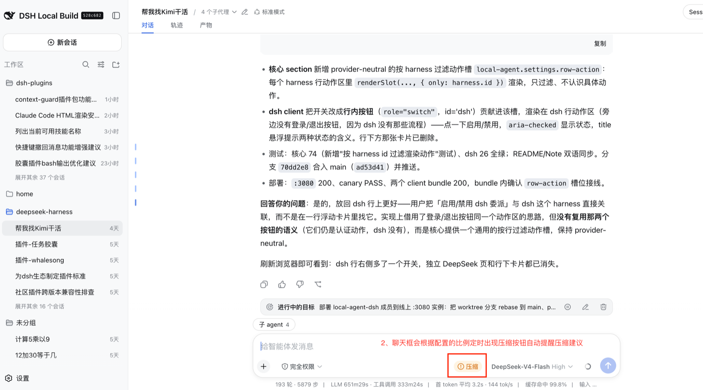

# @khorsheed/dsh-context-guard

English | [中文](README.md)

A context-window compaction reminder for the dsh web GUI: once **context occupancy** — the same number the composer's context ring shows — crosses a configured share of the model's context window, a compact button appears in the composer, and clicking it runs the official `/compact` command. Uninstalling removes every surface it adds.




## Features

- **Compact button in the composer** — hidden below the threshold, appears in the amber warning tint above it.
- **Same number as the context ring** — driven by the official `contextPressure` projection, so button and ring never disagree.
- **Runs the official `/compact`** — idle-gating, the compaction lock, and presentation stay host-owned.
- **One live tunable** — the occupancy threshold, editable in Settings → Plugins with no restart.

## Install

```sh
dsh plugin --profile web add @khorsheed/dsh-context-guard
```

Restart the web instance after adding. Uninstall:

```sh
dsh plugin --profile web remove @khorsheed/dsh-context-guard
```

## Config

One tunable, editable in the GUI (Settings → Plugins → "压缩提醒时机 / Compaction reminder timing") and live with no restart.

| Key | Default | Meaning |
|---|---|---|
| `thresholdRatio` | `0.8` | Context occupancy fraction at which the button appears (clamped to (0, 1]). Lower it to be reminded earlier — the provider rejection wall sits below 100% occupancy (see *How it works*). |

```yaml
plugins:
  context-guard:
    thresholdRatio: 0.65
```

**This field tunes ONLY when the button appears** — real compaction timing stays owned by the official compaction engine's own `thresholdRatio` / `auto` config.

## Compatibility

- npm release line (`@deepseek-ai/dsh@0.1.1-rc.1`): ✅ full — built and tested against the rc.8 type surface. This build REQUIRES rc.8: the `commands/execute` Remote gained a required `images` argument (rc.6/rc.7 hosts would receive shifted arguments) — stay on the previous build there. — also verified on 0.1.1-rc.1 (additive audit, 2026-08-21)
- source line (deepseek-harness master): ✅

## Known Limitations

- **Reminder, not guarantee** — context may grow between the button appearing and the click, and `/compact` can report `busy` while the agent runs.
- **No output-cap knob** — the rejection wall depends on `window − maxTokens`, a model property, not a user preference.
- **No auto-compaction** — the official 80% auto-compaction keeps running unchanged.

## How it works

<details>
<summary>Why it exists and internals (click to expand)</summary>

### Reminding you before the wall the meter does not show

The official compaction-basic engine auto-compacts at 80% of the context window, and only between steps. But providers reject a request when `prompt + max_tokens > context_length` — the request reserves output tokens, so the rejection wall sits below 100% occupancy. With the deepseek adapter's defaults (window 1,000,000, output cap 256,000) the wall is ~74.4%, below even the official 80% point; the estimator also underprices CJK text and JSON schemas, so the provider-side count runs higher than the ring shows. On an idle session nothing signals that the next send will fail.

At the default ratio (0.8) the button appears exactly when the official engine would compact anyway; **lower the ratio (e.g. 0.6–0.7) to be reminded earlier** — while a manual `/compact`'s summarization call still fits comfortably.

### Mechanics

- **Seat**: `conversation.input.right` (the composer's tool row, before the send button).
- **Data**: the official `contextPressure` session projection — `projectedTokens` and `contextWindow`, with a fallback to the bare provider sample on older logs.
- **Formula**: `projectedTokens / contextWindow >= thresholdRatio` — the same occupancy the context ring shows.
- **Action**: the official `/compact` channel (`remote.commands.execute` → `ctx.commands` → `ctx.compaction.compactNow`).

### Model experience

Nothing changes for the model: clicking the button runs the same `/compact` the user could type, with the same command lifecycle in the session log. The plugin itself has no token or KV-cache effect.

`/client` exports the plugin body (`apply`/`inject`) and the `CompactGuardButtonProps` / `ContextGuardSettingsCardProps` types.

</details>

## Development

Part of the [dsh-plugins](https://github.com/Khorsheed/dsh-plugins) monorepo (`packages/context-guard`). Issues and contributions welcome there.
