# dsh-basic

中文 | [English](README.en.md)

**一组日常高频的体验插件，让你的 DSH 变得更好用、更自由。** 发出去的消息可以改、可以撤；会话标题一键修改；后台任务一目了然、自由中止；上下文压缩提醒自由配置；聊天过程中随时让 Agent 帮你画预览卡片，明确 UI 效果再动手，避免重复返工；自由管理所有的 Skill 和工具，并配置到不同的 preset；任务完成有提示音；移动端快速接入；开发插件安全重启，从此不怕小鲸鱼自杀……——大多数用户最先想要的那层体验，一次装齐。

每个成员都是独立插件，复制包名到宿主的「添加插件」对话框（0.1.7-rc.2 起：设置 → 插件）即可自由安装；后续如果官方开放自定义 profile 安装，本仓库会支持一行命令直接安装。
常用的会话插件也可以直接装整合包 `@khorsheed/dsh-bundle-conversation-toolbox` 一次打包七个（见[功能展示](#功能展示)末尾）。


## basic 整合包 - 插件列表

| 插件 | 包名（复制即可安装） | 能力说明 |
|---|---|---|
| message-tools | `@khorsheed/dsh-client-message-tools` | 发出去的消息可以原位编辑、撤回、恢复 |
| message-timeline | `@khorsheed/dsh-message-timeline` | 会话左缘一条安静的时间轴——悬停展开，点击跳转 |
| session-title-edit | `@khorsheed/dsh-client-session-title-edit` | 聊天头部内联重命名会话 |
| quote | `@khorsheed/dsh-quote` | 选中任意文本浮出引用动作菜单：引用进输入框 / 侧边对话 / 复制 |
| file-preview | `@khorsheed/dsh-file-preview` | 「产物」tab + 宿主服务一体：会话写过的每个文件，不开 IDE 直接预览 |
| local-files | `@khorsheed/dsh-local-files` | 右栏本地文件浏览器：懒加载文件树 + 结构化预览，任意目录随手翻 |
| taskpilot | `@khorsheed/dsh-taskpilot` | 后台任务与子 agent 变成聊天框上方的胶囊，一键停止/中断 |
| context-guard | `@khorsheed/dsh-context-guard` | 上下文溢出拒绝请求之前，压缩按钮先出现 |
| inline-html-render | `@khorsheed/dsh-inline-html-render` | agent 写的 HTML 变成会话内的沙箱交互卡片 |
| capability-catalog | `@khorsheed/dsh-capability-catalog` | 设置页枚举实例全部 skill 与工具及注册渠道，可在线加 skill |
| ui-shortcuts | `@khorsheed/dsh-ui-shortcuts` | Esc 暂停、Ctrl/Cmd+S 插队发送、Ctrl/Cmd+O 新会话，键位可改 |
| whalesong | `@khorsheed/dsh-whalesong` | 任务运行时侧栏鲸鱼喷水；完成时一声提示音 |
| mobile | `@khorsheed/dsh-mobile` | 手机浏览器上的移动版界面 + iOS 桥 |
| ankh-guard | `@khorsheed/dsh-ankh-guard` | 运维助手：agent 改完代码想重启时，先验证构建与测试再放行，改坏了自动回滚 |

### 版本兼容

**宿主 `0.2.0-rc.*`**：复制下表中带 `@^版本` 下限的规格。发版当天不要裸填包名——pnpm 11 默认启用 24 小时新版保护（`minimumReleaseAge`，供应链安全），裸名会把当天发布的新版藏起来、装到只支持 0.1.x 的旧线，再被宿主的兼容性检查拦下；带下限的规格会自动豁免保护期，装到兼容的新版。

**宿主 `0.1.5-rc.1` ~ `0.1.7.*`**：直接填包名，全部 14 个成员的 latest 可用（旧插件线在 0.1.x 宿主上依然兼容，保护期回退不碍事）。

**宿主 `0.1.2-rc.1` ~ `0.1.4`**：

- **可直接装 latest**：`@khorsheed/dsh-message-timeline`、`@khorsheed/dsh-client-session-title-edit`、`@khorsheed/dsh-context-guard`、`@khorsheed/dsh-ui-shortcuts`、`@khorsheed/dsh-whalesong`、`@khorsheed/dsh-inline-html-render`
- **需指定旧线**（复制完整规格）：`@khorsheed/dsh-client-message-tools@^0.2.0`、`@khorsheed/dsh-file-preview@^0.2.0`、`@khorsheed/dsh-client-ui-file-preview@^0.2.0`、`@khorsheed/dsh-taskpilot@^0.2.0`、`@khorsheed/dsh-ankh-guard@^0.2.0`
- **不支持**：capability-catalog、mobile、quote、local-files（没有这条线的版本）

## 功能展示

### message-tools：消息编辑、撤回与恢复

| 宿主版本 | 安装规格（复制到对话框） |
|---|---|
| ≥ `0.1.5-rc.1` | `@khorsheed/dsh-client-message-tools@^0.3.3` |
| `0.1.2` ~ `0.1.4` | `@khorsheed/dsh-client-message-tools@^0.2.0` |
| `0.1.x` | `@khorsheed/dsh-client-message-tools@^0.1.0` |

每条用户消息带复制/编辑/撤回操作行。编辑是原位替换，保存后以新消息重新发送；撤回不是打标记——消息及其后内容彻底离开模型上下文，折叠成可展开的分隔线，原文自动回填草稿；还能一键恢复到对话末尾。全程不改动任何官方包。

<details open>
<summary>功能示意（5 张）</summary>


</details>

### message-timeline：历史消息时间轴

| 宿主版本 | 安装规格（复制到对话框） |
|---|---|
| ≥ `0.1.2-rc.1` | `@khorsheed/dsh-message-timeline@^0.2.4` |
| `0.1.x` | `@khorsheed/dsh-message-timeline@^0.1.0` |

官方的时间轴在长会话中定位成本会比较高，我个人更常用的方式是用用户消息定位，且能一次性在多条用户消息里找而非需要一直上下滑动。会话左缘一条悬浮时间轴，一行一条用户消息。日常收成一条细线不占视线，悬停展开预览，点击直接把会话滚动到对应消息。跟随阅读位置，顶部翻页加载更早历史。

<details open>
<summary>功能示意（2 张）</summary>

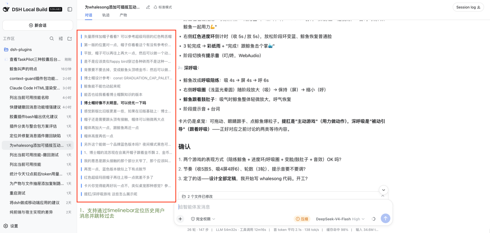


</details>

### session-title-edit：会话标题内联编辑

| 宿主版本 | 安装规格（复制到对话框） |
|---|---|
| ≥ `0.1.2-rc.1` | `@khorsheed/dsh-client-session-title-edit@^0.2.5` |
| `0.1.x` | `@khorsheed/dsh-client-session-title-edit@^0.1.0` |

点击聊天头部标题旁的铅笔，标题本身变成输入框，回车即保存、Escape 取消。用户改过的标题会被钉住，不再被自动生成覆盖。走官方 rename 通道，模型完全无感。

<details open>
<summary>功能示意（2 张）</summary>

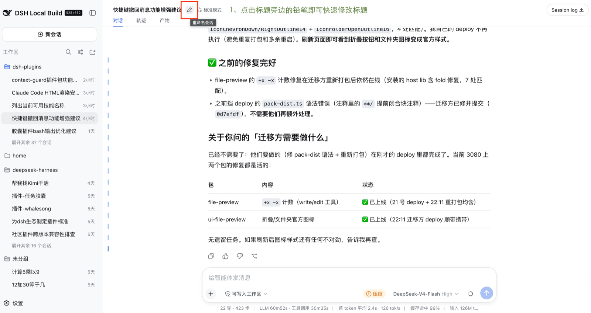

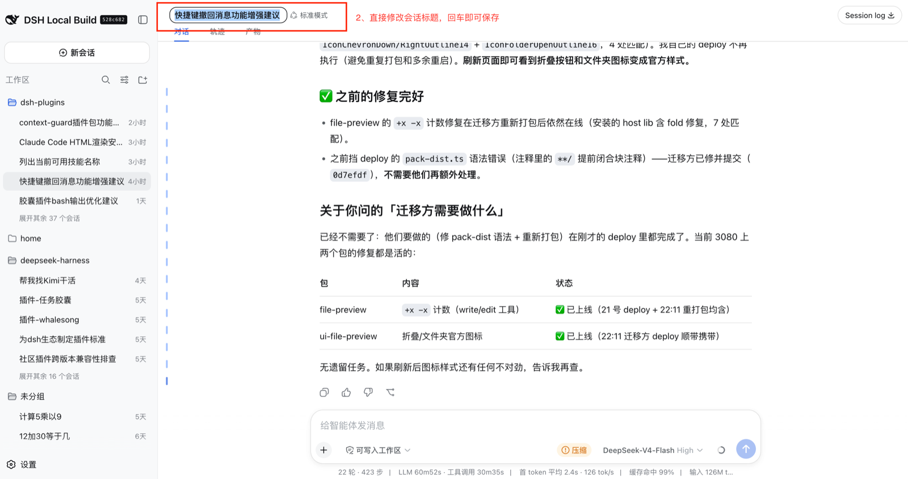

</details>

### quote：引用任意内容

| 宿主版本 | 安装规格（复制到对话框） |
|---|---|
| ≥ `0.1.5-rc.1` | `@khorsheed/dsh-quote@^0.1.2` |
| 更早 | 无可用版本 |

选中任意文本浮出动作菜单——引用到当前会话（进输入框）、引用到侧边对话、复制；其他插件还可以往这个菜单里注册自己的动作行。

<details open>
<summary>功能示意（2 张）</summary>

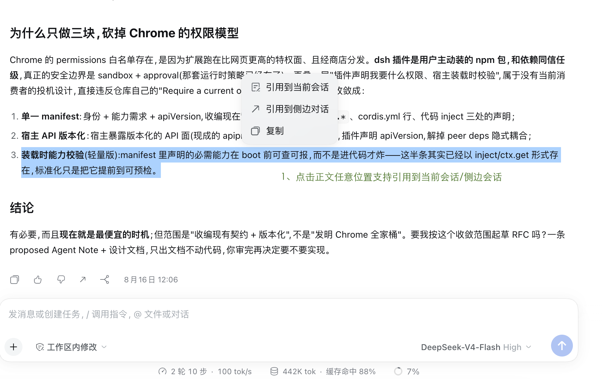

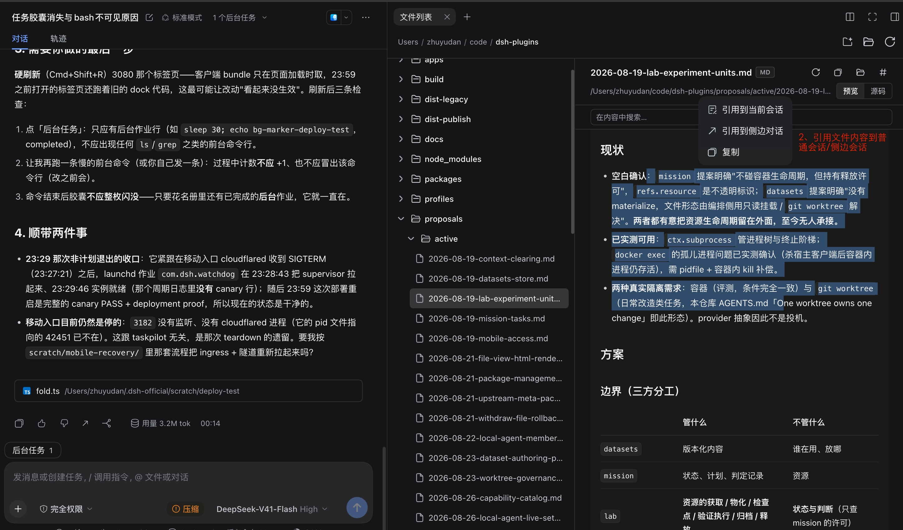

</details>

### file-preview：会话产物预览

| 宿主版本 | 安装规格（复制到对话框） |
|---|---|
| ≥ `0.1.5-rc.1` | `@khorsheed/dsh-file-preview@^0.4.1`（0.4.0 起宿主服务与界面同包，一个规格即是全部） |
| `0.1.2` ~ `0.1.4` | `@khorsheed/dsh-file-preview@^0.2.0` + `@khorsheed/dsh-client-ui-file-preview@^0.2.0`（旧线仍是宿主/界面两包成对） |
| `0.1.x` | `@khorsheed/dsh-file-preview@^0.1.0` + `@khorsheed/dsh-client-ui-file-preview@^0.1.0` |

「会话产物」 列出会话写入/编辑过的每个文件（按最近活动倒序），这对写作场景的帮助会比较大。选中即在页面内预览当前内容；改动记录逐条步进每次 write/edit 的 diff，带内容搜索。

<details open>
<summary>功能示意（5 张）</summary>

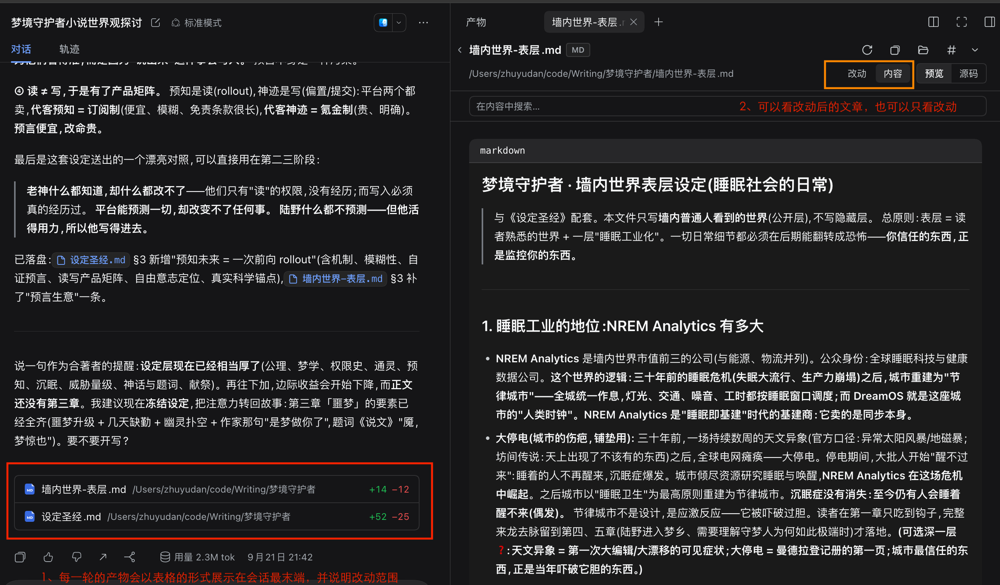

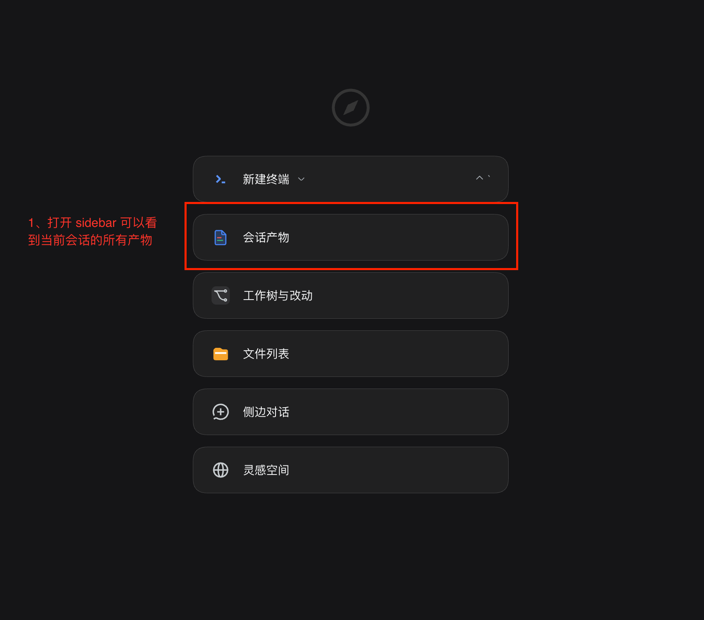

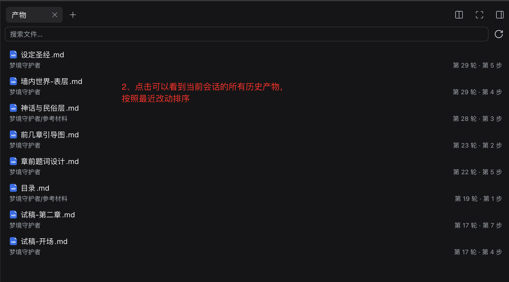

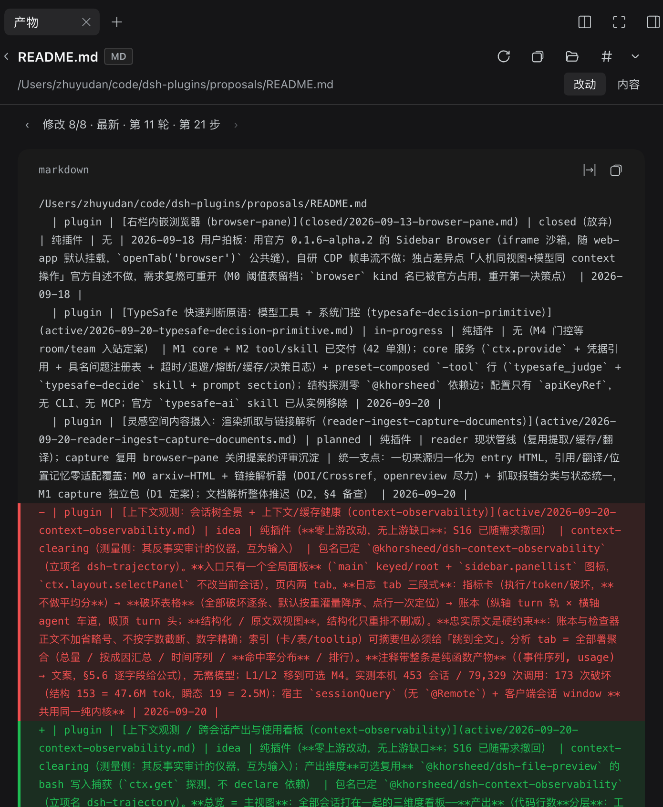

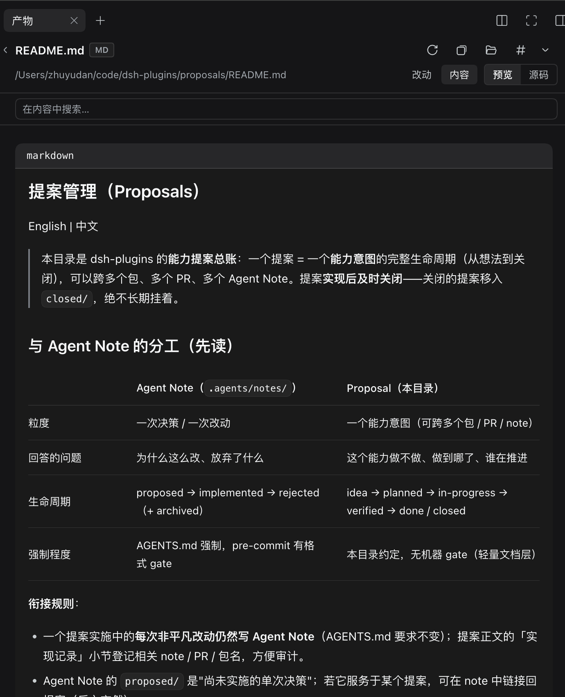

</details>

### local-files：本地文件浏览器

| 宿主版本 | 安装规格（复制到对话框） |
|---|---|
| ≥ `0.1.5-rc.1` | `@khorsheed/dsh-local-files@^0.1.2` |
| 更早 | 无可用版本 |

工作区之外的本地目录，也能在右栏随手翻：懒加载文件树配结构化预览（HTML/Markdown/JSON/CSV 渲染、图片内联），git 无关，默认落在当前会话的工作区但不锁死。它接管官方「文件」页签——guide 页只出现一张文件卡片，卸载后官方卡片自动恢复。（细分：local-files 是「任意本地目录浏览」，file-preview 是「当前会话产物」，语义不同、各司其职。）

<details open>
<summary>功能示意（2 张）</summary>

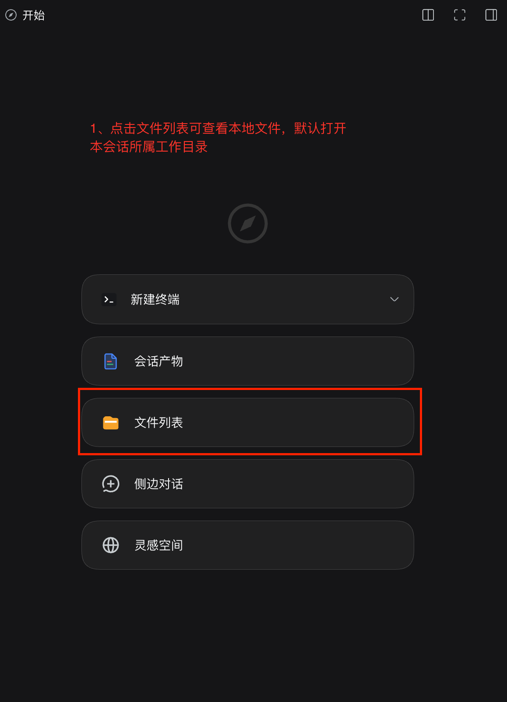

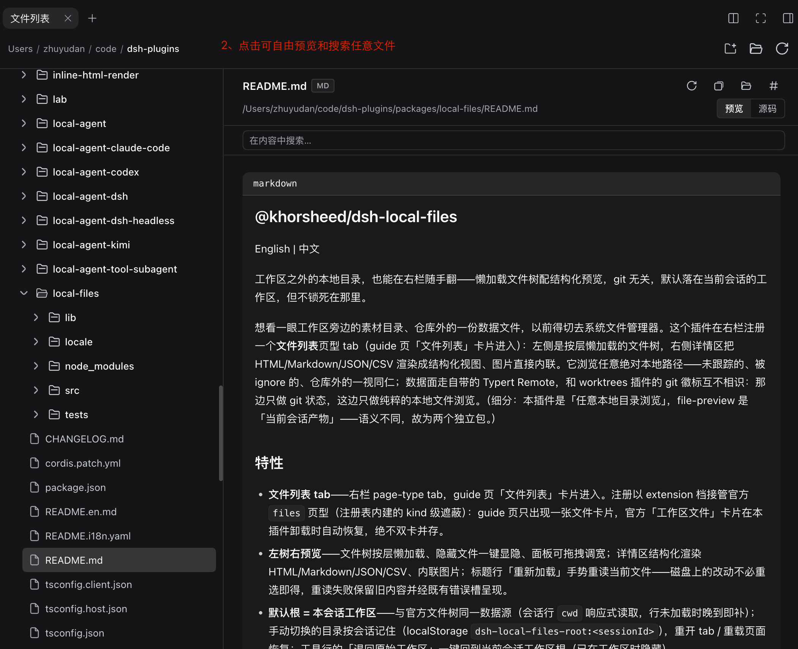

</details>

### taskpilot：后台任务与子 agent 胶囊

| 宿主版本 | 安装规格（复制到对话框） |
|---|---|
| ≥ `0.1.5-rc.1` | `@khorsheed/dsh-taskpilot@^0.3.4` |
| `0.1.2` ~ `0.1.4` | `@khorsheed/dsh-taskpilot@^0.2.0` |
| `0.1.x` | `@khorsheed/dsh-taskpilot@^0.1.0` |

聊天框上方两枚胶囊——「后台任务」和「子 agent」——各自独立显隐。运行中的任务每秒计时、带停止按钮；子 agent 展示完整谱系与 token 消耗、可中断；点击行打开详情抽屉，回放执行轨迹。数据全部来自产品已有镜像，对模型零影响。

<details open>
<summary>功能示意（2 张）</summary>


</details>

### context-guard：上下文压缩提醒

| 宿主版本 | 安装规格（复制到对话框） |
|---|---|
| ≥ `0.1.2-rc.1` | `@khorsheed/dsh-context-guard@^0.2.4` |
| `0.1.x` | `@khorsheed/dsh-context-guard@^0.1.0` |

上下文占用越过你配置的比例时，输入框工具栏自动出现压缩按钮，点击执行官方 /compact——在溢出拒绝请求之前提醒。提醒比例可在设置里按偏好调整（0.01–1），想早提醒就调低。

<details open>
<summary>功能示意（2 张）</summary>


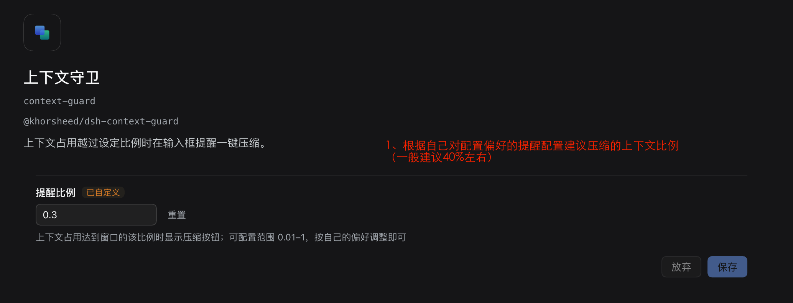


</details>

### inline-html-render：内联 HTML 卡片

| 宿主版本 | 安装规格（复制到对话框） |
|---|---|
| ≥ `0.1.2-rc.1` | `@khorsheed/dsh-inline-html-render@^0.1.15` |
| 更早 | 无可用版本 |

agent 在回复里写的 ```` ```dsh-card ```` HTML 块，渲染成会话内的沙箱交互卡片——图表、小工具、可视化结果直接可玩，不必复制到别处打开。沙箱隔离，`prefers-reduced-motion` 下动画自动收敛。

<details open>
<summary>功能示意（2 张）</summary>

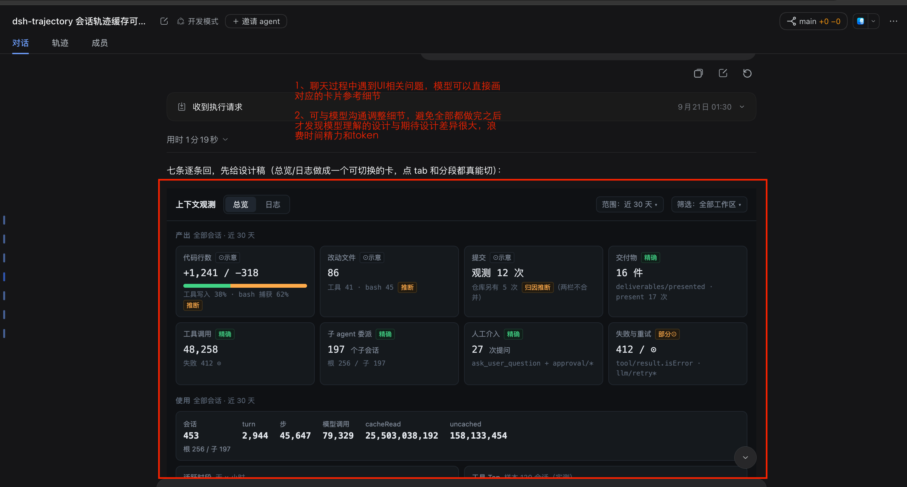

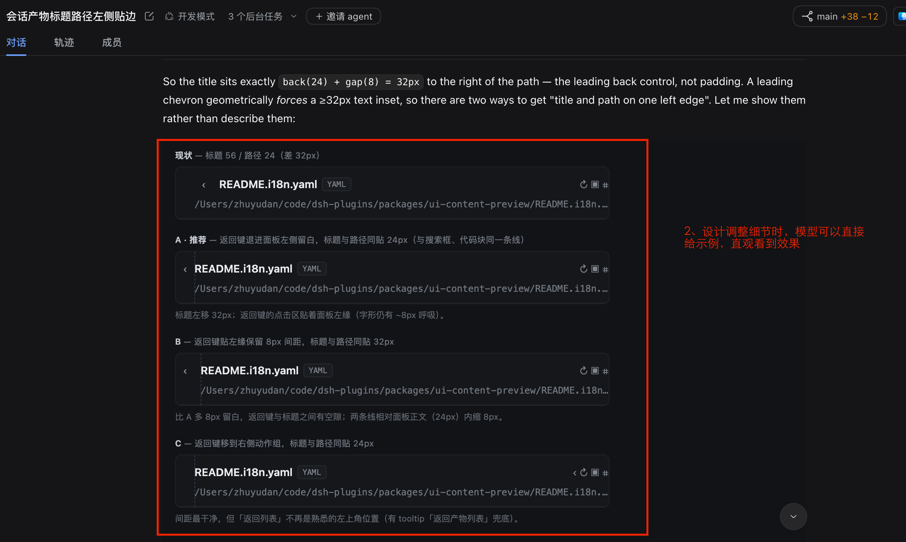

</details>

### capability-catalog：能力目录

| 宿主版本 | 安装规格（复制到对话框） |
|---|---|
| ≥ `0.1.5-rc.1` | `@khorsheed/dsh-capability-catalog@^0.1.97` |
| 更早 | 无可用版本 |

设置页新增「工具与技能」入口：枚举运行实例里的全部 skill 与工具，每一行标注注册渠道（官方内置 / 项目 / 用户 / 插件）；三列卡片预览，点开看 SKILL.md 全文、元数据与凭据配置；还能从上传的 zip 或粘贴的 SKILL.md 直接安装新 skill。

<details open>
<summary>功能示意（3 张）</summary>


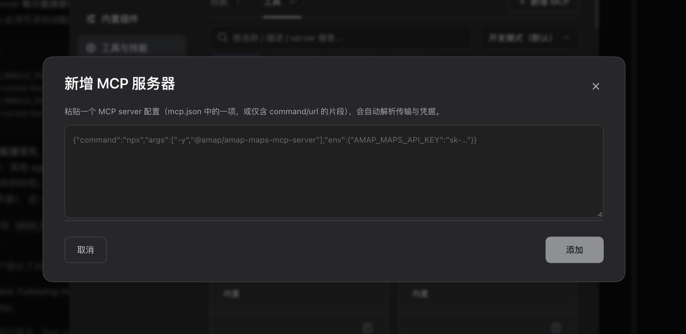

</details>

### ui-shortcuts：可自定义键位的快捷键

0.1.7-rc.2之后，官方支持自己的快捷键设置，可直接使用官方能力。

| 宿主版本 | 安装规格（复制到对话框） |
|---|---|
| ≥ `0.1.2-rc.1` | `@khorsheed/dsh-ui-shortcuts@^0.2.4` |
| `0.1.x` | `@khorsheed/dsh-ui-shortcuts@^0.1.0` |

Esc 暂停当前任务、Ctrl/Cmd+S 插队发送草稿、Ctrl/Cmd+O 新建会话。设置里点击键帽即可改键，偏好持久保存。还附带一个动作注册表：任何插件都能注册自己的键盘动作，免费获得设置项与无冲突分发。


<details open>
<summary>功能示意（1 张）</summary>

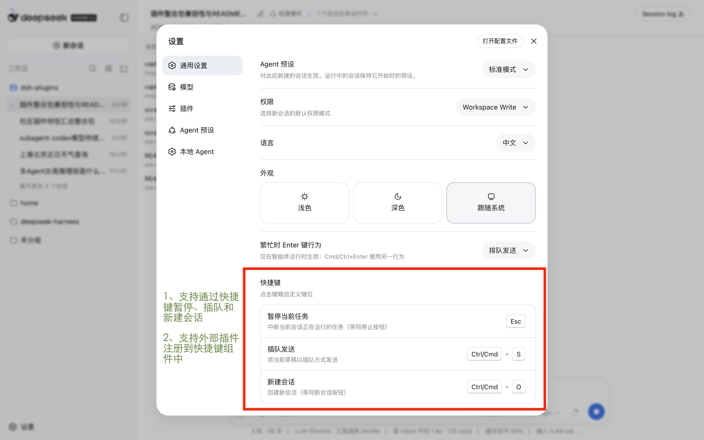

</details>

### whalesong：任务状态氛围

| 宿主版本 | 安装规格（复制到对话框） |
|---|---|
| ≥ `0.1.2-rc.1` | `@khorsheed/dsh-whalesong@^0.2.4` |
| `0.1.x` | `@khorsheed/dsh-whalesong@^0.1.0` |

只要有会话在跑，侧边栏的鲸鱼就喷水、标签页图标跟着动；任务完成或卡住等你时，播一小段提示音（WebAudio 合成，`prefers-reduced-motion` 下自动静音）。

<details open>
<summary>功能示意（2 张）</summary>


</details>

### mobile：移动端

| 宿主版本 | 安装规格（复制到对话框） |
|---|---|
| ≥ `0.1.5-rc.1` | `@khorsheed/dsh-mobile@^0.1.3` |
| 更早 | 无可用版本 |

手机浏览器上的移动版界面适配，外加 iOS 桥——出门在外也能看会话、布置任务、处理审批。

<details open>
<summary>功能示意（2 张）</summary>


</details>

### ankh-guard：运维守护

| 宿主版本 | 安装规格（复制到对话框） |
|---|---|
| ≥ `0.1.5-rc.1` | `@khorsheed/dsh-ankh-guard@^0.4.1` |
| `0.1.2` ~ `0.1.4` | `@khorsheed/dsh-ankh-guard@^0.2.0` |
| `0.1.x` | `@khorsheed/dsh-ankh-guard@^0.1.0` |

让 agent 自己改代码、自己重启，还不把服务搞挂：重启前先验证构建与测试（凭证绑定 git HEAD、限时有效），验证不过就拦下；重启后金丝雀自动激活会话继续验证；连续起不来自动回滚到已知良好版本。自托管、让 AI 自主干活的场景必备。

<details open>
<summary>功能示意（1 张）</summary>

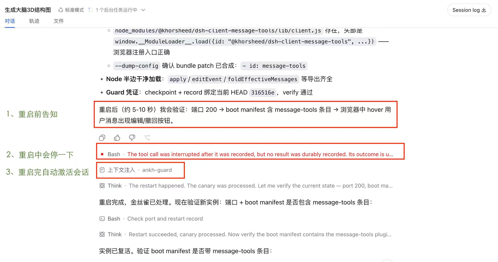

</details>

### 打包装：bundle-conversation-toolbox（会话工具七件套）

| 宿主版本 | 安装规格（复制到对话框） |
|---|---|
| ≥ `0.1.5-rc.1` | `@khorsheed/dsh-bundle-conversation-toolbox@^0.1.2` |
| 更早 | 无可用版本（成员可按上表逐线单装） |

不想逐个挑？这一个元包把会话工具七件套一次装齐：message-tools、message-timeline、session-title-edit、quote、inline-html-render、context-guard、taskpilot。成员作为 npm 依赖自动带入，元包的 patch 逐字重挂各成员的标准行；装完后每个组件在 设置 → 插件 里仍可单独禁用——打包的是安装，不是绑定。

<details open>
<summary>功能示意（1 张）</summary>

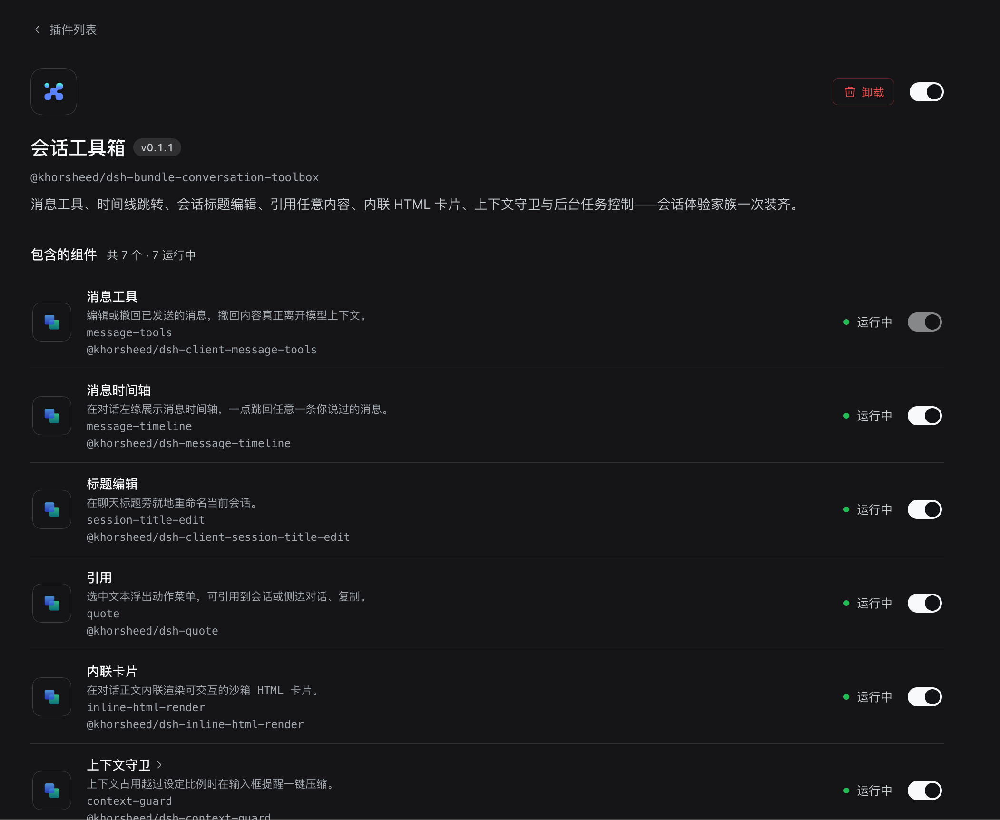

</details>

## 按你的方式调整

- **去掉某个成员**：在 设置 → 插件 里禁用/卸载，或 `dsh plugin --profile <你的 profile> remove <包名>`——其余照常工作。整合包是起点，不是绑定
- **加装**：任何 `@khorsheed/dsh-*` 插件同样复制包名安装
- **更新**：设置 → 插件 里操作，或 `dsh plugin --profile <你的 profile> update` 拉取范围内最新版本

## 其他整合包

| 整合包 | 定位 |
|---|---|
| [dsh-dev](https://github.com/Khorsheed/dsh-dev) | 开发模式：方便开发场景的插件 |
| [dsh-plugins](https://github.com/Khorsheed/dsh-plugins) | 插件 monorepo 主仓：全部插件的能力地图、preset 设计与开发文档 |

## 变更记录

见 [CHANGELOG.md](CHANGELOG.md)。

## 开发

插件源码在 [Khorsheed/dsh-plugins](https://github.com/Khorsheed/dsh-plugins)（唯一事实源）。本仓只有 profile 模板与文档，不含插件代码。欢迎 issue。

## 给 Agent 的安装指南

<details>
<summary><strong>展开：整合包整体安装 + 单包命令行安装</strong>（用户说"帮我装一下"时照此执行）</summary>

### 一、整体安装整合包

整合包整体安装要求宿主 ≥ `0.1.5-rc.1`（capability-catalog、mobile、quote、local-files 与五个成员的最新线都以它为地板）；`0.1.2` 线宿主请停留在 2026-09-27 更名前的档案（`host-0.1.2-line` tag 随下一发布波提供），`0.1.0` / `0.1.1` 宿主用 `host-0.1.1-line` tag 的档案。

**〇、先按宿主版本选线（跳过这步可能装出打不开的插件）**

```sh
dsh --version    # 或从运行中实例的启动命令/进程信息里确认宿主版本
```

- 宿主是 `0.1.5` 或更新（含各 rc）→ 用主线（clone 默认分支即可）。
- 宿主是 `0.1.2-rc.*` ~ `0.1.4` → 停留在旧档案（`host-0.1.2-line` tag）。
- 宿主是 `0.1.0-rc.*` / `0.1.1-rc.*` → 用旧线：clone 后 `git -C /tmp/dsh-basic checkout host-0.1.1-line`，成员插件停在 0.1.x（功能不再更新）。

**一、安装与离线自检（不碰运行中的实例）**

```sh
git clone https://github.com/Khorsheed/dsh-basic.git /tmp/dsh-basic
sh /tmp/dsh-basic/scripts/install.sh
```

install.sh 末尾会打印组合的行数。如需手动复核：`dsh --profile basic --dump-config | grep -c "@khorsheed"` 应为 14（ankh-guard / capability-catalog / context-guard / file-preview / inline-html-render / local-files / message-timeline / message-tools / mobile / quote / session-title-edit / taskpilot / ui-shortcuts / whalesong）。`dsh` 不在 PATH 时用它的完整路径（可用 `ps` 查当前实例的启动命令获得）。

**二、同端口交接（关键一步）**

```sh
sh /tmp/dsh-basic/scripts/restart-into-basic.sh [端口，默认 3080]
```

脚本走整合包自带的 ankh-guard 守卫通道：环境探针 → 记录凭证 → 接管当前实例 → watchdog 停旧启新 + canary 验证。**你会随宿主实例一起断开，这是预期**——watchdog 会在原端口拉起 basic；脚本刻意不传 `--initiator`，守卫会从你的环境读取 `$DSH_SESSION_ID`，重启报告才能寻址到你的会话：用户重新打开这个会话时，你会收到「重启完成」的 followup 并继续。注意：中断回合的快照续跑依赖旧实例里已挂载 guard（首次交接不具备），从第二次重启起才完整。

两个前置，缺一会被脚本拒绝并给出原因：

- **会话权限**：如果你运行在沙箱会话里（工作区外写入受限），分离的 watchdog 会在回合结束时被回收——脚本会提前拒绝。请用户切到完全权限模式再跑（或直接给用户这条命令让 TA 在终端跑）。
- **不要在沙箱里用 `nohup ... &` 或手写 `kill` + 重启代替**：沙箱按进程树回收，nohup 防不住；手写顺序错了实例永远回不来。

**三、交付**

`curl -s -o /dev/null -w '%{http_code}' http://127.0.0.1:<端口>/` 为 200 后，让用户**硬刷**页面（Cmd/Ctrl+Shift+R)——产物 tab、任务胶囊等新的 client bundle 要强刷才会加载，普通刷新可能继续跑缓存的旧壳。然后呈上功能清单（即 README「插件列表」一表）。已知边界：纯净 npm 部署里 ankh-guard 的组合 preflight 门禁为降级运行（提示后放行），其余能力完整。

### 二、安装单个插件

- **对话框（0.1.7-rc.2 起，推荐）**：设置 → 插件 → 添加插件，填包名（如 `@khorsheed/dsh-whalesong`），按提示启用。旧宿主记得带版本线后缀（见上文「版本兼容」）；`0.2.0-rc.*` 宿主在发版当天也要带（下限见各表）。
- **命令行**：`dsh plugin --profile <profile> add <包名>`；卸载 `remove`，更新 `update`。
- **打包装**：常用会话插件七件套用元包 `dsh plugin --profile <profile> add @khorsheed/dsh-bundle-conversation-toolbox` 一次装齐，成员行仍可在 设置 → 插件 里单独禁用。

</details>
