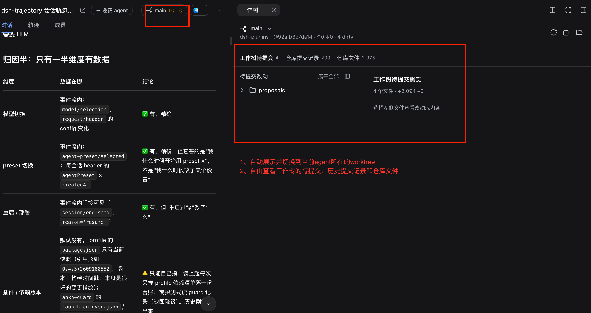
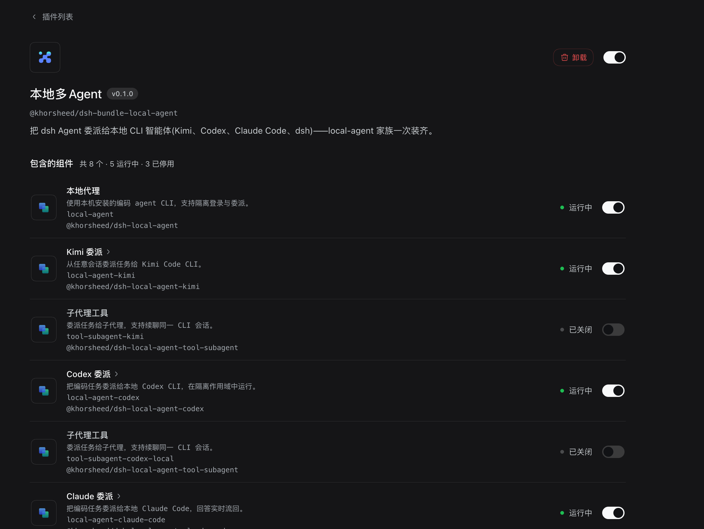

# dsh-dev

[中文](README.md) | English

**Direct a team of agents to write code, and see exactly what they changed.** Delegate tasks to the coding agents installed on your machine — Kimi Code, Codex, Claude Code, or dsh itself — each with its own context and accounting; which branch a change landed on, which files moved, what each commit did, all visible inside the session; and several agents can collaborate in one conversation. The full baseline experience (message editing, artifact preview, task capsules) is included.

Every member is an independent plugin — copy its package name into the host's "Add plugin" dialog (0.1.7-rc.2+: Settings → Plugins) and install freely. If the official host later opens up custom-profile installation, this repo will support one-command install. The local-agent family also comes as a meta package — `@khorsheed/dsh-bundle-local-agent` installs it all at once (see the end of [Features](#features)).


## The dsh-dev pack — plugin list

Thirteen members are shared with [dsh-basic](https://github.com/Khorsheed/dsh-basic) (message edit/withdraw, timeline, title editing, quote, artifact preview, task pills, compaction reminder, inline cards, capability catalog, shortcuts, ambience, mobile, ops guard) — see basic's plugin list for their intros and screenshots. The 9 unique to this pack:

| Plugin | Package name (copy to install) | What you get |
|---|---|---|
| local-agent | `@khorsheed/dsh-local-agent` | The local coding-agent family core: scoped homes, login/session command family, delegation registry |
| local-agent-kimi | `@khorsheed/dsh-local-agent-kimi` | Kimi Code delegation (`kimi -p`), resume, accounting |
| local-agent-codex | `@khorsheed/dsh-local-agent-codex` | Codex delegation (`codex exec`), resume, accounting |
| local-agent-claude-code | `@khorsheed/dsh-local-agent-claude-code` | Claude Code delegation (`claude -p`), resume, accounting |
| local-agent-dsh | `@khorsheed/dsh-local-agent-dsh` | dsh self-delegation: use dsh itself as a local CLI |
| local-agent-tool-subagent | `@khorsheed/dsh-local-agent-tool-subagent` | The family's shared delegation tool row with a `resume` parameter (mounted by providers) |
| worktrees | `@khorsheed/dsh-worktrees` | A per-session repo/worktree badge plus a change drawer (read-only git facts); the model tool ships as the package's `@khorsheed/dsh-worktrees/tool` subpath row, granted per session by the dev-mode preset |
| room | `@khorsheed/dsh-room` | Multi-agent collaboration in one session: member roster, @ dispatch, task board; the model tools `room_invite / room_task / room_message` ride the package's `./tool` subpath row, granted per session by the dev-mode preset |
| local-files | `@khorsheed/dsh-local-files` | A local file browser in the right sidebar: lazy tree plus structured previews |

### Version compatibility

The whole pack requires host ≥ `0.1.5-rc.1` (the floor of most members; six of the members shared with basic floor lower and install individually on the 0.1.2 line too). The local-agent family publishes as `0.1.0-rc` prereleases — a bare package name in the dialog resolves to the latest. The per-member per-host-line matrix lives in [dsh-plugins' release status](https://github.com/Khorsheed/dsh-plugins/blob/main/docs/release-status.md).

## Features

### Local agent family (6 packages): delegate to other coding agents

| How | Install spec (copy into the dialog) |
|---|---|
| The whole family at once (recommended) | `@khorsheed/dsh-bundle-local-agent` |
| Individually: core + any provider | `@khorsheed/dsh-local-agent` + `@khorsheed/dsh-local-agent-kimi` (or `-codex` / `-claude-code` / `-dsh`) |

Delegate subtasks to the coding agent CLIs on your machine — Kimi Code, Codex, Claude Code, and dsh itself. Each harness runs under its own scoped home (`$DSH_HOME/local-agent/<name>`, mode 0700), and **never touches the private configuration and credentials in your user directory**.

- **Separate context and accounting**: a child session's tokens and KV cache never enter the parent; every delegation is accounted from real usage.
- **Resume across turns**: pass the child session id back to continue inside the same CLI session.
- **Live mode**: output streams into the member session, cancelling does not kill the process, and a crash resumes the session.
- **Two-way member channel**: open a member's sub-session to continue it directly; members can also notify each other.


### worktrees (1 package): live git state

| Host version | Install spec (copy into the dialog) |
|---|---|
| ≥ `0.1.5-rc.1` | `@khorsheed/dsh-worktrees` (the model tool row is the package's `./tool` subpath entry, activated by the dev-mode preset — no separate install needed) |

A repo/worktree badge sits at the top right of every session, showing the current repository, branch, and combined diff size (green = clean, yellow = dirty). Opening it reveals the change drawer: uncommitted and committed file trees with diffs, an IDE-style commit log, and full repository file browsing. It displays git facts read-only and never writes to the repository.



### room (1 package): several agents inside one session

| Host version | Install spec (copy into the dialog) |
|---|---|
| ≥ `0.1.5-rc.1` | `@khorsheed/dsh-room` (the model tool row is the package's `./tool` subpath entry, activated by the dev-mode preset — no separate install needed) |

Invite an agent into any session and that session becomes a room: member tab, @-dispatch, multi-member capsules, a task board, and a notification gate. Members can summon each other, and progress stays visible on one conversation thread.


### Bundle install: bundle-local-agent (the local multi-agent family in one shot)

| Host version | Install spec (copy into the dialog) |
|---|---|
| ≥ `0.1.5-rc.1` | `@khorsheed/dsh-bundle-local-agent` |

One meta package installs the local-agent core plus all four providers (kimi / codex / claude-code / dsh): members arrive as npm dependencies and the bundle's patch re-mounts each member's canonical rows verbatim; afterwards every component stays individually disable-able under Settings → Plugins — the bundle packages the install, not your choices.

<details>
<summary>View the screenshots (1)</summary>



</details>

## Bundled agent preset: the dev mode (dev)

The pack ships a **dev mode** preset (`presets/dev`, built on the official Standard composition): it adds the three local-agent delegation tools (`subagent_kimi` / `subagent_codex` / `subagent_claude_code`), the worktrees model tool, and the room tool trio (`room_invite` / `room_task` / `room_message`), all **granted per session** — the tool rows live in this preset's composition only, never at the profile root. `install.sh` / `update.sh` drops it into `$DSH_HOME/.agent-presets/dev` (replaced whole — it is pack apparatus, not preference; a same-id preset of yours would be overwritten, so author your own under a different id). Pick the dev preset in the preset chip when creating a session; the default preset stays Standard — change it under **Settings → Agent presets** (the patch layer is yours, the pack pins nothing). The mission / datasets / eval companion tool rows are **deliberately absent here**: the three cores are not members of this pack (unpublished incubation) and a companion imports its core's `./tool` factory at runtime, so a missing row would mark the whole dev preset `broken` — they join once they are published and listed in `profiles/dev/package.json` (see CHANGELOG).

## Custom agent presets

This profile runs the official Standard preset. To build your own: **Settings → Agent presets** → copy a built-in preset and edit it, or use "create with Creation mode" at the bottom to have an agent build it with you. Your presets live in `$DSH_HOME/.agent-presets/` and are unaffected by updates to this profile.

## Update

When the member list changes, pull and run the updater:

```sh
cd dsh-dev && git pull
sh scripts/update.sh
sh scripts/restart-into-dev.sh
```

`update.sh` overwrites `package.json` and the lockfile only — it **never touches your `cordis.patch.yml`**, which is your layer.

## Switching modes

```sh
sh scripts/restart-into-dev.sh          # switch to this profile, port 3080 by default
sh scripts/restart-into-dev.sh 3090     # pick a port
```

To switch to another profile, run the matching script in its own repo. The switch is a same-port handover: refresh the original address.

Installing several profiles: clone each and run its own `install.sh` — they do not interfere; **switch on the same port with each pack's restart script**, so there is no port to remember. With several installed, a membership update runs `update.sh` once per profile.

Sessions live in `$DSH_HOME/sessions/`, and credentials and shortcuts live under `$DSH_HOME` — **all shared across profiles**: log into Kimi under one and the next already has it.

> Running two instances over one `$DSH_HOME` is not recommended: they share session data and there is no cross-process write protection. Give a long-lived isolated instance (an evaluation one, say) its own `$DSH_HOME`.

## Other packs

| Pack | What it is |
|---|---|
| [dsh-basic](https://github.com/Khorsheed/dsh-basic) | Everyday mode: the baseline experience only, without the development capabilities |
| [dsh-plugins](https://github.com/Khorsheed/dsh-plugins) | The plugin monorepo: the capability map of every package, the preset designs, and the development docs |

## Changelog

See [CHANGELOG.md](CHANGELOG.md).

## Removing the whole profile

```sh
rm -rf "$DSH_HOME/profiles/dev"
```

Session data lives in `$DSH_HOME/sessions/` and does not go with the profile.

## Install guide for agents

<details>
<summary><strong>Expand: whole-pack install + single-package CLI install</strong> (follow this when the user says "install this for me"; users without an agent can run the same commands by hand)</summary>

### 1. Installing the whole pack

A whole-pack install requires host ≥ `0.1.5-rc.1`.

**1. Install and self-check offline (leaves the running instance alone)**

```sh
git clone https://github.com/Khorsheed/dsh-dev.git /tmp/dsh-dev
sh /tmp/dsh-dev/scripts/install.sh
```

`install.sh` prints the composed row count. To verify by hand: `dsh --profile dev --dump-config | grep -c "@khorsheed"` should be 23 (the member list is in the plugin list above). When `dsh` is not on PATH, use its full path (readable from the running instance's launch command via `ps`).

**2. Same-port handover (the critical step)**

```sh
sh /tmp/dsh-dev/scripts/restart-into-dev.sh [port, default 3080]
```

The script goes through the ankh-guard path: environment probe → credential record → preflight → watchdog stop-and-start with canary verification. **You will disconnect along with the host instance — this is expected.** The watchdog brings dev up on the original port. The script deliberately omits `--initiator`: the guard reads `$DSH_SESSION_ID` from your environment so the restart report can address your session, and you receive the "restart complete" followup when the user reopens it.

**3. Tell the user to hard-refresh**

The client bundles changed, so the browser needs Cmd/Ctrl+Shift+R.

### 2. Installing a single plugin

- **Dialog (0.1.7-rc.2+, recommended)**: Settings → Plugins → Add plugin, enter the package name, enable as prompted.
- **CLI**: `dsh plugin --profile <profile> add <package name>`; `remove` to uninstall, `update` to upgrade.
- **Bundle install**: the local-agent family installs in one shot via the meta package — `dsh plugin --profile <profile> add @khorsheed/dsh-bundle-local-agent`; member rows stay individually disable-able under Settings → Plugins.

</details>
