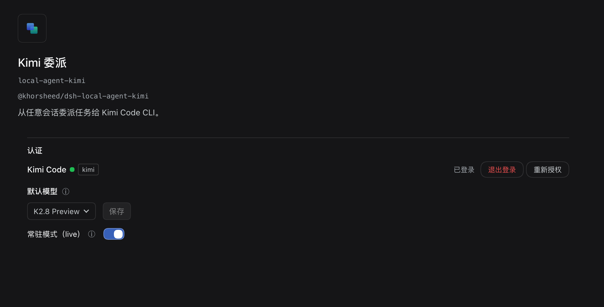
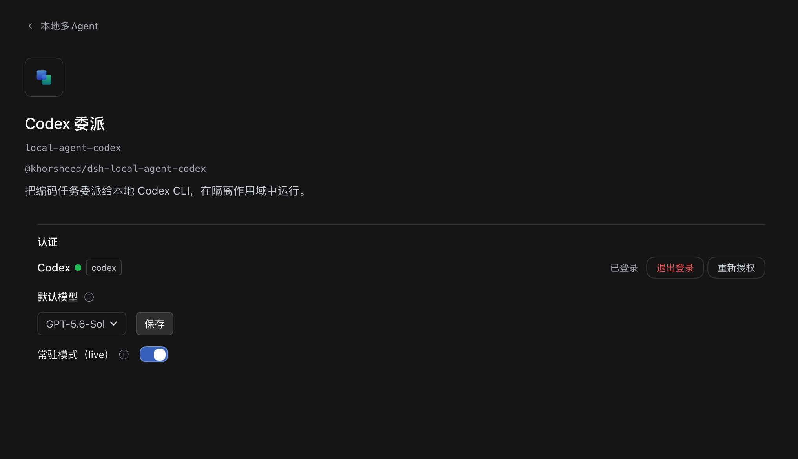
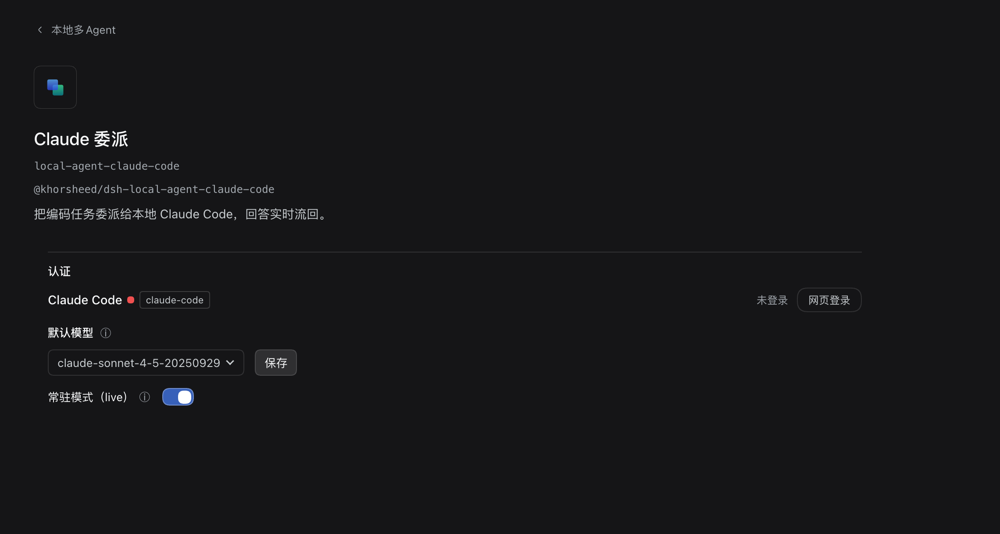

# dsh-dev

中文 | [English](README.en.md)

**调度一组 agent 写代码，并看清他们改了什么。** 把任务派给你本机装的 Kimi Code、Codex、Claude Code 或 dsh 自己，各自独立上下文与记账；改动落在哪个分支、动了哪些文件、每次提交做了什么，都在会话里一眼可见；多个 agent 可以在同一个会话里协作。

每个成员都是独立插件，复制包名到宿主的「添加插件」对话框（0.1.7-rc.2 起：设置 → 插件）即可自由安装；后续如果官方开放自定义 profile 安装，本仓库会支持一行命令直接安装。本地 Agent 家族也可以装元包 `@khorsheed/dsh-bundle-local-agent` 一次装齐（见[功能展示](#功能展示)末尾）。


## dev 整合包 - 插件列表

本整合包包含开发模式单独的 8 个插件（见下表）。除此之外，也推荐安装 [dsh-basic](https://github.com/Khorsheed/dsh-basic) 的基础体验优化插件（消息编辑/撤回、时间轴、标题编辑、引用、产物预览、本地文件浏览、任务胶囊、压缩提醒、内联卡片、能力目录、快捷键、提示音、移动端）——复制包名逐个装，或用元包 `@khorsheed/dsh-bundle-conversation-toolbox` 一次装齐常用会话组件；逐插件介绍与截图见 dsh-basic。

| 插件 | 包名（复制即可安装） | 你得到 |
|---|---|---|
| local-agent | `@khorsheed/dsh-local-agent` | 本地编码 agent 家族核心：作用域 home、登录/会话命令族、委派 registry |
| local-agent-kimi | `@khorsheed/dsh-local-agent-kimi` | Kimi Code 委派（`kimi -p`）、续聊、记账 |
| local-agent-codex | `@khorsheed/dsh-local-agent-codex` | Codex 委派（`codex exec`）、续聊、记账 |
| local-agent-claude-code | `@khorsheed/dsh-local-agent-claude-code` | Claude Code 委派（`claude -p`）、续聊、记账 |
| local-agent-dsh | `@khorsheed/dsh-local-agent-dsh` | dsh 自委派：把 dsh 自己当本地 CLI 用 |
| local-agent-tool-subagent | `@khorsheed/dsh-local-agent-tool-subagent` | 家族共享委派工具行（带 `resume` 续聊参数，随 provider 挂载） |
| worktrees | `@khorsheed/dsh-worktrees` | 会话头部 repo/worktree 徽标 + 改动抽屉（只读 git 事实）；模型工具随 `@khorsheed/dsh-worktrees/tool` 子路径行由开发模式 preset 按会话授予 |
| room | `@khorsheed/dsh-room` | 多 agent 同会话协作：成员名册、@ 派发、任务板；模型工具 `room_invite / room_task / room_message` 随包内 `./tool` 子路径行由开发模式 preset 按会话授予 |

### 版本兼容

宿主 ≥ `0.1.5-rc.1`。

**宿主 `0.2.0-rc.*`**：复制下表中带 `@^版本` 下限的规格。发版当天不要裸填包名——pnpm 11 默认启用 24 小时新版保护（`minimumReleaseAge`，供应链安全），裸名会把当天发布的新版藏起来、装到只支持 0.1.x 的旧线，再被宿主的兼容性检查拦下；带下限的规格会自动豁免保护期，装到兼容的新版。

## 功能展示

### 本地 Agent 家族（6 个包）：把任务派给别的编码 agent

| 装法 | 安装规格（复制到对话框） |
|---|---|
| 核心 + Kimi | `@khorsheed/dsh-local-agent@^0.1.0-rc.8` + `@khorsheed/dsh-local-agent-kimi@^0.1.0-rc.8` |
| 核心 + Codex | `@khorsheed/dsh-local-agent@^0.1.0-rc.8` + `@khorsheed/dsh-local-agent-codex@^0.1.0-rc.8` |
| 核心 + Claude Code | `@khorsheed/dsh-local-agent@^0.1.0-rc.8` + `@khorsheed/dsh-local-agent-claude-code@^0.1.0-rc.8` |
| 核心 + dsh | `@khorsheed/dsh-local-agent@^0.1.0-rc.8` + `@khorsheed/dsh-local-agent-dsh@^0.1.0-rc.8` |

把子任务委派给你本机装的编码 Agent CLI——Kimi Code、Codex、Claude Code、以及 dsh 自己。每个 harness 在自己独立的作用域目录下运行（`$DSH_HOME/local-agent/<name>`，0700 权限），**绝不触碰你用户目录里的私人配置与凭据**。

- **独立上下文与记账**：子会话独立 token、独立 KV 缓存，永不进父级；每次委派按真实用量分桶记账。
- **跨轮续聊**：把子会话 id 传回即可在同一个 CLI 会话里继续。
- **常驻模式**：输出实时流入成员会话、取消不杀进程、崩溃自动续会话。
- **成员双向通道**：打开成员子会话即可直接对它续一轮；成员之间也能互相通知。









### worktrees（1 个包）：git 状态实况

| 宿主版本 | 安装规格（复制到对话框） |
|---|---|
| ≥ `0.1.5-rc.1` | `@khorsheed/dsh-worktrees@^0.3.1`（模型工具行是包内 `./tool` 子路径入口，随开发模式 preset 生效，无需单装） |

每个会话右上角一个 repo/worktree 徽标，显示当前仓库、分支与合并 diff 行数（绿 = 无改动，黄 = 有改动）。点开是改动抽屉：未提交/已提交文件树 + diff、IDE 风格提交记录、仓库全量文件浏览。只读展示 git 事实，不写仓库。


### room（1 个包）：多 agent 在同一个会话里协作

| 宿主版本 | 安装规格（复制到对话框） |
|---|---|
| ≥ `0.1.5-rc.1` | `@khorsheed/dsh-room@^0.2.1`（模型工具行是包内 `./tool` 子路径入口，随开发模式 preset 生效，无需单装） |

在任意会话里邀请一个 agent，这个会话就成为 room：成员 tab、@ 分发、多成员胶囊、任务板、通知闸门。成员之间可以互相召唤，进度在同一条会话线上可见。


### 打包装：bundle-local-agent（本地多 Agent 一次装齐）

| 宿主版本 | 安装规格（复制到对话框） |
|---|---|
| ≥ `0.1.5-rc.1` | `@khorsheed/dsh-bundle-local-agent@^0.1.2` |

一个元包装齐 local-agent 核心 + kimi / codex / claude-code / dsh 四个 provider：成员作为 npm 依赖自动带入，元包的 patch 逐字重挂各成员的规范行；装完后每个组件在 设置 → 插件 里仍可单独禁用——打包的是安装，不是绑定。

<details>
<summary>展开查看功能示意（1 张）</summary>


</details>

## 自带 Agent 预设：开发模式（dev）

pack 自带一个**开发模式** preset（`presets/dev`）。它存在的意义是让开发模式的工具与 UI 不污染其它模式：模型工具行只挂在本 preset 的组合里、不进 profile 根；会话绑定的 UI（worktree 徽标、room 成员名册等）跟随 preset 授予显隐——选了这个 preset 的会话才拿得到工具、才看得见入口。于是同一个实例可以在多个模式之间来回切换：写代码的会话选「开发模式」，日常会话留在「标准模式」，互不干扰。

组合以官方「标准模式」逐字重基，只在末尾追加社区工具行：三家 local-agent 委派工具（`subagent_kimi` / `subagent_codex` / `subagent_claude_code`）、worktrees 模型工具与 room 工具三件套（`room_invite` / `room_task` / `room_message`），全部**按会话授予**；伴生 core 缺席时该行 pending，不炸宿主。

| 宿主版本 | 安装规格（复制到对话框） |
|---|---|
| ≥ `0.1.7-rc.2`（推荐） | `@khorsheed/dsh-presets@^0.2.0` |
| `0.1.5-rc.1` ~ `0.1.7-rc.1` | 随整合包脚本以目录式安装（见文末指南） |

0.1.7-rc.2 起官方支持 preset as a bundle——preset 像普通插件一样打包成包，复制包名即可安装，不再需要手动放置目录；建议升级到该版本，装起来更丝滑。安装后开发模式的 UI 与工具仅在开发模式会话生效，不干扰其它模式。

## 其他整合包

| 整合包 | 定位 |
|---|---|
| [dsh-basic](https://github.com/Khorsheed/dsh-basic) | 日常模式：只含基础体验，不带开发能力 |
| [dsh-plugins](https://github.com/Khorsheed/dsh-plugins) | 插件 monorepo 主仓：全部插件的能力地图、preset 设计与开发文档 |

## 变更记录

见 [CHANGELOG.md](CHANGELOG.md)。

## 给 Agent 的安装指南

<details>
<summary><strong>展开：整合包整体安装 + 单包命令行安装</strong>（用户说"帮我装一下"时照此执行）</summary>

### 一、整体安装整合包

整合包整体安装要求宿主 ≥ `0.1.5-rc.1`。

**一、安装与离线自检（不碰运行中的实例）**

```sh
git clone https://github.com/Khorsheed/dsh-dev.git /tmp/dsh-dev
sh /tmp/dsh-dev/scripts/install.sh
```

`install.sh` 末尾会打印组合的行数，可与脚本输出对照复核（成员清单见上方「插件列表」）。`dsh` 不在 PATH 时用它的完整路径（可用 `ps` 查当前实例的启动命令获得）。

**二、同端口交接（关键一步）**

```sh
sh /tmp/dsh-dev/scripts/restart-into-dev.sh [端口，默认 3080]
```

脚本走 ankh-guard 守卫通道：环境探针 → 记录凭证 → preflight → watchdog 停旧启新 + canary 验证。**你会随宿主实例一起断开，这是预期**——watchdog 会在原端口拉起 dev；脚本刻意不传 `--initiator`，守卫会从你的环境读取 `$DSH_SESSION_ID`，重启报告才能寻址到你的会话：用户重新打开这个会话时，你会收到「重启完成」的 followup 并继续。

**三、告诉用户硬刷页面**

客户端 bundle 变了，浏览器需要 Cmd/Ctrl+Shift+R 强制刷新。

### 二、安装单个插件

- **对话框（0.1.7-rc.2 起，推荐）**：设置 → 插件 → 添加插件，填包名，按提示启用。
- **命令行**：`dsh plugin --profile <profile> add <包名>`；卸载 `remove`，更新 `update`。
- **打包装**：本地 Agent 家族用元包 `dsh plugin --profile <profile> add @khorsheed/dsh-bundle-local-agent` 一次装齐，成员行仍可在 设置 → 插件 里单独禁用。

</details>
