# dsh-web-basic

[中文](README.md) | English

**A set of everyday, high-frequency experience plugins that make the dsh web GUI feel finished.** Edit or withdraw sent messages, jump through long conversations, preview every file the agent touched, watch background jobs at a glance, get nudged before context runs out — the quality-of-life layer most users reach for first, installed in one go.


Don't want the whole pack? Every member below is an independent plugin — copy its package name into the host's "Add plugin" dialog (0.1.7-rc.2+: Settings → Plugins) to install it alone. The pack just installs them all for you at once.

## Why this pack exists

- **Only everyday, high-frequency experience plugins**: message control, history jumping, artifact preview, task status, context reminder, shortcuts… None of them touches model behavior or adds learning cost.
- **Built for ourselves, open to the community**: our own production instance runs the full stack long-term. Every member is published and removable independently — the pack is a starting point, not a lock-in.
- **The endgame is being replaced by the official product**: most of these capabilities are gaps the official GUI will close sooner or later. The day a feature lands natively is the day the corresponding member retires — until then, you don't have to wait.

## What's inside

| Plugin | Package name (copy to install) | What you get |
|---|---|---|
| message-tools | `@khorsheed/dsh-client-message-tools` | Edit, withdraw, and restore messages you already sent |
| message-timeline | `@khorsheed/dsh-message-timeline` | A quiet timeline on the chat's left edge — hover to expand, click to jump |
| session-title-edit | `@khorsheed/dsh-client-session-title-edit` | Rename sessions inline in the chat header |
| file-preview | `@khorsheed/dsh-file-preview` | The host-side file-preview service (pairs with the next row) |
| ui-file-preview | `@khorsheed/dsh-client-ui-file-preview` | A Produced tab: preview every file the session touched, no IDE needed |
| taskpilot | `@khorsheed/dsh-taskpilot` | Background jobs and sub-agents become pills above the composer — stop/interrupt in one click |
| context-guard | `@khorsheed/dsh-context-guard` | A compact button shows up before context overflow starts rejecting requests |
| inline-html-render | `@khorsheed/dsh-inline-html-render` | Agent-written HTML becomes sandboxed interactive cards in the conversation |
| capability-catalog | `@khorsheed/dsh-capability-catalog` | A settings page enumerating every skill and tool in the instance, with add-a-skill built in |
| ui-shortcuts | `@khorsheed/dsh-ui-shortcuts` | Esc to pause, Ctrl/Cmd+S to steer-send, Ctrl/Cmd+O for a new session — all rebindable |
| whalesong | `@khorsheed/dsh-whalesong` | Sidebar whale spouts while tasks run; a chime when they finish |
| mobile | `@khorsheed/dsh-mobile` | A mobile presentation for phone browsers, plus the iOS bridge |
| ankh-guard | `@khorsheed/dsh-ankh-guard` | Ops assistant: when the agent wants to restart after changing code, it verifies the build and tests first — and rolls back if the boot fails |

### Version compatibility

Members iterate fast and older release lines get no updates — pick the line by your host version:

| Host line | How to install |
|---|---|
| ≥ `0.1.5-rc.1` | Use the package names as-is; all 13 members' latest works — the whole-pack install also tracks this line |
| `0.1.2-rc.1` ~ `0.1.4` | 11 members are installable: message-tools, file-preview, ui-file-preview, taskpilot, ankh-guard need the older line (append `@^0.2.0`); message-timeline, session-title-edit, context-guard, ui-shortcuts, whalesong, inline-html-render install fine at latest; capability-catalog and mobile have no release for this line |
| `0.1.0-rc.6` ~ `0.1.1-rc.2` | Only the ten founding members have a 0.1.x line (`@^0.1.0`), no longer updated; members added later never shipped for it |

A whole-pack install (see the install guide at the end) requires host ≥ `0.1.5-rc.1` as of this update (capability-catalog, mobile, and the latest lines of five members all floor there); on the `0.1.2` line stay with the pre-update archive (a `host-0.1.2-line` tag ships with the next publish wave), and on `0.1.0` / `0.1.1` hosts use the `host-0.1.1-line` tag.

## The tour

### message-tools — edit, withdraw, restore

`@khorsheed/dsh-client-message-tools` · host ≥ `0.1.5-rc.1` (older hosts: `@^0.2.0` on the 0.1.2 line, `@^0.1.0` on 0.1.x)

Every user message carries a copy/edit/withdraw action row. Edits replace in place and re-send as a new message; a withdraw is real — the message and everything after it leaves the model's context, folding into an expandable divider with the original text refilled into your draft; one click restores them to the end of the conversation. No official package is touched.

<details>
<summary>View the screenshots (5)</summary>


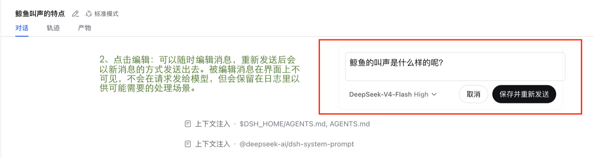

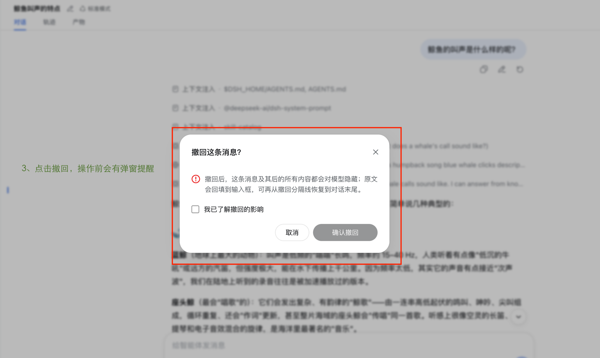

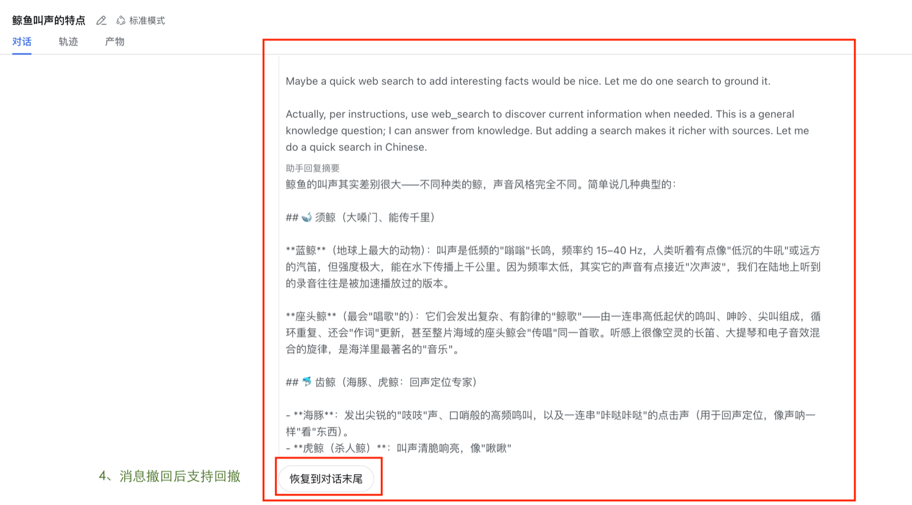

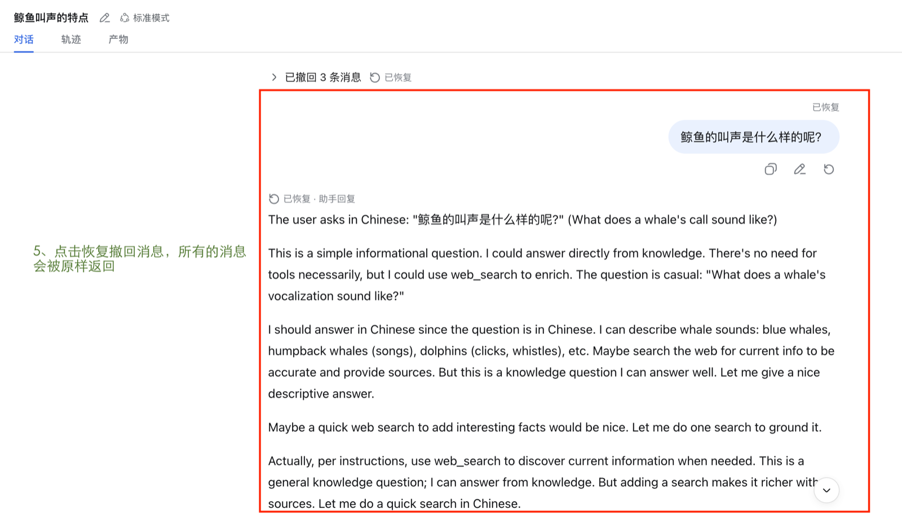

</details>

### message-timeline — history at a glance

`@khorsheed/dsh-message-timeline` · host ≥ `0.1.2-rc.1` (`@^0.1.0` line on 0.1.x hosts)

A floating timeline along the chat's left edge, one row per user message. At rest it is a thin rail out of sight; hover to expand a preview, click to scroll straight to that message. Follows your reading position and pages older history at the top. A pure read of the session snapshot — zero model impact.

<details>
<summary>View the screenshots (2)</summary>


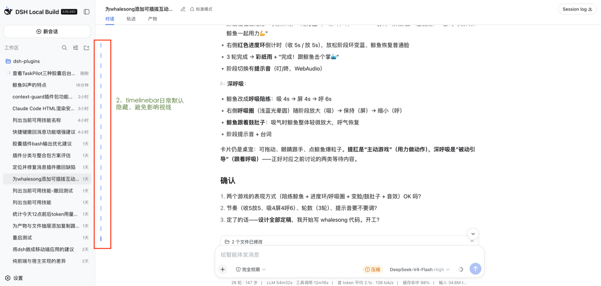

</details>

### session-title-edit — rename inline

`@khorsheed/dsh-client-session-title-edit` · host ≥ `0.1.2-rc.1` (`@^0.1.0` line on 0.1.x hosts)

Click the pencil beside the title in the chat header and the title itself becomes an input — Enter saves, Escape cancels. A user-set title is pinned and never overwritten by auto-generation. Rides the official rename channel; the model never notices.

<details>
<summary>View the screenshots (2)</summary>


</details>

### file-preview + ui-file-preview — session artifacts

`@khorsheed/dsh-file-preview` + `@khorsheed/dsh-client-ui-file-preview` · host ≥ `0.1.5-rc.1` (older hosts: `@^0.2.0` on the 0.1.2 line, `@^0.1.0` on 0.1.x) · installed as a pair

The Produced tab lists every file the session wrote or edited (most recent first); select one to preview its current content in-page, or step through every write/edit diff with content search.

<details>
<summary>View the screenshots (3)</summary>


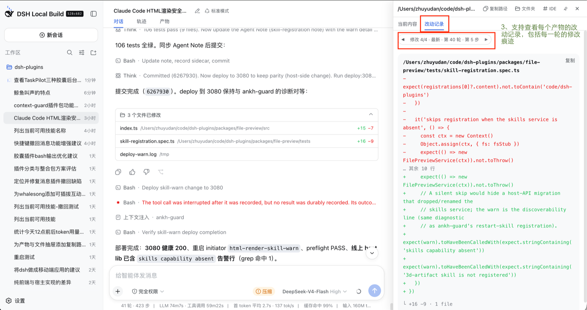


</details>

### taskpilot — pills for background work

`@khorsheed/dsh-taskpilot` · host ≥ `0.1.5-rc.1` (older hosts: `@^0.2.0` on the 0.1.2 line, `@^0.1.0` on 0.1.x)

Two pills above the composer — background jobs and sub-agents — each appearing only when there is something to show. Running jobs tick every second with a stop button; sub-agents show the full lineage with token cost and can be interrupted; click a row for the detail drawer with a replayed execution trace. All data comes from mirrors the product already keeps — zero model impact.

<details>
<summary>View the screenshots (2)</summary>


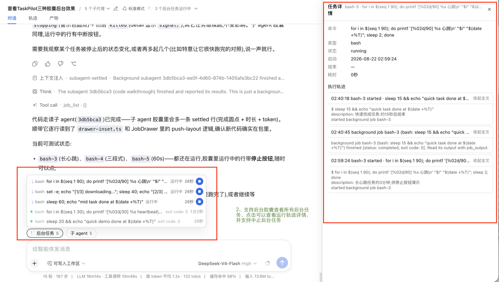

</details>

### context-guard — compact before you run out

`@khorsheed/dsh-context-guard` · host ≥ `0.1.2-rc.1` (`@^0.1.0` line on 0.1.x hosts)

When context occupancy crosses your configured ratio, a compact button appears in the composer toolbar — one click runs the official /compact, before overflow starts rejecting requests. Tune the ratio to your taste (0.01–1); lower means earlier.

<details>
<summary>View the screenshots (2)</summary>


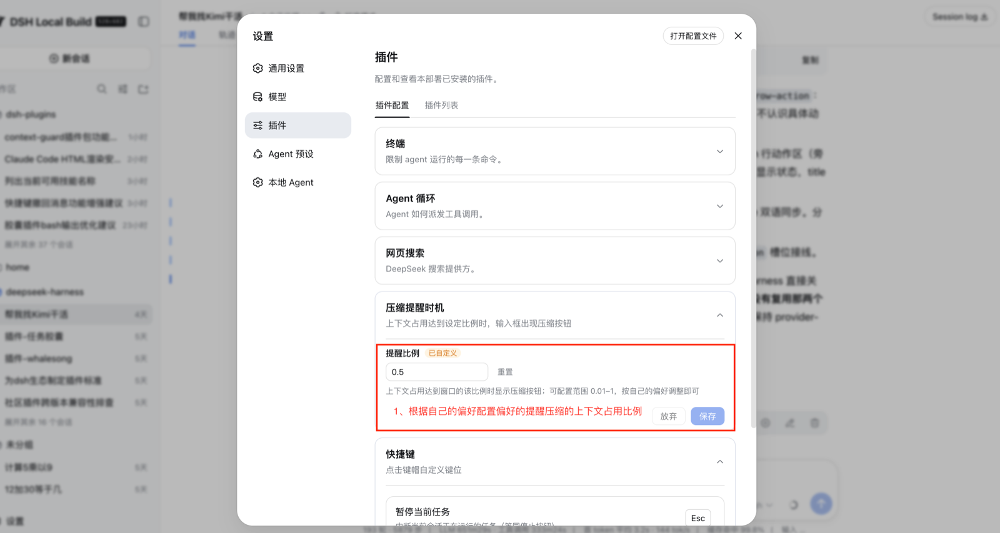

</details>

### inline-html-render — inline HTML cards

`@khorsheed/dsh-inline-html-render` · host ≥ `0.1.2-rc.1` (no release for 0.1.x hosts)

A ```` ```dsh-card ```` HTML block in the agent's reply renders as a sandboxed interactive card right in the conversation — charts, little tools, and visualizations you can play with instead of copying elsewhere. Sandboxed and isolated; animations settle down under `prefers-reduced-motion`.

<details>
<summary>View the screenshots (1)</summary>

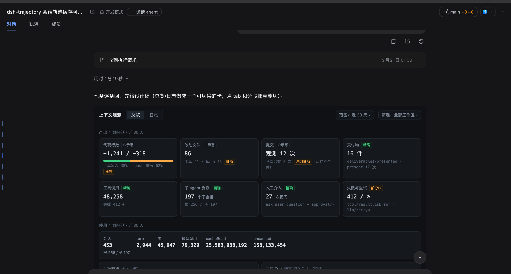

</details>

### capability-catalog — the capability catalog

`@khorsheed/dsh-capability-catalog` · host ≥ `0.1.5-rc.1` (no release for older hosts)

A new Tools & Skills entry in settings: every skill and tool in the running instance, each labeled with its registration channel (official built-in / project / user / plugin); a three-column card grid, a detail modal with the full SKILL.md, metadata and credential config, and an add-skill modal that installs from an uploaded zip or a pasted SKILL.md.

<details>
<summary>View the screenshots (3)</summary>

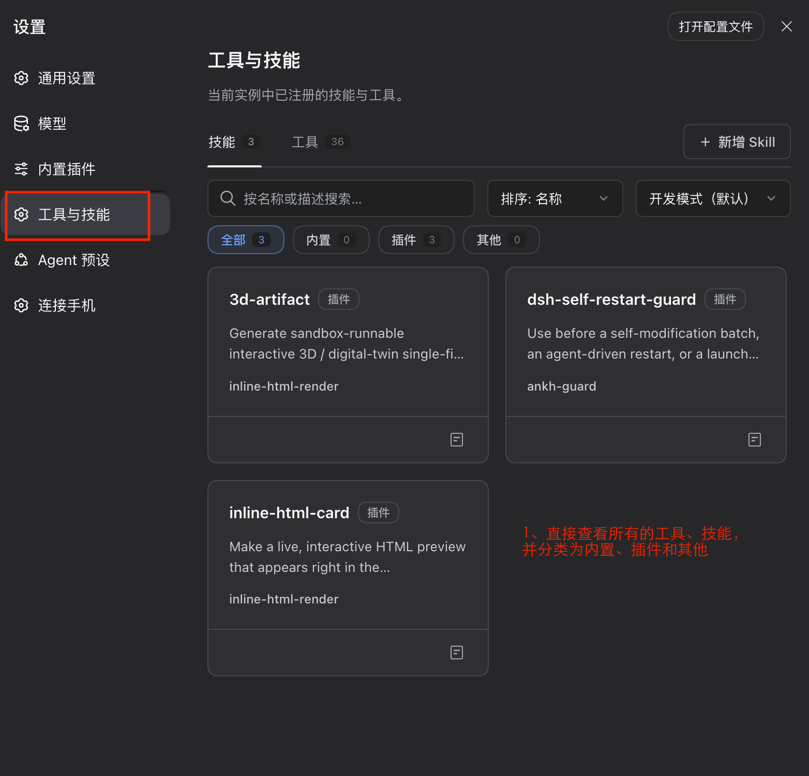

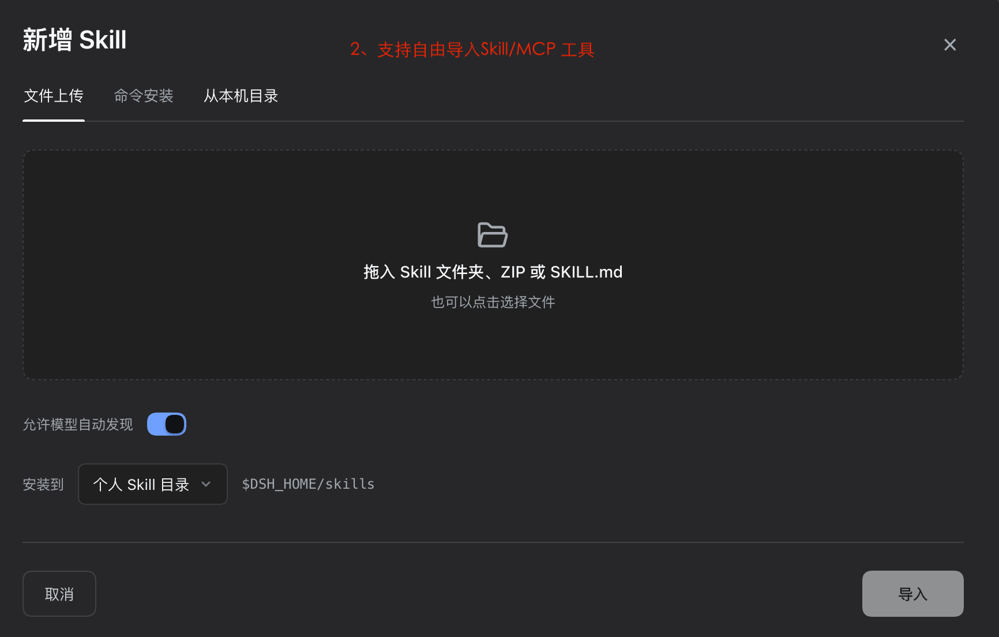


</details>

### ui-shortcuts — rebindable keys

`@khorsheed/dsh-ui-shortcuts` · host ≥ `0.1.2-rc.1` (`@^0.1.0` line on 0.1.x hosts)

Esc pauses the current task, Ctrl/Cmd+S steer-sends your draft, Ctrl/Cmd+O starts a new session. Click a keycap in settings to rebind; preferences persist. It also ships an action registry: any plugin can register its own keyboard action and gets a settings entry plus conflict-free dispatch for free.

<details>
<summary>View the screenshots (1)</summary>


</details>

### whalesong — ambient status

`@khorsheed/dsh-whalesong` · host ≥ `0.1.2-rc.1` (`@^0.1.0` line on 0.1.x hosts)

While any session runs, the sidebar whale spouts and the tab icon moves; when a run finishes or stalls waiting for you, a short chime plays (synthesized WebAudio, silenced under `prefers-reduced-motion`). Read-only over the session list, zero model impact — install it and the page feels alive.

<details>
<summary>View the screenshots (2)</summary>


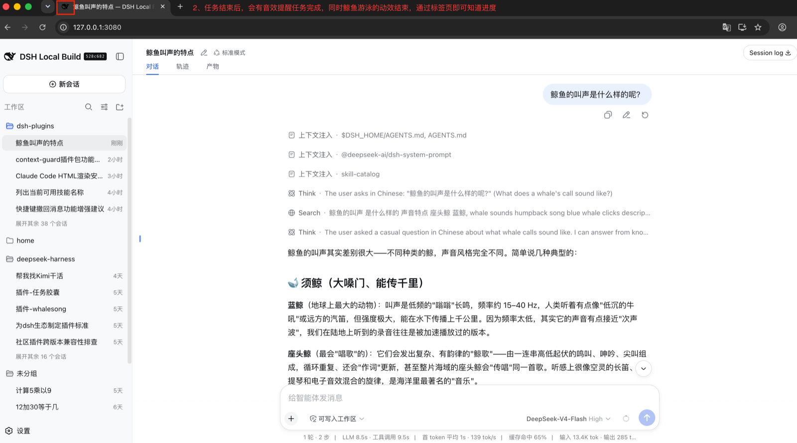

</details>

### mobile — mobile presentation

`@khorsheed/dsh-mobile` · host ≥ `0.1.5-rc.1` (no release for older hosts)

A mobile presentation of the web UI for phone browsers, plus the iOS bridge — check sessions, send messages, and handle approvals away from your desk.

<details>
<summary>View the screenshots (2)</summary>

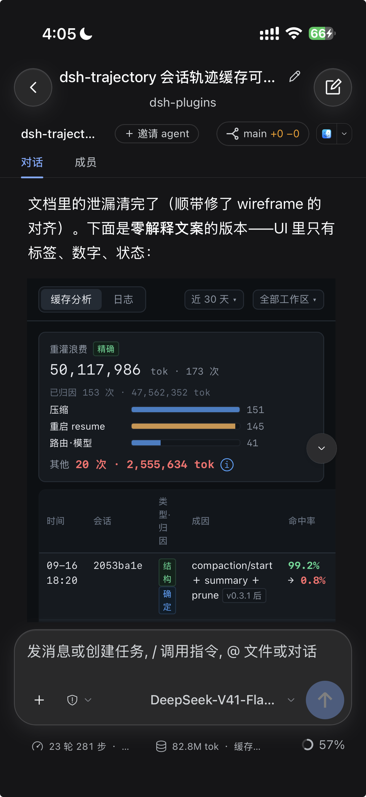

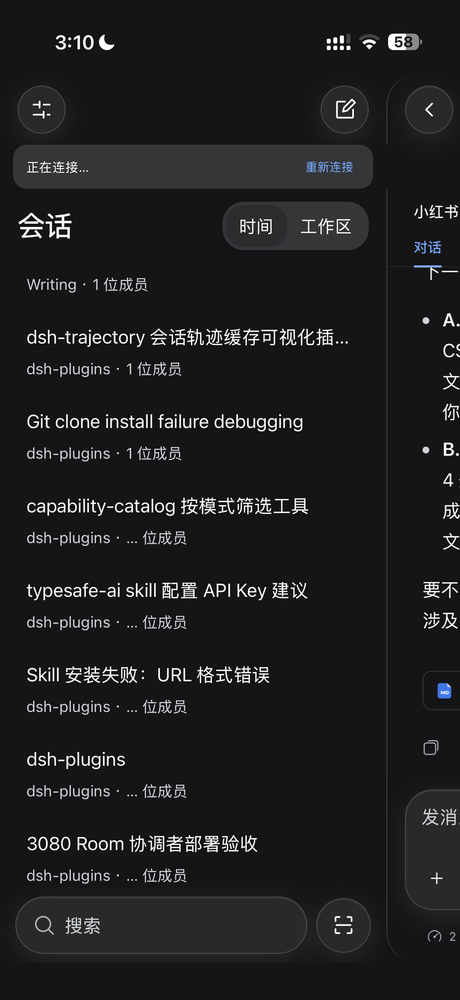

</details>

### ankh-guard — ops guard

`@khorsheed/dsh-ankh-guard` · host ≥ `0.1.5-rc.1` (older hosts: `@^0.2.0` on the 0.1.2 line, `@^0.1.0` on 0.1.x)

Let the agent change its own code and restart its own service without taking it down: restarts require a green build+test credential (bound to the git HEAD, time-boxed) and are refused without one; after the restart a canary reactivates the session to keep verifying; repeated boot failures roll back to the last known-good version. A must for self-hosted, AI-driven setups.

<details>
<summary>View the screenshots (1)</summary>


</details>

## Make it yours

- **Remove a member**: disable/uninstall in Settings → Plugins, or `dsh plugin --profile <your profile> remove <package name>` — the rest keep working. The bundle is a starting point, not a lock-in.
- **Add more**: any `@khorsheed/dsh-*` plugin installs the same way — copy the package name.
- **Update**: from Settings → Plugins, or `dsh plugin --profile <your profile> update` to pull the newest versions in range.

## Related packs

| Pack | What it is |
|---|---|
| [dsh-web-dev](https://github.com/Khorsheed/dsh-web-dev) | Development mode: everything in this pack, plus local coding-agent delegation, live worktree state, and room multi-agent collaboration |
| [dsh-plugins](https://github.com/Khorsheed/dsh-plugins) | The plugin monorepo: the capability map of every package, the preset designs, and the development docs |

## Changelog

See [CHANGELOG.md](CHANGELOG.md).

## Developing

Plugins live in [Khorsheed/dsh-plugins](https://github.com/Khorsheed/dsh-plugins) (single source of truth). This repo carries only the profile template and docs. Issues welcome.

## Install guide for agents

<details>
<summary><strong>Expand: whole-pack install + single-package CLI install</strong> (follow this when the user says "install this for me"; users without an agent can run the same commands by hand)</summary>

### 1. Installing the whole pack

**0. Pick the release line by host version first (skipping this can install plugins that won't boot)**

```sh
dsh --version    # or read the host version from the running instance's process info
```

- Host `0.1.5` or newer (any rc included) → use the main line (clone the default branch).
- Host `0.1.2-rc.*` ~ `0.1.4` → stay with the pre-update archive (the `host-0.1.2-line` tag).
- Host `0.1.0-rc.*` / `0.1.1-rc.*` → use the legacy line: after cloning, `git -C /tmp/dsh-web-basic checkout host-0.1.1-line`; members stay on 0.1.x (no further updates).

**1. Install and self-check offline (do not touch the running instance)**

```sh
git clone https://github.com/Khorsheed/dsh-web-basic.git /tmp/dsh-web-basic
sh /tmp/dsh-web-basic/scripts/install.sh
```

The installer prints the composed row count. To double-check: `dsh --profile web-basic --dump-config | grep -c "@khorsheed"` should print 13 (ankh-guard / capability-catalog / context-guard / file-preview / inline-html-render / message-timeline / message-tools / mobile / session-title-edit / taskpilot / ui-file-preview / ui-shortcuts / whalesong). If `dsh` is not on PATH, use its absolute path (find it via `ps` from the current instance's command line).

**2. Hand over on the same port (the critical step)**

```sh
sh /tmp/dsh-web-basic/scripts/restart-into-web-basic.sh [port, default 3080]
```

The script drives the pack's own ankh-guard watchdog: environment probe → record a credential → adopt the current instance → watchdog stops the old one and boots the pack with a canary. **You will disconnect with the host — that is expected**: the watchdog brings web-basic up on the original port. The script deliberately omits `--initiator` so the guard reads `$DSH_SESSION_ID` from your environment — that is how the restart report finds your session: when the user reopens it, you receive the "restart complete" followup and continue. Note: snapshot-based continuation of interrupted turns needs the guard already mounted in the old instance (absent on a first install); that part exists from the second restart onward.

Two prerequisites — the script refuses early with a reason if either is missing:

- **Session permissions**: in a sandboxed session (writes fenced to the workspace), the detached watchdog gets reaped when the turn ends and the script refuses up front. Ask the user to switch to full-access mode (or hand them the command to run in a plain terminal).
- **Do NOT substitute `nohup ... &` or a hand-rolled `kill` + restart**: sandboxes reap by process tree, nohup does not protect against that, and a wrong stop/start order never comes back.

**3. Deliver**

Once `curl -s -o /dev/null -w '%{http_code}' http://127.0.0.1:<port>/` returns 200, ask the user to **hard-refresh** (Cmd/Ctrl+Shift+R) — the new client bundles (the Produced tab, the dock pills, …) only load on a hard refresh; a plain reload may keep serving the cached shell. Then present the feature list (the README "What's inside" table). Known boundary: on a pure-npm deployment ankh-guard's composition preflight runs degraded (it warns and proceeds); everything else is fully functional.

### 2. Installing a single plugin

- **Dialog (0.1.7-rc.2+, recommended)**: Settings → Plugins → Add plugin, enter the package name (e.g. `@khorsheed/dsh-whalesong`), enable as prompted. On older hosts remember the release-line suffix (see "Version compatibility" above).
- **CLI**: `dsh plugin --profile <profile> add <package name>`; `remove` to uninstall, `update` to upgrade.

</details>
