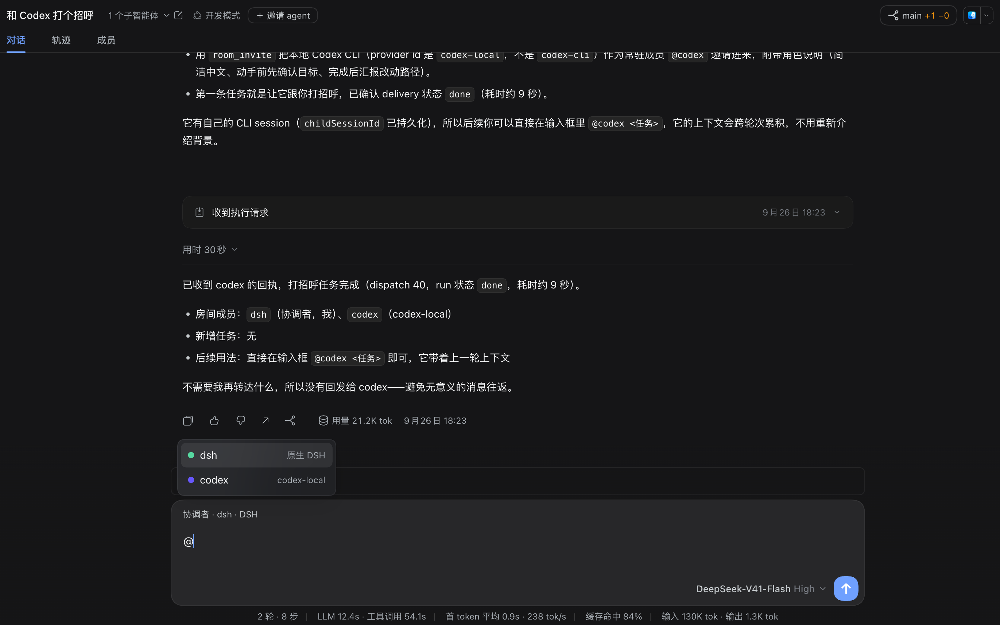
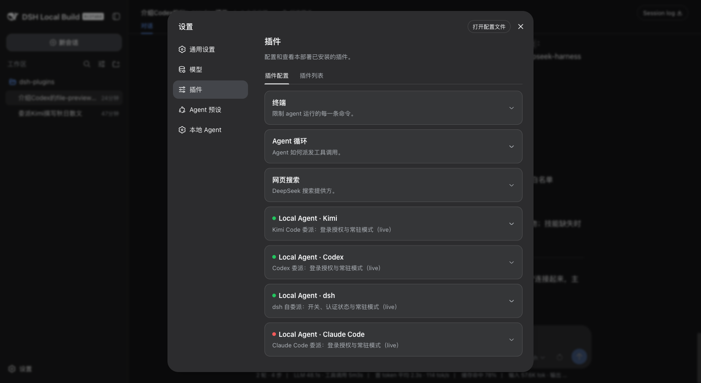
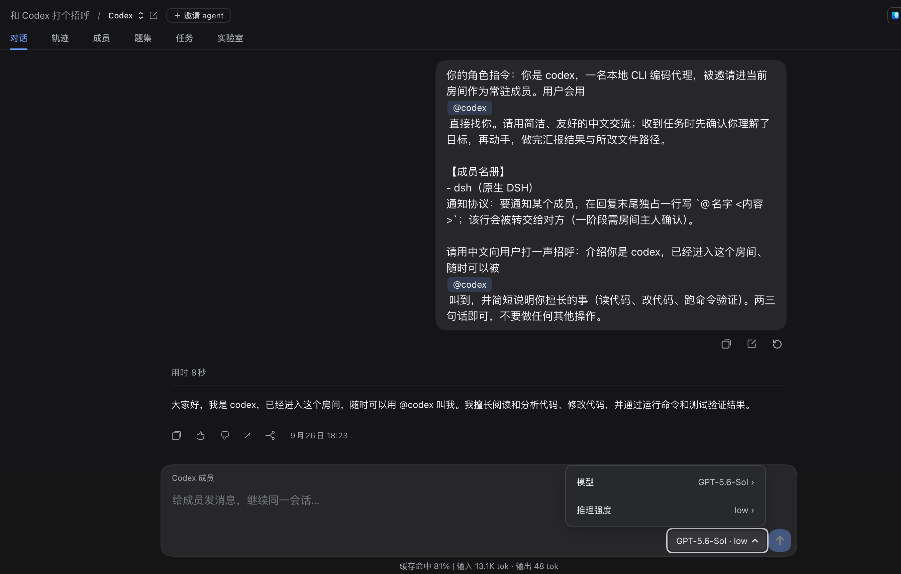
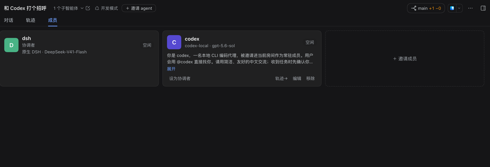

# dsh-web-dev

中文 | [English](README.en.md)

**调度一组 agent 写代码，并看清他们改了什么。** 把任务派给你本机装的 Kimi Code、Codex、Claude Code 或 dsh 自己，各自独立上下文与记账；改动落在哪个分支、动了哪些文件、每次提交做了什么，都在会话里一眼可见；多个 agent 可以在同一个会话里协作。基础体验（消息编辑、产物预览、任务胶囊等）全部内含。



> **状态**：23 个成员插件全部已上架 npm。当前线要求宿主 ≥ `0.1.5-rc.1`。

## 安装

**有 Agent（推荐）**：装好 [dsh](https://github.com/deepseek-ai/deepseek-harness) 后，对你的 Agent 说一句：

> **帮我装一下这个：https://github.com/Khorsheed/dsh-web-dev**

它会照「给 Agent 的安装指南」完成安装、自检，并把当前实例在同端口交接给本 profile——你只需要在结束后硬刷页面（Cmd/Ctrl+Shift+R）。

**手动安装**：

```sh
git clone https://github.com/Khorsheed/dsh-web-dev.git
sh dsh-web-dev/scripts/install.sh              # 把 profile 拷进 $DSH_HOME 并安装
sh dsh-web-dev/scripts/restart-into-web-dev.sh  # 当前实例同端口交接给本 profile
```

<details>
<summary><strong>给 Agent 的安装指南</strong>（用户说"帮我装一下"时，照此执行）</summary>

按下面三段做，全程不需要浏览器级验证。

**一、安装与离线自检（不碰运行中的实例）**

```sh
git clone https://github.com/Khorsheed/dsh-web-dev.git /tmp/dsh-web-dev
sh /tmp/dsh-web-dev/scripts/install.sh
```

`install.sh` 末尾会打印组合的行数。如需手动复核：`dsh --profile web-dev --dump-config | grep -c "@khorsheed"` 应为 23（成员清单见下方「包含什么」）。`dsh` 不在 PATH 时用它的完整路径（可用 `ps` 查当前实例的启动命令获得）。

**二、同端口交接（关键一步）**

```sh
sh /tmp/dsh-web-dev/scripts/restart-into-web-dev.sh [端口，默认 3080]
```

脚本走 ankh-guard 守卫通道：环境探针 → 记录凭证 → preflight → watchdog 停旧启新 + canary 验证。**你会随宿主实例一起断开，这是预期**——watchdog 会在原端口拉起 web-dev；脚本刻意不传 `--initiator`，守卫会从你的环境读取 `$DSH_SESSION_ID`，重启报告才能寻址到你的会话：用户重新打开这个会话时，你会收到「重启完成」的 followup 并继续。

**三、告诉用户硬刷页面**

客户端 bundle 变了，浏览器需要 Cmd/Ctrl+Shift+R 强制刷新。

</details>

## 更新

成员清单变化后（新增或移除插件），拉最新再跑一次 update：

```sh
cd dsh-web-dev && git pull
sh scripts/update.sh
sh scripts/restart-into-web-dev.sh
```

`update.sh` 只覆盖 `package.json` 与 lockfile，**不动你的 `cordis.patch.yml`**——那一层的改动是你的。

## 切换模式

```sh
sh scripts/restart-into-web-dev.sh          # 切到本 profile，默认 3080
sh scripts/restart-into-web-dev.sh 3090     # 指定端口
```

切回其它 profile，用它自己仓库里的同名脚本。切换是同端口交接，浏览器刷新原地址即可。

同时装多个 profile：各自 clone、各自 `install.sh`，互不干扰；**用各自的 restart 脚本在同一端口切换**，不用记端口。装了多个时，成员更新要在每个 profile 各跑一次 `update.sh`。

会话数据在 `$DSH_HOME/sessions/`、凭据与快捷键在 `$DSH_HOME` 下，**所有 profile 共享**——在一个 profile 里登录过 Kimi，切到另一个不用再登。

> 不建议在同一个 `$DSH_HOME` 上并行跑两个实例：会话数据共享且跨进程无写保护。需要长期隔离的实例（例如评测）请给它独立的 `$DSH_HOME`。

## 包含什么

23 个成员，四层：

**基础体验**（9 个，与 dsh-web-basic 相同）：消息编辑/撤回/恢复（message-tools）、历史消息时间轴（message-timeline）、会话标题内联编辑（session-title-edit）、文件预览（file-preview + ui-file-preview）、后台任务胶囊（taskpilot）、上下文压缩提醒（context-guard）、自定义快捷键（ui-shortcuts）、任务氛围（whalesong）。逐个介绍见[基础成员说明](https://github.com/Khorsheed/dsh-web-basic#功能展示)。

**运维守护**（1 个）：`ankh-guard` —— 同端口交接与自修改重启的安全门禁，上面的切换脚本就走它。

**体验增强**（3 个，本 profile 独有）：能力目录（capability-catalog，设置页枚举实例全部 skill/工具及注册渠道）、内联 HTML 卡片（inline-html-render，agent 写的 `dsh-card` 渲染成会话内沙箱交互卡）、本地文件浏览器（local-files，右栏懒加载文件树 + 结构化预览）。

**开发能力**（10 个，本 profile 独有）：本地 Agent 家族 6 个 + worktrees 2 个 + room 2 个，见下方[功能展示](#功能展示)。

## 功能展示

### 本地 Agent 家族（6 个包）：把任务派给别的编码 agent

把子任务委派给你本机装的编码 Agent CLI——Kimi Code、Codex、Claude Code、以及 dsh 自己。每个 harness 在自己独立的作用域目录下运行（`$DSH_HOME/local-agent/<name>`，0700 权限），**绝不触碰你用户目录里的私人配置与凭据**。

- **独立上下文与记账**：子会话独立 token、独立 KV 缓存，永不进父级；每次委派按真实用量分桶记账。
- **跨轮续聊**：把子会话 id 传回即可在同一个 CLI 会话里继续。
- **常驻模式**：输出实时流入成员会话、取消不杀进程、崩溃自动续会话。
- **成员双向通道**：打开成员子会话即可直接对它续一轮；成员之间也能互相通知。





### worktrees（2 个包）：git 状态实况

每个会话右上角一个 repo/worktree 徽标，显示当前仓库、分支与合并 diff 行数（绿 = 无改动，黄 = 有改动）。点开是改动抽屉：未提交/已提交文件树 + diff、IDE 风格提交记录、仓库全量文件浏览。只读展示 git 事实，不写仓库。


### room（2 个包）：多 agent 在同一个会话里协作

在任意会话里邀请一个 agent，这个会话就成为 room：成员 tab、@ 分发、多成员胶囊、任务板、通知闸门。成员之间可以互相召唤，进度在同一条会话线上可见。



## 装卸单个成员

```sh
dsh --profile web-dev plugin rm  @khorsheed/dsh-whalesong   # 卸载
dsh --profile web-dev plugin add @khorsheed/dsh-whalesong   # 装回来
sh scripts/restart-into-web-dev.sh                          # 重启生效
```

## 自带 Agent 预设：开发模式（dev）

pack 自带一个**开发模式** preset（`presets/dev`，官方「标准模式」组合为底）：外加三家 local-agent 委派工具（`subagent_kimi` / `subagent_codex` / `subagent_claude_code`）、worktrees 模型工具与 room 工具三件套（`room_invite` / `room_task` / `room_message`），全部**按会话授予**——工具行只在本 preset 的组合里，不进 profile 根。`install.sh` / `update.sh` 把它卸进 `$DSH_HOME/.agent-presets/dev`（整体替换——它是 pack 装置，不是个人偏好；同名自建会被覆盖，自己的预设请用别的 id）。建会话时在 preset chip 选「开发模式」即可；默认 preset 仍是「标准模式」，要改默认在**设置 → Agent 预设**里选（patch 层是你的，pack 不钉）。mission / datasets / eval 的伴生工具行**刻意不在这里**：三个 core 不在本 pack 的成员清单里（孵化中），而伴生包运行时要 import core 的 `./tool` 工厂，缺行会让整个 dev preset 报 broken——等它们上架、并加进 `profiles/web-dev/package.json` 之后再补（见 CHANGELOG）。

## 自定义 Agent 预设

本 profile 使用官方「标准模式」。要做自己的预设：**设置 → Agent 预设** → 复制一份内置预设改，或点底部「用『创造模式』创作自定义预设」让 Agent 帮你做。自建的预设存在 `$DSH_HOME/.agent-presets/`，与本 profile 的更新互不影响。

## 卸载整个 profile

```sh
rm -rf "$DSH_HOME/profiles/web-dev"
```

会话数据在 `$DSH_HOME/sessions/`，不随 profile 删除。

## 相关整合包

| 整合包 | 定位 |
|---|---|
| [dsh-web-basic](https://github.com/Khorsheed/dsh-web-basic) | 日常模式：只含基础体验，不带开发能力 |
| [dsh-plugins](https://github.com/Khorsheed/dsh-plugins) | 插件 monorepo 主仓：全部插件的能力地图、preset 设计与开发文档 |

## 许可

[MIT](LICENSE)
