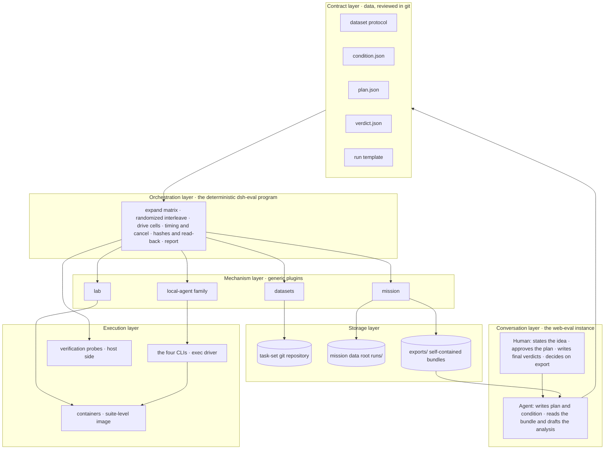
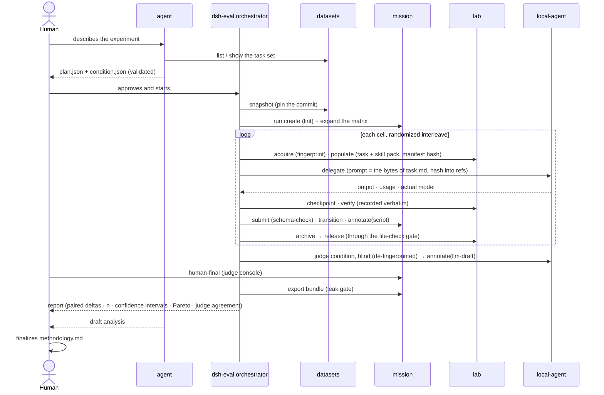

# dsh-web-eval

[中文](README.md) | English

**Run controlled comparisons from one screen: hand the same batch of tasks to different harnesses, models, presets, or skills, and compare them paired by task.** Task sets, conditions, and plans are reviewed in git; execution is driven by a deterministic orchestrator; verdicts come from three sources (scripts, LLM draft, human final) that never overwrite each other; conclusions leave as a self-contained bundle. The base experience and the local-agent family are included.

> **Status**: I2 closed (2026-09-08): orchestrator v0 (run loop, judge, report, read-only tools) is merged to main; pilot A ran F2 + F3 × codex / dsh for three cells to released on the host, the report refused comparison for lack of an environment fingerprint as designed, judge agreement is κ 0.655 (carried by one cell), and the first conclusion is a list of 14 gaps rather than a ranking (the task repo's `docs/pilot-a-log.md`). I3 is in progress: containers + stages 3–4, starting with pilot A's gaps. This document first fixes the target architecture, member plugins, target flow, and final UI, then approaches them iteration by iteration, with each iteration's done criteria pinned in the [iteration plan](#iteration-plan); per-task status and briefs live in [docs/iterations.md](docs/iterations.md) (Chinese). The roadmap's "dsh-eval pack" is this profile.

## Positioning

This is a **factorial-design bench**, not a traffic A/B platform. Factors are harness, model, preset, or skill; tasks are blocks; each cell is one independent sample. It answers questions shaped like "same task, change one factor, how much does the outcome move", not "who has the highest total".

Three disciplines that differ from [dsh-web-dev](../web-dev/README.en.md):

- **Determinism belongs to programs, judgment to the agent, approval to the human.** Starting containers, materializing tasks, tagging, running verifiers, archiving, destroying — all executed by the orchestrator; the agent only turns an idea into a plan and a bundle into a draft analysis; the human approves the plan, writes final verdicts, and decides on export.
- **Every factor is hashable.** Task content has a snapshot commit, the environment an image digest, inputs a materialization manifest hash, the subject a condition hash, the prompt a byte hash. "These two cells differ in exactly one factor" must be provable, not declared.
- **Plugins carry no evaluation vocabulary.** datasets, mission, lab, and local-agent are generic mechanisms; evaluation semantics live entirely in the contract layer and the orchestrator.

## Target architecture



Each of the six layers does exactly one thing:

| Layer | Responsibility | Carrier |
|---|---|---|
| Conversation | ideas in, conclusions out; the human makes three decisions: approve the plan, write final verdicts, export | sessions and tabs in the web-eval instance |
| Contract | evaluation semantics written as validatable, hashable data | `docs/dataset-authoring-protocol.md` plus this profile's three schemas |
| Orchestration | the only executor; every action deterministic, testable with a fake exec | `@khorsheed/dsh-eval` (to be built): service face + CLI + skill |
| Mechanism | generic verbs: task sets, state machines, units, delegation | the four existing plugins |
| Execution | where contestants actually run; the starting point is byte-identical | suite-level image, each CLI, host-side probes |
| Storage | task sets in git, run data in the data root, the shareable thing is a bundle | three directories |

### The contract layer's three schemas

They are this profile's real design work; their shapes were finalized in I1 and have landed as `dataseek.condition/1`, `dataseek.plan/1`, and `dataseek.verdict/1` (full text and hash rules in [dataset-authoring-protocol §6](../../docs/dataset-authoring-protocol.en.md)). Below is the intent.

**condition.json: the subject.** A condition = the content of one scoped home + a set of env keys + one argv template + optional materialized packs; the content hash of the whole is the condition id.

```json
{
  "schema": "dataseek.condition/1",
  "harness": { "name": "claude-code", "version": "2.1.236", "drive": "exec" },
  "model": { "declared": "claude-opus-5", "endpoint": "proxy" },
  "reasoning": { "effort": "default" },
  "permissions": "skip",
  "instructions": "none",
  "preset": null,
  "skills": { "pack": null },
  "home": { "sha": "<content hash of the scoped home>" },
  "env": { "keys": ["ANTHROPIC_BASE_URL"] }
}
```

**plan.json: every input of one run.** Snapshot × conditions × reps × stages × order × budget × judge. The agent produces it, the human approves it, the orchestrator accepts nothing else.

```json
{
  "schema": "dataseek.plan/1",
  "dataset": { "repo": "<path>", "commit": "<sha>", "id": "harness-comparison", "items": ["F2-multi-agent-room", "F3-self-restart-report"] },
  "conditions": ["<condition id>", "<condition id>"],
  "reps": 3,
  "stages": ["stage1", "stage2"],
  "order": { "seed": 42, "interleave": true },
  "budget": { "activeMinutes": 60, "turns": 10 },
  "judge": { "conditions": ["<judge condition id>"], "samples": 2 },
  "expectedNs": ["script", "llm-draft", "human-final"],
  "retry": { "infrastructure": 1 },
  "exports": "<path>/exports"
}
```

The plan's `conditions` and `judge.conditions` carry **condition ids** (never shas; the validator resolves shas from `conditions/<id>.lock.json` and run.meta records them); `judge` may be absent, and when it is, `expectedNs` must not contain `llm-draft`; `retry.infrastructure` (the per-cell infrastructure-retry budget, default 1) and `exports` (the bundle export directory, default `<dataset repo>/exports`) are optional too — both are **reviewed defaults** the run call options override; a plan carries no template field. The run template is written by neither human nor agent: it is a deterministic function of the task set manifest's stages plus the archive gate, generated and linted at validate time and reviewed together with the plan. A condition is a declaration; `dsh-eval conditions provision` turns it into a real scoped home and computes `home.sha` back; a mismatch between declaration and reality means "not ready", and validate blocks it. The orchestrator version is written into run.meta alongside the plan hash: same version and same plan means the same procedure.

**verdict.json: the verdict output contract.** Probe scripts and judges both emit it, the orchestrator writes it into the matching ns, the report tabulates it.

```json
{ "schema": "dataseek.verdict/1", "task": "F2-multi-agent-room", "criterion": "R3", "pass": true, "evidence": "<verifiable fact>", "by": "probes/dispatch-trace.mjs" }
```

## Member plugins

23 members in four groups:

| Group | Members | Status | Changes this profile needs |
|---|---|---|---|
| Base experience | the same 12 as web-dev | ✅ / 🔶 | none |
| Local-agent family | `local-agent` + the kimi / codex / claude-code / dsh providers + `tool-subagent` | 🔶 | I1: evaluation pins (all exec, codex full-access inside containers, explicit reasoning effort for claude and kimi) and the effectiveSettings snapshot (including the configured model). I2: model read-back, recording the model actually used. I3: in-container exec wrapping, or the CLI driver extracted into its own package. I4: per-condition model parameter (set on the first delegation, fixed within a member, unchanged on resume) and scoped-home override, plus a "default model" field on each provider's settings card |
| Evaluation mechanisms | `datasets` / `mission` / `lab` / `eval` | 🔶 rc | `mission`: retry carries a reason; the ns report carries writtenBy. `lab`: composite fingerprint (image + resource limits + mount layout + env keys). `datasets`: canary field; item-level external source pointers. `eval`: the run loop's judge (T9), report (T10), read-only tools (T14), and the full readiness gate |
| Ops guard | `ankh-guard` | ✅ | none; the eval instance gets its own `$DSH_HOME` |

The 23rd member is **`@khorsheed/dsh-eval`** (the orchestrator, joined with I2·T8). Landed: the three contract schemas, `validatePlan` / `hashCondition` / `hashHome`, `generateTemplate` (manifest → run template, item-for-item equivalent to the I1 hand-written bench-v1), the run loop v0 (stages one-two, host directories, per-cell materialization, byte-exact delegation, submit/transition, the archive gate, bundle export), the `/eval run` slash command, and the `dsh-eval` CLI (validate / run --dry-run / template / conditions hash). To come: judge delegation (T9), `dsh-eval report` (T10), the read-only tools `eval_conditions` / `eval_plan_validate` / `eval_run_status` (T14).

`capability-catalog` gains one more use here: it reads the registry by the preset's standing scope, so it is the evidence source for "which tools and skills does the agent have under this condition"; I4 makes it emit a hashable capability manifest.

### Tool exposure by domain

The agent appears only in the planning and analysis phases and needs reading and drafting; there is no agent during execution; the judge is one delegation, not a session with tools. Write tools stay with the orchestrator's service face and the human's CLI and tabs. A preset cannot subtract tools registered at the profile layer, so each plugin provides a `tools` configuration that registers by group; the default `all` keeps the dev-domain behavior, and this profile sets the table below (lands in I2):

| Plugin | Agent tools (eval domain) | Orchestrator service face | Human |
|---|---|---|---|
| datasets | all read verbs; `put_item` kept for authoring | snapshot, worktree_path, read (explicit layers) | bind, tab, validate |
| mission | only `run_list` `run_status` `list` `get` | every write method | export, retry, human-final |
| lab | none | all | status, release |
| eval | `eval_conditions` `eval_plan_validate` `eval_run_status`; no run | the kernel | approve, run, report |

The full capability map, the step-by-step trace from natural language to execution, and the list of generated files are in [docs/architecture.md](docs/architecture.md) (Chinese).

## Target flow



Each cell's state machine is declared by the run template, frozen and enforced by mission. The shape of the evaluation template:

```text
pending → ws-ready → stage-1 → stage-2 → iterating ⇄ checkpoint-N → judged → archived → releasable → released
                                  └→ halted (feasible = false) → archived → releasable → released
```

Every transition into `releasable` carries a `file-check`; the failure path is the same shape, no exceptions.

The division among the three verdict sources stays: `script` is written only by probes; `llm-draft` by a judge condition, where the judge is itself a condition, its model must not be one of the contestants, sampled at least twice with agreement reported; `human-final` is written only from the judge console, and a `by` with a `tool:` prefix is flagged red in the report.

## Final UI

Seven surfaces, four existing and three to build:

| Surface | Purpose | Status |
|---|---|---|
| **Bench tab** (`eval`) | matrix board: task × condition; each cell shows rep progress, stage, bucket, whether the materialization hash matches, stuck-cell warnings; run scope and the five buckets reuse the missions tab's projection | ⬜ I5 |
| **Condition registry** | the list of conditions, a diff of two conditions (which single item differs), hashes, provenance (scoped home / image / skill pack); factors such as the model are displayed and diffed, never chosen here, since choosing a model means creating a new condition | ⬜ I4 data, I5 surface |
| **Plan review** | the agent's plan rendered as "snapshot @commit · N conditions · M tasks · R reps · order" + validate result + an approve button; approval is the human's action | ⬜ I5 |
| **Cell detail** | the member child session's transcript, verify output verbatim, checkpoints and tags, artifacts, the three annotation sources side by side | 🔶 mostly there in the missions tab detail + member dock |
| **Judge console** | the blind-review queue, de-fingerprinted artifacts, llm-draft and human-final side by side, agreement statistics; the only write entry for human-final | ⬜ I5 |
| **Report view** | paired-delta table by task, Pareto chart (completion × cost), n and confidence intervals, refuses to rank on insufficient samples; export goes through the existing leak-gate dialog | ⬜ I2 as a CLI table, I5 in the UI |
| **datasets tab / missions tab / member dock** | browse and bind task sets, queue and release checks, continue a member | ✅ existing |

What the bench tab looks like:

```text
┌ eval · run 2026-09-20-pilot ─────────────── snapshot harness-comparison@d1ac20a ┐
│ conditions: [A codex/…] [B claude/…] [C kimi/…] [D dsh/…]   rep 3 · stages 1-2 │
│──────────┬──────────────┬──────────────┬──────────────┬────────────────────────│
│ task     │ A            │ B            │ C            │ D                      │
│──────────┼──────────────┼──────────────┼──────────────┼────────────────────────│
│ F2       │ ●●● judged   │ ●●○ stage-2  │ ●●● judged   │ ●○○ stage-1 ⚠ 47m     │
│ F3       │ ●●● judged   │ ●●● judged   │ ●●● halted×1 │ ●●● judged             │
│──────────┴──────────────┴──────────────┴──────────────┴────────────────────────│
│ materialization 9f2c1a2b all equal · 2 units unreleased · judge κ 0.71 [report] [export] │
└─────────────────────────────────────────────────────────────────────────────────┘
```

CLI and UI share semantics: `dsh-eval conditions | plan validate | run | report`.

## Frozen decisions

These are the apparatus's fairness baseline: written into the run meta before the run starts, unchanged after. Changing any of them means a new run.

1. **A rep is an independent mission; an attempt is only for infrastructure-failure reruns.** retry carries a reason enum; the report counts them separately.
2. **All exec driving.** live is a resident process; idle reclaim, crash resume, and auto-answered approvals are all extra factors.
3. **Sandboxing is left to the container boundary.** codex `danger-full-access` inside containers, claude `skip`, kimi auto-approve, dsh unrestricted; identical across the four.
4. **Reasoning effort explicitly pinned and recorded per harness.** Today kimi's provisioning hardcodes high while the others use their defaults, which is uncontrolled.
5. **Model explicitly pinned and read back from the output.** Declared versus actual mismatch fails loud; when claude goes through a proxy, the proxy address is part of the condition.
6. **The prompt is the byte-for-byte content of the visible layer's files.** The parent agent plays no part in prompt construction; the prompt hash goes into refs.
7. **Timeouts and turn caps belong to the orchestrator.** Providers do not manage them; cancellation reasons are recorded.
8. **Budgets use contestant-active time, not wall clock.** The sum of delegation run durations; wall clock is only an explanatory variable.
9. **The judge must not be a contestant; de-fingerprint before judging; double-sample and report agreement.**
10. **Cross-harness efficiency uses list-price cost or active seconds; tokens are compared only within one model.**
11. **Run order is randomized and interleaved, with the seed recorded.**
12. **A single destroy path.** The eval instance's agent preset carries no Bash and no docker; only the orchestrator holds the docker socket.

## Iteration plan

Principle: **contracts before code, one cell end to end before widening factors, conclusions before surfaces.** Each iteration's done criterion is an observable state; the next one does not start until it is reached.

| Iteration | Scope | Deliverables | Done criteria |
|---|---|---|---|
| **I0 skeleton** | this profile directory and this document | package.json, scripts, README, frozen decisions | the directory exists; the decision list is referenced by the next iteration |
| **I1 one cell + three contracts** | P0 × dsh × stages 1–2, pushed by hand on the host, no container; at the same time fix the shapes of condition / plan / verdict | `dsh-eval validate`; local-agent evaluation pins; mission retry reason; the operating playbook updated | no ❌ left in the playbook; P0's plan validates and hashes identically twice; the cell's time and blockers are recorded |
| **I2 orchestrator v0 + pilot A** | host plugin + CLI covering only stages 1–2; F2 + F3 × the four harnesses × 3 reps, each cell in its own cwd | `@khorsheed/dsh-eval` joins the member list; templates generated from the manifest; `script` and `llm-draft` land automatically; model read-back; the datasets canary field; `tools` group configuration for datasets and mission; a bundle; `dsh-eval report` paired table | one cell runs fully unattended; one conclusion with its caveats; a number for judge agreement |
| **I3 containers + stages 3–4** | validate the suite-level image; the four CLIs on Linux; in-container exec; composite fingerprint; verify probe scripts; pilot A's gaps (liveness probe, finalize re-entry, negative criteria and weights, CLI version read-back, judgeability check) | lab composite fingerprint; provider container wrapping or the standalone CLI driver package; F2 stage-3 probes; stage 1–2 objective probes; the eval preset | one cell completes end to end inside a container with release through the gate; the four harnesses run the same task inside containers |
| **I4 widen factors** | condition parameters: model, preset, skill pack | provider model parameter and per-condition scoped-home override; `dsh-eval conditions provision`; the condition registry's data face; capability-catalog manifest hash | paired results for dsh × two models; claude × two models validates the parameter path; paired results for one harness × two presets |
| **I5 agent-configured experiments + surfaces** | the `eval-planning` skill; bench tab; plan review; judge console; report view | three new surfaces + the skill | one sentence → plan → approval → run → report, with the human doing only approval and final verdicts |
| **I6 external task sets and release** | SWE-bench / Terminal-Bench adapter scripts; item-level external source pointers; train/dev/test tags; npm release | adapter scripts; protocol extensions; mirror repository | one external task set runs one cell; `dsh plugin add` installs the whole family |

Why factor widening sits at I4 rather than I1: the **shape** of the condition hash is fixed in I1, so I4 changes no contract, it only teaches the providers more fields. Producing one conclusion across four harnesses first surfaces every judge, rubric, and de-fingerprinting problem at that step, which is cheaper than going multi-factor first.

Explicitly out of scope for this period (I0 through I2): new surfaces, lab's model-tool face, the agent executing cells, external task-set ingestion, npm release.

## Install

> Until the orchestrator lands, this profile is only a plugin composition. The flow below matches web-dev and can stand the eval instance up early.

The eval instance needs its own `$DSH_HOME`, sharing neither sessions nor credentials with the dev instance (environment isolation is a basic evaluation requirement; see the environment topology in `docs/ops.md`). I1 through I2 run the four CLIs directly on the host and need only node, git, and the CLIs themselves; from I3 on docker is required, and the checklist for the suite-level image, the local package mirror, the allowlist proxy, and credential volumes is in the "runtime environment" section of [docs/architecture.md](docs/architecture.md).

`install.sh` has two paths; both print the composed composition stats at the end, and `dsh --profile web-eval --dump-config | grep -o "@khorsheed/[a-z0-9-]*" | sort -u | wc -l` should be 23 (distinct members — the dump repeats each member as a layer header plus entry rows, and tool-subagent appears only through its per-provider entries).

**npm mode** (no arguments) — every member resolves from the npm registry. It works as-is once every member is published (I6); until then, the unpublished members fail with a registry 404 at install time (the authoritative list is [docs/release-status.md](https://github.com/Khorsheed/dsh-plugins/blob/main/docs/release-status.md) in dsh-plugins):

```sh
git clone https://github.com/Khorsheed/dsh-web-eval.git
DSH_HOME=~/.dsh-eval sh dsh-web-eval/scripts/install.sh
DSH_HOME=~/.dsh-eval sh dsh-web-eval/scripts/restart-into-web-eval.sh <port>
```

**Source mode** (`--source <dsh-plugins checkout>`) — the working path today. Given a buildable [dsh-plugins](https://github.com/Khorsheed/dsh-plugins) checkout (dependencies installed, building green per its AGENTS.md; building and type resolution need a deepseek-harness checkout), the script builds every unpublished member, packs the tarballs with `--family` into the profile's `tarballs/`, writes pnpm overrides to pin the family edges, leaves published members to npm, and then runs the standard install:

```sh
git clone https://github.com/Khorsheed/dsh-web-eval.git
git clone https://github.com/Khorsheed/dsh-plugins.git && pnpm --dir dsh-plugins install
DSH_HOME=~/.dsh-eval sh dsh-web-eval/scripts/install.sh --source "$PWD/dsh-plugins"
DSH_HOME=~/.dsh-eval sh dsh-web-eval/scripts/restart-into-web-eval.sh <port>
```

Source-mode tarballs live inside the profile directory: uninstalling (`rm -rf "$DSH_HOME/profiles/web-eval"`) removes them too. To swap in fresh tarballs after the checkout moves, re-run **with `--fresh`**: an installed profile's `node_modules`, `pnpm-lock.yaml` and `tarballs/` would otherwise keep the newly packed tarballs out and the instance would keep running the old build with no sign of it. `--fresh` removes all three first, and a re-run without it is refused with exactly that reason printed.

The evaluation pins (frozen decisions 2 through 4) belong to the apparatus, not to personal preference, so they **belong to the pack**: they live in this profile's `cordis.patch.yml`, and both `install.sh` and `update.sh` overwrite that file — the one patch-layer difference from [dsh-web-dev](../web-dev/README.en.md). Leaving it to the user means an update can silently change the sandbox tier or the reasoning effort while run.meta still records the old one, and the report's "the subject under test is the same" stops meaning anything. Personal preferences go in a preset layer, not here.

The current pins (written by I2 · T15): `mission tools: read`, `datasets tools: authoring`, `eval tools: all` (tools by domain); `live: false` for all four harnesses (decision 2); codex `sandbox`, claude `permissionMode: skip`, kimi `thinkingEffort: high` (decisions 3 and 4); claude `baseUrl` and `proxyUrl` (decision 5 — the endpoint is part of the subject under test, and without the pin the provider falls back to the host process environment, so restarting from another terminal silently swaps the upstream; the values match the 3080 production profile — the official endpoint, egress through the local proxy — because the third-party address the host environment exports authenticates by API key, and `delegationEnv` strips that key). **On the host-direct stage codex takes `workspace-write`, not `danger-full-access`**: there is no container boundary on the host, and full access there puts the evaluation's side effects into a real home. The asymmetry is declared in each run's methodology; I3's containers restore `danger-full-access`, and only then do the four sit on the same tier.

## Update, switch, add or remove a member, uninstall

Switching is a same-port handoff; `update.sh` overwrites the member list, the lockfile **and `cordis.patch.yml`** — the evaluation pins belong to the pack (see [Install](#install)), the one difference from [dsh-web-dev](../web-dev/README.en.md#update); `dsh --profile web-eval plugin rm/add <pkg>` adds or removes one member; `rm -rf "$DSH_HOME/profiles/web-eval"` uninstalls the whole profile. Until I6, do not run `update.sh` on a source-mode install — it overwrites the member list back to npm ranges and the unpublished members start 404-ing; re-run `install.sh --source` instead.

## Related documents

- Technical architecture: capability map, the trace from natural language to execution, generated files: [docs/architecture.md](docs/architecture.md) (Chinese)
- Iteration document: the plugin × layer landing matrix, per-iteration tasks and acceptance, the I1 briefs: [docs/iterations.md](docs/iterations.md) (Chinese)
- Dataset authoring protocol: `docs/dataset-authoring-protocol.md`
- The three mechanism plugins' proposals: `proposals/active/2026-08-19-datasets-store.md`, `2026-08-19-mission-tasks.md`, `2026-08-19-lab-experiment-units.md`
- Three-package integration (the orchestrator's seed): `scripts/integration-triad.mts`
- Roadmap and layering model: `docs/roadmap.md`

## Related packs

| Pack | Positioning |
|---|---|
| [dsh-web-basic](../web-basic/README.en.md) | daily mode: base experience only |
| [dsh-web-dev](../web-dev/README.en.md) | dev mode: base experience + local-agent family + worktrees + room |

## License

[MIT](LICENSE)
