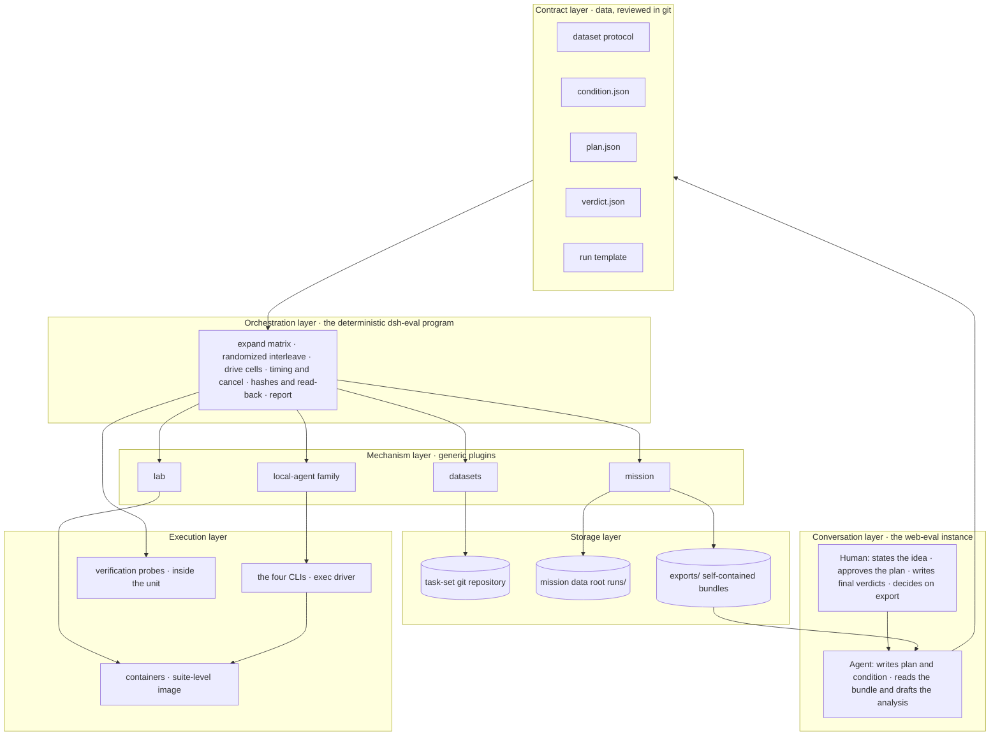
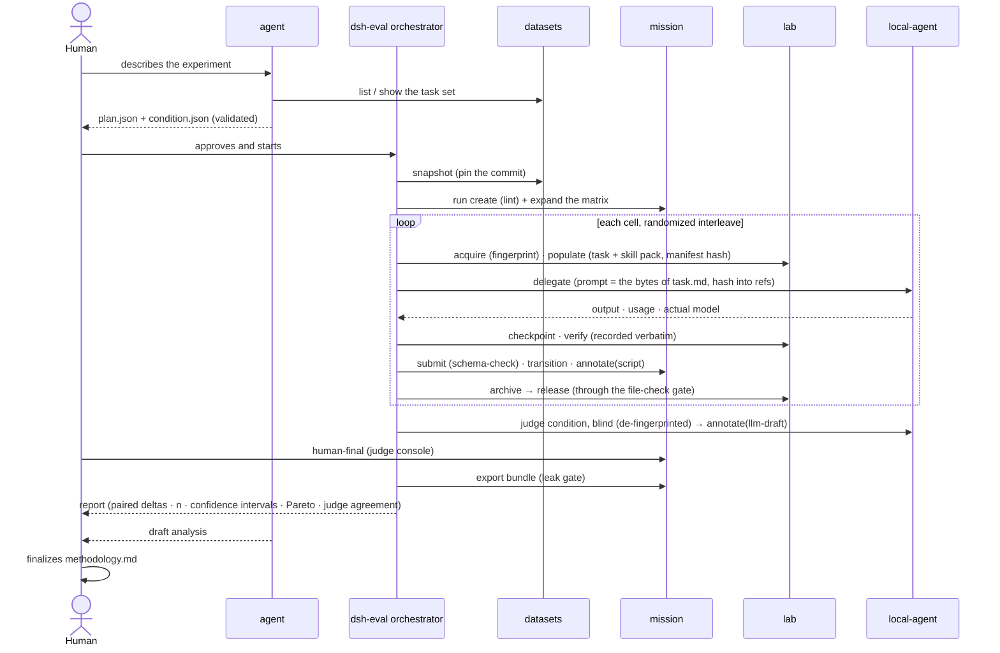

# dsh-web-eval

[中文](README.md) | English

**Run controlled comparisons from one screen: hand the same batch of tasks to different harnesses, models, presets, or skills, and compare them paired by task.** Task sets, conditions, and plans are reviewed in git; execution is driven by a deterministic orchestrator; verdicts come from three sources (scripts, LLM draft, human final) that never overwrite each other; conclusions leave as a self-contained bundle. The base experience and the local-agent family are included.

> **Status**: I2 closed (2026-09-08): orchestrator v0 (run loop, judge, report, read-only tools) is merged to main; pilot A ran F2 + F3 × codex / dsh for three cells to released on the host, the report refused comparison for lack of an environment fingerprint as designed, judge agreement is κ 0.655 (carried by one cell), and the first conclusion is a list of 14 gaps rather than a ranking (the task repo's `docs/pilot-a-log.md`). I3 closed (2026-09-09): one cell ran the whole flow inside a container and was released through the gate; the four harnesses ran the same item (P0) in containers, all four report invariants held for the first time, the comparison section opened, and the efficiency table carries the four token columns (the task repo's `docs/pilot-b-log.md`); the stage-3 data gap is recorded as T19d. I4 is closing: the mechanisms are in; the first paired report on the container path landed on 2026-09-16 through the I5 walkthrough (dsh × two models × P0, all four invariants ✅, comparison open; Δ = 0 is what P0 is designed to give); pilot B is closed by the walkthrough's run, C folds into the first real-item run once T55's live acceptance passes (the fix is merged), D is ready to go (dataset `docs/i4-pilots-log.md`). The I5 loop runs end to end (dataset `docs/i5-walkthrough-log.md`: one sentence → agent draft → approval → container run → report → final verdict → analysis draft, R1 never bypassed); 17 human interventions, 9 of them gaps, last-mile T57–T59 merged (2026-09-17), T60 pending; the UI is being brought to the [docs/ui-spec.md](docs/ui-spec.md) §九 baseline (T62 hotfix merged 2026-09-17, T63 overall polish pending). This document first fixes the target architecture, member plugins, target flow, and final UI, then approaches them iteration by iteration, with each iteration's done criteria pinned in the [iteration plan](#iteration-plan); per-task status and briefs live in [docs/iterations.md](docs/iterations.md) (Chinese); the I5 UI specification is [docs/ui-spec.md](docs/ui-spec.md) (settled 2026-09-13; the Final UI section below is written from it, T48). The roadmap's "dsh-eval pack" is this profile.

## Positioning

This is a **factorial-design bench**, not a traffic A/B platform. Factors are harness, model, preset, or skill; tasks are blocks; each cell is one independent sample. It answers questions shaped like "same task, change one factor, how much does the outcome move", not "who has the highest total".

Three disciplines that differ from [dsh-dev](../dev/README.en.md):

- **Determinism belongs to programs, judgment to the agent, approval to the human.** Starting containers, materializing tasks, tagging, running verifiers, archiving, destroying — all executed by the orchestrator; the agent only turns an idea into a plan and a bundle into a draft analysis; the human approves the plan, writes final verdicts, and decides on export.
- **Every factor is hashable.** Task content has a snapshot commit, the environment an image digest, inputs a materialization manifest hash, the subject a condition hash, the prompt a byte hash. "These two cells differ in exactly one factor" must be provable, not declared.
- **Plugins carry no evaluation vocabulary.** datasets, mission, lab, and local-agent are generic mechanisms; evaluation semantics live entirely in the contract layer and the orchestrator.

## Target architecture



Each of the six layers does exactly one thing:

| Layer | Responsibility | Carrier |
|---|---|---|
| Conversation | ideas in, conclusions out; the human makes three decisions: approve the plan, write final verdicts, export | sessions and tabs in the web-eval instance |
| Contract | evaluation semantics written as validatable, hashable data | `docs/dataset-authoring-protocol.md` plus this profile's three schemas |
| Orchestration | the only executor; every action deterministic, testable with a fake exec | `@khorsheed/dsh-eval` (to be built): service face + CLI + skill |
| Mechanism | generic verbs: task sets, state machines, units, delegation | the four existing plugins |
| Execution | where contestants actually run; the starting point is byte-identical | suite-level image, each CLI, in-unit probes (since I3 they run through `lab.verify` inside the cell's unit) |
| Storage | task sets in git, run data in the data root, the shareable thing is a bundle | three directories |

### The contract layer's three schemas

They are this profile's real design work; their shapes were finalized in I1 and have landed as `dataseek.condition/1`, `dataseek.plan/1`, and `dataseek.verdict/1` (full text and hash rules in [dataset-authoring-protocol §6](../../docs/dataset-authoring-protocol.en.md)). Below is the intent.

**condition.json: the subject.** A condition = the content of one scoped home + a set of env keys + one argv template + optional materialized packs; the content hash of the whole is the condition id.

```json
{
  "schema": "dataseek.condition/1",
  "harness": { "name": "claude-code", "version": "2.1.236", "drive": "exec" },
  "model": { "declared": "claude-opus-5", "endpoint": "proxy" },
  "reasoning": { "effort": "default" },
  "permissions": "skip",
  "instructions": "none",
  "preset": null,
  "skills": { "pack": null },
  "home": { "sha": "<content hash of the scoped home>" },
  "env": { "keys": ["ANTHROPIC_BASE_URL"] }
}
```

**plan.json: every input of one run.** Snapshot × conditions × reps × stages × order × budget × judge. The agent produces it, the human approves it, the orchestrator accepts nothing else.

```json
{
  "schema": "dataseek.plan/1",
  "dataset": { "repo": "<path>", "commit": "<sha>", "id": "harness-comparison", "items": ["F2-multi-agent-room", "F3-self-restart-report"] },
  "conditions": ["<condition id>", "<condition id>"],
  "reps": 3,
  "stages": ["stage1", "stage2"],
  "order": { "seed": 42, "interleave": true },
  "budget": { "activeMinutes": 60, "turns": 10 },
  "judge": { "conditions": ["<judge condition id>"], "samples": 2 },
  "expectedNs": ["script", "llm-draft", "human-final"],
  "retry": { "infrastructure": 1 },
  "exports": "<path>/exports"
}
```

The plan's `conditions` and `judge.conditions` carry **condition ids** (never shas; the validator resolves shas from `conditions/<id>.lock.json` and run.meta records them); `judge` may be absent, and when it is, `expectedNs` must not contain `llm-draft`; `retry.infrastructure` (the per-cell infrastructure-retry budget, default 1) and `exports` (the bundle export directory, default `<dataset repo>/exports`) are optional too — both are **reviewed defaults** the run call options override; a plan carries no template field. The run template is written by neither human nor agent: it is a deterministic function of the task set manifest's stages plus the archive gate, generated and linted at validate time and reviewed together with the plan. A condition is a declaration; `dsh-eval conditions provision` turns it into a real scoped home and computes `home.sha` back; a mismatch between declaration and reality means "not ready", and validate blocks it. The orchestrator version is written into run.meta alongside the plan hash: same version and same plan means the same procedure.

**verdict.json: the verdict output contract.** Probe scripts and judges both emit it, the orchestrator writes it into the matching ns, the report tabulates it.

```json
{ "schema": "dataseek.verdict/1", "task": "F2-multi-agent-room", "criterion": "R3", "pass": true, "evidence": "<verifiable fact>", "by": "probes/dispatch-trace.mjs" }
```

## Member plugins

25 members in three groups:

| Group | Members | Status | Changes this profile needs |
|---|---|---|---|
| Base experience | the same 12 as dev (`ankh-guard` among them) | ✅ / 🔶 | none; the eval instance gets its own `$DSH_HOME`, and `ankh-guard` owns switching it and watching over it |
| Local-agent family | 6: `local-agent` + the kimi / codex / claude-code / dsh providers + `tool-subagent` | 🔶 | I1: evaluation pins (all exec, codex full-access inside containers, explicit reasoning effort for claude and kimi) and the effectiveSettings snapshot (including the configured model). I2: model read-back, recording the model actually used. I3: in-container exec wrapping landed (T17: `exec: {container, workdir, env}`, values never on argv); "the CLI driver extracted into its own package" is deferred until a second consumer exists; `cliVersion` and `credentialState` filled in (T25). I4: per-condition model parameter (set on the first delegation, fixed within a member, unchanged on resume) and scoped-home override, plus a "default model" field on each provider's settings card |
| Evaluation mechanisms | 7: the `datasets` / `mission` / `lab` / `eval` cores plus the `datasets-tool` / `mission-tool` / `eval-tool` companions (split since M4'③; the companion rows belong to the preset) | 🔶 rc | `mission`: retry carries a reason; the ns report carries writtenBy. `lab`: composite fingerprint (image + resource limits + mount layout + env keys). `datasets`: canary field; item-level external source pointers. `eval`: the run loop's judge (T9), report (T10), read-only tools (T14), and the full readiness gate |

The evaluation mechanisms' **`@khorsheed/dsh-eval`** is the orchestrator (joined with I2·T8). Landed: the three contract schemas, `validatePlan` / `hashCondition` / `hashHome`, `generateTemplate` (manifest → run template, item-for-item equivalent to the I1 hand-written bench-v1), the run loop v0 (stages one-two, host directories, per-cell materialization, byte-exact delegation, submit/transition, the archive gate, bundle export), the `/eval run` slash command, and the `dsh-eval` CLI (validate / run --dry-run / template / conditions hash). Judge delegation (T9), `dsh-eval report` (T10) and the model tools (T14; four reads since I5·T46 — `eval_conditions` / `eval_plan_validate` / `eval_run_status` / `eval_cells` — plus the draft verb `eval_plan_draft` since I5·T34) have all landed.

`capability-catalog` gains one more use here: it reads the registry by the preset's standing scope, so it is the evidence source for "which tools and skills does the agent have under this condition". Since T32 it offers `snapshotFor(presetId)` and `hashOf(snapshot)`: the canonical form keeps each skill's name/source/body-sha and each tool's name/channel/parameters (descriptions stay out — rewording one must not mint a new subject), and the hash is written `caps:<sha256>`. The orchestrating instance's own face is recorded in `run.meta.orchestrator.capabilities` as provenance; a subject's face is computed by provision into the lock's `provisioned.capabilities`, which is what the readiness gate checks the condition's declared `preset` against.

### Tool exposure by domain

The agent appears only in the planning and analysis phases and needs reading and drafting; there is no agent during execution; the judge is one delegation, not a session with tools. Write tools stay with the orchestrator's service face and the human's CLI and tabs. A preset cannot subtract tools registered at the profile layer, so each plugin provides a `tools` configuration that registers by group; the default `all` keeps the dev-domain behavior, and this profile sets the table below (lands in I2):

| Plugin | Agent tools (eval domain) | Orchestrator service face | Human |
|---|---|---|---|
| datasets | tier `authoring`: the six read verbs (`list` `show` `describe` `read` `snapshot` `validate`) + `put_item`; items are fetched only by registration `<registration id>/<set>`, never from the repository's directory | materialization at the pinned commit (`worktreePath`), read (explicit layers) | register on the 题集 tab, validate |
| mission | **not composed by the eval preset** (I5 · T46); mission still provides the ledger and the release gate | every write method | export, retry, human-final |
| lab | none | all | status, release |
| eval | four reads `eval_conditions` `eval_plan_validate` `eval_run_status` `eval_cells` + two writes `eval_plan_draft` (an experiment directory in the deployment) `eval_analysis_write` (`analysis/` only); no run | the kernel | approve, run, report |
| tool-subagent (the four delegation tools) | none — three rows set `tools: none`, the fourth is not mounted by default (lands in I3·T27) | delegates the players through the local-agent face | the provider verbs: `/codex login`, `/kimi status`, … |

The **three mechanism plugins are core + companion since M4'③**: the profile root mounts only the core (service / CLI / slash / tab), while the model tool rows and their guidance sections belong to the companion, so the by-domain tiers above are granted by companion rows of the pack's `eval` preset — `datasets-tool: authoring`, `eval-tool: all` (see [frozen decision 12's execution point](#frozen-decision-12s-execution-point-the-eval-preset)) — not by profile-root `tools` config; a session in this profile on another preset gets neither tool set. The service / CLI / slash faces stay global, while the 任务 / 数据集 tabs additionally self-hide under the same composition criterion (every unreadable path fails open). **`mission-tool` used to be the third row (`tools: read`) and was dropped by I5 · T46**: UI spec R6 settles that the word mission does not appear in evaluation mode, so per-cell detail is read by `eval_cells` from eval's own projection instead (still computed from mission's ledger through the structural face, but computed on the service side). The other half of that same self-hiding rule follows for free — the 任务 tab's criterion IS the presence of this row, so dropping it hides the tab in evaluation sessions without a second switch. The package still ships, so anyone can name the row again in their own overlay preset. The three companion packages ship with the pack: dependencies in `package.json`, and source mode's `UNPUBLISHED_DIRS` builds and packs them from the checkout (`autoInstallPeers: false`, so peers are never installed automatically).

The full capability map, the step-by-step trace from natural language to execution, and the list of generated files are in [docs/architecture.md](docs/architecture.md) (Chinese).

### Frozen decision 12's execution point: the `eval` preset

Tool exposure by domain bounds what the *profile layer* registers; the **preset** bounds the other half. An evaluation instance's agent runs on the pack's own `eval` preset (`presets/eval/`), whose composition is the shipped `standard` preset minus two classes of row:

- **Anything that can run a host command**: `tool-bash` / `tool-pwsh`; `tool-workflow` and the `workflow-ptc` engine it needs — a workflow script is **model-authored JavaScript** executed as an async function body inside a Node worker thread, so it reaches `node:child_process` with no shell anywhere in the path; `tool-ralph` drives the same engine and goes with it.
- **Anything whose vocabulary collides with this line's own**: `plan-mode`. Its prompt plans an *implementation* and forbids writing files, while this agent's whole output is a `dataseek.plan/1` written to disk and approved by a person. Two things called "plan" in one session is the confusion, not the missing capability.

What stays is reading, drafting, and delegation to an agent **running on this same preset**: an in-process child runs on its parent's preset (the harness proves it in `subagent-in-process-driver/tests/preset-inheritance.spec.ts`), so a delegation cannot hand a child the shell this preset does not carry. Docker was never on the table: `lab` registers no model-facing tool at all, and every container verb lives on the orchestrator's service face.

**The preset belongs to the pack**, for the same reason `cordis.patch.yml` does (see [Install](#install)): `install.sh` and `update.sh` both replace `$DSH_HOME/.agent-presets/eval` with `presets/eval/` whole, and `cordis.patch.yml` pins `agent-presets`' `default` to `eval`. Keep personal preferences under a different preset id, not in this one.

**How to confirm an instance is running it** — three layers, cheapest first: composition, files, session.

```sh
# composition: the default preset is eval, and the preset directory is in place
dsh --profile web-eval --dump-config | grep -A3 'id: agent-presets'   # → default: eval
ls "$DSH_HOME/.agent-presets/eval"                                     # → agent.cordis.yml  preset.yml

# files: with the comments stripped, no execution row is left in the composition
grep -vE '^\s*#' "$DSH_HOME/.agent-presets/eval/agent.cordis.yml" \
  | grep -nE 'tool-bash|tool-pwsh|tool-workflow|tool-ralph|docker'     # → no output

# composition (the three rows of the next subsection): all set to tools: none
dsh --profile web-eval --dump-config \
  | grep -A5 -E '^- id: tool-subagent-(codex-local|claude-code-local|kimi)$' \
  | grep -c 'tools: none'                                              # → 3
```

The session layer needs the UI: Settings → Agent presets should show **评测模式** as the default, and a fresh session's Settings → Tools and skills should list no `bash`, no container tool, and no `subagent_<harness>` — a default session sees **35 tools** (39 at T21; 36 once T27 closed the three delegation tools; 33 by arithmetic once I5 · T46 dropped mission's four read tools and added `eval_cells`; counted live on 2026-09-17 with 3171 on `2c4476f8`: 35 = 21 built-in + 14 plugin — datasets 7, eval 5 including T34's `eval_plan_draft`, `subagent_dsh`, `list_capabilities`; no `mission_*`), with the in-process `subagent` and `subagent_fork` still there. A session header records the preset it was created with, and a session that switched carries an `agent-preset/selected` event in its log.

**This pins the default, not the reachable set.** The shipped standard / code / minimal / cordis presets stay on the roster: `apps/cli`'s `composeProfile` writes the shipped preset root into `roots` as the last overlay unconditionally, and no profile layer can remove them. A person who picks 标准模式 for a blank session gets Bash back. Decision 12 is aimed at **agent misoperation** — an agent has no tool for switching its own preset; switching is a human act.

**Execution-class tools this preset cannot reach, now closed in the plugin layer** (I3·T27): the four players' delegation tools `subagent_codex` / `subagent_claude_code` / `subagent_kimi` / `subagent_dsh` are inserted at the **profile root** by each provider's own bundle patch, and a preset can only subtract rows it mounts itself — so it cannot reach them, and they are exactly the rows that start the local CLIs, with the sandbox opened up per [frozen decision](#frozen-decisions) 3. Of the three options T21 recorded, the first was taken: `@khorsheed/dsh-local-agent-tool-subagent` gained a `tools: all | none` registration switch, and `cordis.patch.yml` sets the codex / claude-code / kimi rows to `none` (the trade-offs are in the [eval-preset Agent Note](../../.agents/notes/implemented/process/2026-09-08-web-eval-agent-preset.md)). Only the model-visible tool is closed: the provider rows still mount, the orchestrator still delegates the players through the local-agent face, and `/codex login` and its siblings still work.

**The fourth, `subagent_dsh`, is still an open path.** It has no config row — `local-agent-dsh`'s DeepSeek switch is off by default, and while ON the controller mounts the tool dynamically with a hardcoded config the profile layer cannot reach. By default it registers nothing (which is why it is absent from the 33-tool count above), but **a person who turns that switch on in 设置 → 本地 Agent gets `subagent_dsh` with the default `tools: all`**. Closing it for good means changing the provider package; the T27 Agent Note records it. As with the rest of decision 12, this pins the default, not the reachable set.

## Target flow



Each cell's state machine is declared by the run template, frozen and enforced by mission. The shape of the evaluation template:

```text
pending → ws-ready → stage-1 → stage-2 → iterating ⇄ checkpoint-N → judged → archived → releasable → released
                                  └→ halted (feasible = false) → archived → releasable → released
```

Every transition into `releasable` carries a `file-check`; the failure path is the same shape, no exceptions.

The division among the three verdict sources stays: `script` is written only by probes; `llm-draft` by a judge condition, where the judge is itself a condition, its model must not be one of the contestants, sampled at least twice with agreement reported; `human-final` is written only from the judge console, and a `by` with a `tool:` prefix is flagged red in the report.

## Final UI

In evaluation mode the human has three surfaces: the **session**, the **task-sets tab**, and the **Experiments tab** (the normative text is [docs/ui-spec.md](docs/ui-spec.md), settled 2026-09-13, in Chinese). Both tabs have the same shape — a list, a create form, and a detail page, with the experiment detail split into subpages. **The missions tab is hidden**: mission is still the evaluation's ledger and release gate, but the word never reaches the UI, and per-cell detail is read by `eval_cells` from eval's own projection (ui-spec R6).

| Surface | Purpose | Status |
|---|---|---|
| **Task sets › list** | one row per task set: id, snapshot (branch @ commit), item count, which slot maps to which layer, whether a canary is set, the validate result, which experiments use it. Actions: new task set (scaffold with a `dataset.json`), import task set (point at a directory or repo + commit already organized per the protocol; it validates and joins the list — registration, in essence) | ✅ I5·T47 |
| **Task sets › detail** (task set › item) | a file tree plus a preview: every file in the tree carries its slot and who sees it, and the slots filter the tree; "what the contestant will see" lists this item exactly as it lands in the unit (the anti-leak self-check); a can-this-be-scored line (how many rubric rows, how many probes, how many stage schemas); "answer records" projects each experiment's cells by item. Actions: item skeleton, import item, validate | ✅ I5·T47 |
| **Experiments › list** | one row per experiment: name, task-set snapshot, condition count (+ judge), item count, rep, factors (derived from the condition diff), state, progress, start time; drafts and runs share the list. States: draft → awaiting approval → running → judging → done, plus rejected and cancelled | ✅ I5·T35a |
| **Experiments › new experiment** | name, task-set snapshot, multi-select items, conditions (pick an existing one or create one: harness, model, scope, preset, permissions, reasoning effort), judge and sampling count, rep, stages, order seed, environment (image, network, egress check), budget. It produces `plans/<name>.json` and any new condition files in the task repo's working tree's passthrough zone; the only action is "save draft and validate" — **starting is not on this form**. Agent-drafted and human-drafted plans land in the same list: both paths call the same service verb (`draftExperiment`), so they are literally the same file | ✅ I5·T34 |
| Detail › **Design** | since T67 it absorbs the old overview and conditions pages: scale and comparison variables; comparison groups and readiness (the readiness badge, the validate lines that need reading, a table of only this experiment's groups with 准备环境 on every row, the endpoint edited in place, two rows picked for a diff); the planned grid; advanced settings (snapshot, readiness records verbatim, run.meta and the rest, folded). The status bar on top carries one primary action: **approve and start** — approval is always the human's | ✅ I5·T36 · T67 |
| Detail › **matrix** | rows are always items, columns are the factor the human picked, the remaining factors group or filter; each cell carries four fixed things: rep dots (filled judged / half running / hollow not started), stage or bucket, stuck-cell warning, whether the materialization hash matches the item's other cells; a run-level summary sits at the bottom (materialization hash, environment fingerprint, unreleased units, judge agreement, stuck cells). Clicking a cell opens its detail | ✅ I5·T35b |
| Detail › **cells** | the old missions queue filtered to this run: item × condition × rep, bucket, stage, attempt, duration; the right-hand drawer is the cell detail — refs, checkpoints, the child session (opens the member session; you can keep chatting without intervening), verify output verbatim, artifacts, annotation counts. Actions: retry with a reason, release check, export bundle | ✅ I5·T35b |
| Detail › **report** | the four invariants, the paired-delta table, the efficiency table, judge agreement; until all four are ok, "report" reads "comparison section not open". Actions: finalize (through the release gate), export (through the existing leak-gate dialog) | ✅ I5·T38 |
| Detail › **judge console** | the blind-review queue, de-fingerprinted artifacts, llm-draft and human-final side by side, agreement statistics; the only write entry for human-final. A judge is not a row on the matrix — its verdict is that cell's llm-draft annotation, carrying `by` = the judge condition's id | ⬜ I5·T37 |
| **Member dock · continue a member** | from the cell detail, the host's `sessions.open(childSessionId)` opens the member's child session, with the composer and dock taken over by local-agent | ✅ existing |

The experiment detail's run records (the grid):

```text
┌ Experiments › 2026-09-20-pilot ───────────── snapshot harness-comparison@d1ac20a ┐
│ Design ·[Run records]· Results · Human review                                    │
│ column = harness ▾ other factors: model default · scope eval  rep 3 · stages 1-2 │
│────────┬─────────────┬─────────────┬─────────────┬───────────────────────────────│
│ task   │ codex       │ claude-code │ kimi        │ dsh                           │
│────────┼─────────────┼─────────────┼─────────────┼───────────────────────────────│
│ F2     │ ●●● judged  │ ●●○ stage-2 │ ●●● judged  │ ●○○ stage-1 ⚠ 47m             │
│ F3     │ ●●● judged  │ ●●● judged  │ ●●● halted×1│ ●●● judged  ≠ materialization │
│────────┴─────────────┴─────────────┴─────────────┴───────────────────────────────│
│ materialization hashes all equal · 2 unreleased · κ 0.71     [finalize] [export] │
└──────────────────────────────────────────────────────────────────────────────────┘
```

CLI and UI share semantics: `dsh-eval conditions | plan validate | run | report`.

## Frozen decisions

These are the apparatus's fairness baseline: written into the run meta before the run starts, unchanged after. Changing any of them means a new run.

1. **A rep is an independent mission; an attempt is only for infrastructure-failure reruns.** retry carries a reason enum; the report counts them separately.
2. **All exec driving.** live is a resident process; idle reclaim, crash resume, and auto-answered approvals are all extra factors.
3. **Sandboxing is left to the container boundary.** codex `danger-full-access` inside containers, claude `skip`, kimi auto-approve, dsh unrestricted; identical across the four. Cells run as a non-root user inside the container: claude refuses the `skip` tier under root (measured in T16).
4. **Reasoning effort explicitly pinned and recorded per harness.** Today kimi's provisioning hardcodes high while the others use their defaults, which is uncontrolled.
5. **Model explicitly pinned and read back from the output.** Declared versus actual mismatch fails loud; when claude goes through a proxy, the proxy address is part of the condition.
6. **The prompt is the byte-for-byte content of the visible layer's files.** The parent agent plays no part in prompt construction; the prompt hash goes into refs.
7. **Timeouts and turn caps belong to the orchestrator.** Providers do not manage them; cancellation reasons are recorded.
8. **Budgets use contestant-active time, not wall clock.** The sum of delegation run durations; wall clock is only an explanatory variable.
9. **A judge pins its model explicitly; who judged each cell goes into the report; self-judged cells are marked.** De-fingerprint before judging, double-sample each judge and report agreement, and name several judges for a panel if you want one. A judge sharing a model with a player is **no longer refused** — when the thing being evaluated is every model, the judge necessarily overlaps one of them, and the public leaderboards answer that with a panel plus disclosure rather than exclusion. Every verdict now carries its judge (condition id and model), the report lists per cell who judged it, a cell judged by its own model is marked self-judged, and the consistency section gains a cross-judge line beside the per-judge κ. (Relaxed 2026-09-10; the original wording — "the judge must not be a contestant" — is in the I4·T31 Agent Note.)
10. **Cross-harness efficiency uses list-price cost or active seconds; tokens are compared only within one model.**
11. **Run order is randomized and interleaved, with the seed recorded.**
12. **A single destroy path.** The eval instance's agent preset carries no Bash and no docker; only the orchestrator holds the docker socket. Its execution point has [its own section](#frozen-decision-12s-execution-point-the-eval-preset).

## Iteration plan

Principle: **contracts before code, one cell end to end before widening factors, conclusions before surfaces.** Each iteration's done criterion is an observable state; the next one does not start until it is reached.

| Iteration | Scope | Deliverables | Done criteria |
|---|---|---|---|
| **I0 skeleton** | this profile directory and this document | package.json, scripts, README, frozen decisions | the directory exists; the decision list is referenced by the next iteration |
| **I1 one cell + three contracts** | P0 × dsh × stages 1–2, pushed by hand on the host, no container; at the same time fix the shapes of condition / plan / verdict | `dsh-eval validate`; local-agent evaluation pins; mission retry reason; the operating playbook updated | no ❌ left in the playbook; P0's plan validates and hashes identically twice; the cell's time and blockers are recorded |
| **I2 orchestrator v0 + pilot A** | host plugin + CLI covering only stages 1–2; F2 + F3 × the four harnesses × 3 reps, each cell in its own cwd | `@khorsheed/dsh-eval` joins the member list; templates generated from the manifest; `script` and `llm-draft` land automatically; model read-back; the datasets canary field; `tools` group configuration for datasets and mission; a bundle; `dsh-eval report` paired table | one cell runs fully unattended; one conclusion with its caveats; a number for judge agreement |
| **I3 containers + stages 3–4** | validate the suite-level image; the four CLIs on Linux; in-container exec; composite fingerprint; verify probe scripts; pilot A's gaps (liveness probe, finalize re-entry, negative criteria and weights, CLI version read-back, judgeability check) | lab composite fingerprint; provider container wrapping or the standalone CLI driver package; F2 stage-3 probes; stage 1–2 objective probes; the eval preset | one cell completes end to end inside a container with release through the gate; the four harnesses run the same task inside containers |
| **I4 widen factors** | condition parameters: model, preset, skill pack | provider model parameter and per-condition scoped-home override; `dsh-eval conditions provision`; the condition registry's data face; capability-catalog manifest hash | paired results for dsh × two models; claude × two models validates the parameter path; paired results for one harness × two presets |
| **I5 agent-configured experiments + surfaces** | the `eval-planning` skill; bench tab; Design; judge console; report view; eval as a mode (preset + companion tool packages + named providers; heavy runs stay on the separate instance) | three new surfaces + the skill | one sentence → plan → approval → run → report, with the human doing only approval and final verdicts |
| **I6 external task sets and release** | SWE-bench / Terminal-Bench adapter scripts; item-level external source pointers; train/dev/test tags; npm release | adapter scripts; protocol extensions; mirror repository | one external task set runs one cell; `dsh plugin add` installs the whole family |

Why factor widening sits at I4 rather than I1: the **shape** of the condition hash is fixed in I1, so I4 changes no contract, it only teaches the providers more fields. Producing one conclusion across four harnesses first surfaces every judge, rubric, and de-fingerprinting problem at that step, which is cheaper than going multi-factor first.

Explicitly out of scope for this period (I0 through I2): new surfaces, lab's model-tool face, the agent executing cells, external task-set ingestion, npm release.

## Install

> Until the orchestrator lands, this profile is only a plugin composition. The flow below matches dev and can stand the eval instance up early.

The eval instance needs its own `$DSH_HOME`, sharing neither sessions nor credentials with the dev instance (environment isolation is a basic evaluation requirement; see the environment topology in `docs/ops.md`). I1 through I2 run the four CLIs directly on the host and need only node, git, and the CLIs themselves; from I3 on docker is required, and the checklist for the suite-level image, the local package mirror, the allowlist proxy, and credential volumes is in the "runtime environment" section of [docs/architecture.md](docs/architecture.md).

**Both scripts begin with a machine-level preflight, before anything is
written**: `dsh` on PATH, `dsh --version` runs, and the headless-bundle path
`cordis.patch.yml` pins exists (read out of that file, not hardcoded). Any of
them missing prints what is missing and exits 2, with `$DSH_HOME` and
`$DSH_HOME/.agent-presets/eval` untouched — before this the first `dsh` call
was at the BOTTOM of the script, so a machine without it replaced the preset
directory whole and (in source mode) built and packed every member before
failing on the last line. The preset directory is backed up to
`$DSH_HOME/.agent-presets/.web-eval-backup.<pid>` before it is replaced, and
the trap says where it is; `update.sh` backs up the pinned files it
overwrites the same way, and had no trap at all until now.

**Host line: this profile needs `dsh` >= 0.1.5-rc.1.** The evaluation family's
six packages carry that line in `dsh.compat.minHost` / `verifiedHost` as of
2026-09-11; the local-agent family has since the baseline commit `bb04c84`.
Source mode's preflight therefore carries one more check: it reads
`dsh.compat.minHost` out of every member it is about to pack, compares it
against `dsh --version` once, and exits 2 before touching a file when the host
is older than any of them, listing who needs what. The check exists in source
mode only — npm mode resolves its members from the registry, so there is no
local `package.json` to read. What it catches is a failure that never reaches
install time: too old a host does not fail while installing, it throws a
missing export out of some plugin's import AT BOOT (measured twice on this
machine: `@deepseek-ai/dsh-settings` has no `settingsNamespace` on 0.1.5, and
the 0.2.0 context-guard / ui-shortcuts on npm import it) — or later still, on
an instance that boots fine and only reports
`childSession.snapshotEvents is not a function` on a resume round.

`install.sh` has two paths; both print the composed composition stats at the end, and `dsh --profile web-eval --dump-config | grep -o "@khorsheed/[a-z0-9-]*" | sort -u | wc -l` should be 22 (distinct members — the dump repeats each member as a layer header plus entry rows, and tool-subagent appears only through its per-provider entries).

**npm mode** (no arguments) — every member resolves from the npm registry. It works as-is once every member is published (I6); until then, the unpublished members fail with a registry 404 at install time (the authoritative list is [docs/release-status.md](https://github.com/Khorsheed/dsh-plugins/blob/main/docs/release-status.md) in dsh-plugins):

```sh
git clone https://github.com/Khorsheed/dsh-web-eval.git
DSH_HOME=~/.dsh-eval sh dsh-web-eval/scripts/install.sh
DSH_HOME=~/.dsh-eval sh dsh-web-eval/scripts/restart-into-web-eval.sh <port>
```

**Source mode** (`--source <dsh-plugins checkout>`) — the working path today. Given a buildable [dsh-plugins](https://github.com/Khorsheed/dsh-plugins) checkout (dependencies installed, building green per its AGENTS.md; building and type resolution need a deepseek-harness checkout), the script builds every unpublished member, packs the tarballs with `--family` into the profile's `tarballs/`, writes pnpm overrides to pin the family edges, leaves published members to npm, and then runs the standard install:

```sh
git clone https://github.com/Khorsheed/dsh-web-eval.git
git clone https://github.com/Khorsheed/dsh-plugins.git && pnpm --dir dsh-plugins install
DSH_HOME=~/.dsh-eval sh dsh-web-eval/scripts/install.sh --source "$PWD/dsh-plugins"
DSH_HOME=~/.dsh-eval sh dsh-web-eval/scripts/restart-into-web-eval.sh <port>
```

Source-mode tarballs live inside the profile directory: uninstalling (`rm -rf "$DSH_HOME/profiles/web-eval"`) removes them too. To swap in fresh tarballs after the checkout moves, re-run **with `--fresh`**: an installed profile's `node_modules`, `pnpm-lock.yaml` and `tarballs/` would otherwise keep the newly packed tarballs out and the instance would keep running the old build with no sign of it. `--fresh` removes all three first, and a re-run without it is refused with exactly that reason printed.

The evaluation pins (frozen decisions 2 through 4) belong to the apparatus, not to personal preference, so they **belong to the pack**: they live in this profile's `cordis.patch.yml`, and both `install.sh` and `update.sh` overwrite that file — the one patch-layer difference from [dsh-dev](../dev/README.en.md). Leaving it to the user means an update can silently change the sandbox tier or the reasoning effort while run.meta still records the old one, and the report's "the subject under test is the same" stops meaning anything. Personal preferences go in a preset layer, not here.

The agent preset and the skills **belong to the pack** for the same reason: both scripts replace `$DSH_HOME/.agent-presets/eval` with `presets/eval/` whole, and `cordis.patch.yml` pins it as the default preset ([frozen decision 12's execution point](#frozen-decision-12s-execution-point-the-eval-preset)); `skills/eval-planning/` is likewise replaced whole into `$DSH_HOME/skills/eval-planning` — the `user-dsh` root `dsh-skill-filesystem` scans, which the eval preset's own `skill-filesystem` row surfaces in an evaluation session's skill catalog. The skill is apparatus too: it teaches the one drafting verb (`eval_plan_draft`) and names what is not the agent's — approving, logging in, provisioning, the final verdict. Let that drift and a draft turns into a run nobody approved. Both land *outside* the profile directory (preset and skill rosters are organized per `$DSH_HOME`, not per profile), so the uninstall `rm -rf` does not take them with it; see [Uninstall](#update-switch-add-or-remove-a-member-uninstall).

The current pins (written by I2 · T15, three rows added by I3 · T27; since M4'③ these are granted by companion rows of the pack's `eval` preset, and since I5 · T46 the `mission-tool` row is no longer composed): `datasets-tool: authoring`, `eval-tool: all`, plus `tools: none` on the three delegation-tool rows (tools by domain); `live: false` for all four harnesses (decision 2); codex `sandbox`, claude `permissionMode: skip`, kimi `thinkingEffort: high` (decisions 3 and 4); claude `baseUrl` (decision 5 — the endpoint is part of the subject under test, and without the pin the provider falls back to the host process environment, so restarting from another terminal silently swaps the upstream; the value matches the 3080 production profile, the official endpoint, because the third-party address the host environment exports authenticates by API key, and `delegationEnv` strips that key). **claude's `proxyUrl` is no longer pinned since I3 · T22**: the provider writes it into the scoped home's settings.json env block, and since T20c a container round mounts that very scoped home, so the host address fails inside the unit with Connection refused; the unit's egress comes from the whitelist proxy baked into the image, and anyone driving claude on the host adds the line back in their own overlay, not in the pack. **dsh's `headlessBundleDir` and `cliLaunch` are pinned since I3 · T22** to paths that resolve on the host and inside the unit alike — what the provider writes into the scoped home is an absolute symlink to the host installation, dangling inside the unit; this is a machine-level prerequisite, prepared as the task repo's env/README describes. **Since I3 · T22 codex's `sandbox` is `danger-full-access`**, as frozen decision 3 says. On the host-direct stage (I2) it took `workspace-write`: there was no container boundary then, and full access there puts the evaluation's side effects into a real home, so the asymmetry was declared in each run's methodology. With the container path in place the boundary comes from the unit — no egress but the whitelist proxy, non-root, one unit per cell and destroyed after it — so full access is scoped to that disposable unit, the four do sit on the same tier, and the methodology no longer has to declare the asymmetry. **This pin and the container path are a pair**: anyone running stages one and two on the host again must first set it back to `workspace-write` and re-declare the asymmetry, rather than driving a real home with full access.

## Update, switch, add or remove a member, uninstall

Switching is a same-port handoff; `update.sh` overwrites the member list, the lockfile, **`cordis.patch.yml`, `presets/eval/` and `skills/eval-planning/`** — the evaluation pins, the agent preset and the skill all belong to the pack (see [Install](#install)), the one difference from [dsh-dev](../dev/README.en.md#update); `dsh --profile web-eval plugin rm/add <pkg>` adds or removes one member; `rm -rf "$DSH_HOME/profiles/web-eval"` uninstalls the whole profile — neither the pack's agent preset nor its skills are under that directory, so add `rm -rf "$DSH_HOME/.agent-presets/eval" "$DSH_HOME/skills/eval-planning"` to clear them too (leaving them is harmless: with no profile pinning the preset as the default it is just one more roster entry, and so is the skill). Until I6, do not run `update.sh` on a source-mode install — it overwrites the member list back to npm ranges and the unpublished members start 404-ing; re-run `install.sh --source` instead.

## Related documents

- Technical architecture: capability map, the trace from natural language to execution, generated files: [docs/architecture.md](docs/architecture.md) (Chinese)
- Iteration document: the plugin × layer landing matrix, per-iteration tasks and acceptance, the I1 briefs: [docs/iterations.md](docs/iterations.md) (Chinese)
- Dataset authoring protocol: `docs/dataset-authoring-protocol.md`
- The three mechanism plugins' proposals: `proposals/active/2026-08-19-datasets-store.md`, `2026-08-19-mission-tasks.md`, `2026-08-19-lab-experiment-units.md`
- Three-package integration (the orchestrator's seed): `scripts/integration-triad.mts`
- Roadmap and layering model: `docs/roadmap.md`

## Related packs

| Pack | Positioning |
|---|---|
| [dsh-basic](../basic/README.en.md) | daily mode: base experience only |
| [dsh-dev](../dev/README.en.md) | dev mode: base experience + local-agent family + worktrees + room |

## License

[MIT](LICENSE)
