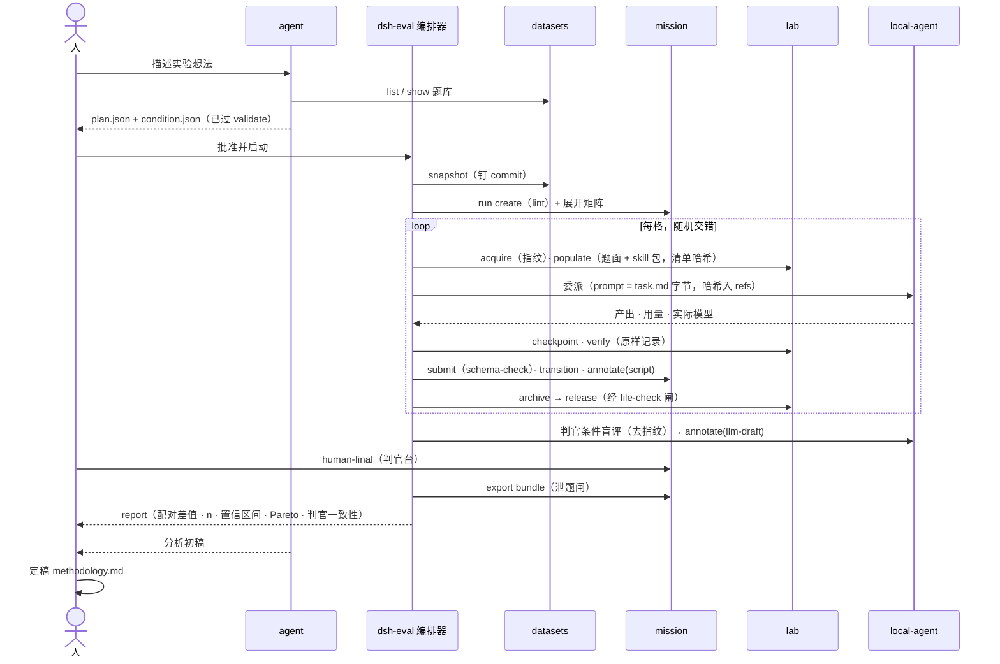

# dsh-web-eval

中文 | [English](README.en.md)

**在一个界面里跑对照实验：同一批题交给不同的 harness、模型、preset 或 skill，按题配对比较。** 题库、条件、计划进 git 评审；执行由确定性编排器驱动；判定分脚本、LLM 初评、人终评三源互不覆盖；结论随自包含 bundle 导出。基础体验与本地 Agent 家族全部内含。

> **状态**：I2 已收口（2026-09-08）：编排器 v0（run 循环、判官、报告、只读工具）合入 main；pilot A 在宿主上真跑 F2 + F3 × codex / dsh 三格到 released，报告因无环境指纹如实拒绝比较，判官一致性 κ 0.655（单格支撑），第一份结论是 14 条缺口而不是名次（题库 `docs/pilot-a-log.md`）。I3 已收口（2026-09-09）：一格在容器内走完全流程、release 经闸；四家在容器内跑通同一题（P0），报告四条不变量首次全部成立、比较节首次打开、效率表 token 四列有数（题库 `docs/pilot-b-log.md`）；阶段三的数据缺口记 T19d。I4 收尾：机制已齐；容器轮的第一份配对报告 2026-09-16 由 I5 的走查拿到（dsh × 两模型 × P0，四条不变量全 ✅、比较节打开，Δ 为 0 是 P0 的设计使然）；pilot B 以走查那次 run 收口、C 等 T55 活体验收过后并进第一次真题 run（修复已合入）、D 可发（题库 `docs/i4-pilots-log.md`）。I5 功能闭环已走通（题库 `docs/i5-walkthrough-log.md`：一句话 → agent 起草 → 批准 → 容器轮 → 报告 → 终评 → 分析初稿，R1 未被绕过），人介入 17 次其中 9 次是缺口，最后一公里 T57–T59 已合入（2026-09-17）、T60 待做；界面按 [docs/ui-spec.md](docs/ui-spec.md) §九 收口（T62 热修已合入 2026-09-17，T63 整体收口待做）。本文先把理想架构、依赖插件、理想流程与最终 UI 立住，再按迭代逼近，每个迭代的完成判据写死在[迭代计划](#迭代计划)里；逐任务的状态与文案见 [docs/iterations.md](docs/iterations.md)；I5 的界面规格见 [docs/ui-spec.md](docs/ui-spec.md)（2026-09-13 定稿，「最终 UI」一节按它写，T48）。路线图里的「dsh-eval 整合包」即本 profile。

## 定位

这是一个**因子设计的实验台**，不是流量 A/B 平台。因子是 harness、模型、preset 或 skill；题目是区组；每格是一次独立样本。它回答的问题形如「同一道题，换掉一个因子，结果差多少」，而不是「谁的总分高」。

三条与 [dsh-dev](../dev/README.md) 不同的纪律：

- **确定性归程序，判断归 agent，审批归人。** 起容器、物化题面、打 tag、跑判定、归档、销毁全部由编排器执行；agent 只把想法写成计划、把 bundle 写成分析初稿；人批准计划、写终评、决定导出。
- **每一个因子都可哈希。** 题面有快照 commit，环境有镜像 digest，输入有物化清单哈希，受试对象有条件哈希，prompt 有字节哈希。两格之间「只差一个因子」必须能被证明，而不是被声明。
- **插件不含评测词汇。** datasets、mission、lab、local-agent 是通用机制；评测语义全在契约层与编排器里。

## 理想架构


六层各自只做一件事：

| 层 | 职责 | 载体 |
|---|---|---|
| 对话层 | 想法进来、结论出去；人做三个决定：批准计划、写终评、导出 | web-eval 实例里的会话与 tab |
| 契约层 | 把评测语义写成可校验、可哈希的数据 | `docs/dataset-authoring-protocol.md` 与本 profile 的三份 schema |
| 编排层 | 唯一的执行者；每个动作确定性，可用假 exec 测试 | `@khorsheed/dsh-eval`（待建）：服务面 + CLI + skill |
| 机制层 | 通用动词：题库、状态机、单元、委派 | 四个现有插件 |
| 执行层 | 选手真正跑的地方；起点字节级一致 | 题集级镜像、各家 CLI、单元内探针（I3 起经 `lab.verify` 跑在格子的单元里） |
| 存储层 | 题库进 git，运行数据进数据根，分享物是 bundle | 三个目录 |

### 契约层的三份 schema

它们是本 profile 真正的设计工作，形状已在 I1 定稿并落成 `dataseek.condition/1`、`dataseek.plan/1`、`dataseek.verdict/1`（全文与哈希规则见[数据集作者协议 §6](../../docs/dataset-authoring-protocol.md)）。下面是意图。

**condition.json：受试对象。** 一个条件 = 一个 scoped home 的内容 + 一组 env 键 + 一个 argv 模板 + 一组可选物化包，整体内容哈希即条件 id。

```json
{
  "schema": "dataseek.condition/1",
  "harness": { "name": "claude-code", "version": "2.1.236", "drive": "exec" },
  "model": { "declared": "claude-opus-5", "endpoint": "proxy" },
  "reasoning": { "effort": "default" },
  "permissions": "skip",
  "instructions": "none",
  "preset": null,
  "skills": { "pack": null },
  "home": { "sha": "<scoped home 内容哈希>" },
  "env": { "keys": ["ANTHROPIC_BASE_URL"] }
}
```

**plan.json：一次 run 的全部输入。** 快照 × 条件 × rep × 阶段 × 顺序 × 预算 × 判官。agent 产出它，人批准它，编排器只认它。

```json
{
  "schema": "dataseek.plan/1",
  "dataset": { "repo": "<路径>", "commit": "<sha>", "id": "harness-comparison", "items": ["F2-multi-agent-room", "F3-self-restart-report"] },
  "conditions": ["<condition id>", "<condition id>"],
  "reps": 3,
  "stages": ["stage1", "stage2"],
  "order": { "seed": 42, "interleave": true },
  "budget": { "activeMinutes": 60, "turns": 10 },
  "judge": { "conditions": ["<judge condition id>"], "samples": 2 },
  "expectedNs": ["script", "llm-draft", "human-final"],
  "retry": { "infrastructure": 1 },
  "exports": "<路径>/exports"
}
```

plan 的 `conditions` 与 `judge.conditions` 写**条件 id**（不写 sha；sha 由校验器从 `conditions/<id>.lock.json` 解析并随 run.meta 记录）；`judge` 可缺省，缺省时 `expectedNs` 不得含 `llm-draft`；`retry.infrastructure`（每格基础设施重试预算，缺省 1）与 `exports`（bundle 导出目录，缺省 `<题库仓库>/exports`）也可缺省，它们是**被审阅的默认值**，run 调用选项可覆盖；plan 不含 template 字段。run 模板不由人或 agent 手写：它是题集 manifest 的 stages 加归档闸的确定性函数，validate 时生成、lint，随 plan 一起审阅。condition 是声明，`dsh-eval conditions provision` 把它变成实物 scoped home 并回算 `home.sha`，声明与实物不符即「未就绪」，validate 拦住。编排器版本与 plan 哈希一起写进 run.meta，同版本同 plan 即同一套程序。

**verdict.json：判定输出契约。** 探针脚本与判官都按它输出，编排器写进对应 ns，报告按它做表。

```json
{ "schema": "dataseek.verdict/1", "task": "F2-multi-agent-room", "criterion": "R3", "pass": true, "evidence": "<可查证事实>", "by": "probes/dispatch-trace.mjs" }
```

## 依赖插件

25 个成员，三组：

| 组 | 成员 | 状态 | 为本 profile 需要的改动 |
|---|---|---|---|
| 基础体验 | 与 dev 相同的 12 个（`ankh-guard` 在其中） | ✅ / 🔶 | 无；评测实例用自己的 `$DSH_HOME`，切换与看护归 `ankh-guard` |
| 本地 Agent 家族 | 6 个：`local-agent` + kimi / codex / claude-code / dsh 四个 provider + `tool-subagent` | 🔶 | I1：评测 pin 配置（全 exec、codex 容器内 full-access、claude 与 kimi 的推理强度显式）与 effectiveSettings 快照（含已配置模型）。I2：模型回读，记录实际使用的模型。I3：容器内 exec 包装已落地（T17：`exec: {container, workdir, env}`，值不上 argv）；「CLI 驱动抽成独立包」推迟到出现第二个消费者；`cliVersion` 与 `credentialState` 填实（T25）。I4：每条件的模型参数（首轮指定、成员内固定、resume 不换）与 scoped home 覆盖，provider 设置卡加「默认模型」 |
| 评测机制 | 7 个：`datasets` / `mission` / `lab` / `eval` 四个 core + `datasets-tool` / `mission-tool` / `eval-tool` 三个伴生（M4'③ 起拆开，伴生行归预设） | 🔶 rc | `mission`：retry 带 reason；ns 报告带 writtenBy。`lab`：复合指纹（镜像 + 资源限制 + 挂载布局 + env 键）。`datasets`：金丝雀字段；item 级外部源指针。`eval`：run 循环的判官（T9）、报告（T10）、只读工具（T14）与完整就绪检查 |

评测机制里的 **`@khorsheed/dsh-eval`** 是编排器（I2·T8 入列）。已落地：三份契约 schema、`validatePlan` / `hashCondition` / `hashHome`、`generateTemplate`（manifest → run 模板，逐项等价于 I1 手写的 bench-v1）、run 循环 v0（阶段一二、宿主目录、逐格物化、逐字节委派、submit/transition、归档闸、bundle 导出）、`/eval run` slash 与 `dsh-eval` CLI（validate / run --dry-run / template / conditions hash）。判官委派（T9）、`dsh-eval report`（T10）、模型工具（T14；I5·T46 起四个读工具 `eval_conditions` / `eval_plan_validate` / `eval_run_status` / `eval_cells`，I5·T34 再加起草工具 `eval_plan_draft`）均已落地。

`capability-catalog` 在这里多一个用途：它按 preset 的 standing scope 读注册表，是「这个条件下 agent 有哪些工具和 skill」的取证来源。T32 起它给出 `snapshotFor(presetId)` 与 `hashOf(snapshot)`：规范形取技能的 name/source/正文 sha 与工具的 name/channel/parameters（描述措辞不进——改一次文案不该换一个受试对象），哈希写作 `caps:<sha256>`。编排实例自己的那份记进 `run.meta.orchestrator.capabilities` 做取证；受试对象那份由 provision 算进 lock 的 `provisioned.capabilities`，就绪检查据此核对条件声明的 `preset`。

### 工具按域开放

agent 只在规划期与分析期出现，需要的是读与起草；执行期没有 agent；判官是一次委派而不是带工具的会话。写类工具留给编排器的服务面和人的 CLI 与 tab。preset 挑不掉 profile 层注册的工具，所以由插件自己提供按组注册的 `tools` 配置项，默认 `all` 保持 dev 域行为，本 profile 设为下表（I2 落地）：

| 插件 | agent 工具（eval 域） | 编排器服务面 | 人 |
|---|---|---|---|
| datasets | tier `authoring`：六个读类动词（`list` `show` `describe` `read` `snapshot` `validate`）+ `put_item`；只按登记 `<登记 id>/<set>` 取题，不碰仓库目录 | 按钉住的 commit 物化（`worktreePath`）、read（显式层） | 题集 tab 登记、validate |
| mission | **eval 预设不挂**（I5·T46）；账本与释放闸仍由 mission 提供 | 全部写方法 | export、retry、human-final |
| lab | 不开 | 全部 | status、release |
| eval | 四读 `eval_conditions` `eval_plan_validate` `eval_run_status` `eval_cells` + 两写 `eval_plan_draft`（部署内实验目录）`eval_analysis_write`（只写 `analysis/`）；不开 run | 内核 | 批准、run、report |
| tool-subagent（四家委派工具） | 不开——三行 `tools: none`，第四家默认不挂（I3·T27 落地） | 经 local-agent 门面委派选手 | `/codex login`、`/kimi status` 等 provider 动词 |

**M4'③ 起这三个机制插件拆成 core + companion**：profile 根只挂 core（服务 / CLI / slash / 标签页），模型工具行与工具提示词段落归 companion，所以上表的按域 tier 由 pack 的 `eval` 预设的伴生行授予——`datasets-tool: authoring`、`eval-tool: all`（见[冻结决策 12 的执行点](#冻结决策-12-的执行点eval-预设)）——不再是 profile 根的 `tools` 配置；同 profile 里走别的预设的会话这两套工具一个都拿不到，服务 / CLI / slash 仍全局，任务 / 数据集两个标签页另按同一组合判据自隐（判据读不到时 fail-open）。**`mission-tool` 曾是第三行（`tools: read`），I5·T46 摘掉**：界面规格的 R6 定了「评测模式下 mission 这个词不出现」，逐格细节改由 `eval_cells` 从 eval 自己的投影读（数据仍经结构面算 mission 的账本，但算在服务端）；同一条自隐规则的另一半随之生效——任务 tab 判的就是预设里有没有这一行，所以它一走，评测会话的任务 tab 自己就不见了。包照装，谁要在自己的覆盖层预设里加回这一行都还在。三个伴生包随 pack 安装：`package.json` 的成员清单加依赖，源码模式的 `UNPUBLISHED_DIRS` 负责从检出构建并打成 tarball（`autoInstallPeers: false`，peer 不会被自动装上）。

能力全貌、自然语言到实现的逐步轨迹与生成文件清单见 [docs/architecture.md](docs/architecture.md)。

### 冻结决策 12 的执行点：eval 预设

「工具按域开放」限的是 profile 根上注册的那批工具；另一半由**预设**限。评测实例的 agent 走 pack 自带的 `eval` 预设（`presets/eval/`），它的组成表是随发行版的 `standard` 减去两类行：

- **能执行宿主命令的**：`tool-bash` / `tool-pwsh`；`tool-workflow` 与它依赖的 `workflow-ptc`——workflow 脚本是**模型写的 JavaScript**，在 Node worker 线程里当作 async 函数体执行，够得着 `node:child_process`，全程没有 shell；`tool-ralph` 驱动同一个引擎，一起去掉。
- **词汇与本线冲突的**：`plan-mode`。它的提示词规划的是**实现**并明令不要写文件，而这个 agent 的产出恰恰是写到盘上、由人批准的 `dataseek.plan/1`。一个会话里两个「plan」是混淆，不是能力缺口。

留下的是读、起草，以及委派给**跑在同一个预设上**的 agent：进程内子 agent 继承父 agent 的预设（宿主的 `subagent-in-process-driver/tests/preset-inheritance.spec.ts` 就是这条的证明），所以委派递不出这个预设本身没有的 shell。docker 从来不在这张表上——`lab` 一个模型可见工具都不注册，容器动作全在编排器的服务面。

**预设归 pack**，理由与 `cordis.patch.yml` 同（见[安装](#安装)）：`install.sh` 与 `update.sh` 都把 `presets/eval/` 整目录覆盖到 `$DSH_HOME/.agent-presets/eval`，`cordis.patch.yml` 把 `agent-presets` 的 `default` 钉成 `eval`。个人偏好另起一个预设 id，别改这个。

**怎样确认实例正在用它**，三层，从便宜到贵——组成层、文件层、会话层：

```sh
# 组成层：默认预设是 eval，预设目录已就位
dsh --profile web-eval --dump-config | grep -A3 'id: agent-presets'   # → default: eval
ls "$DSH_HOME/.agent-presets/eval"                                     # → agent.cordis.yml  preset.yml

# 文件层：去掉注释后，组成里没有任何执行类行
grep -vE '^\s*#' "$DSH_HOME/.agent-presets/eval/agent.cordis.yml" \
  | grep -nE 'tool-bash|tool-pwsh|tool-workflow|tool-ralph|docker'     # → 无输出

# 组成层（下一小节的三行）：三个委派工具行都是 tools: none
dsh --profile web-eval --dump-config \
  | grep -A5 -E '^- id: tool-subagent-(codex-local|claude-code-local|kimi)$' \
  | grep -c 'tools: none'                                              # → 3
```

会话层要看界面：「设置 → Agent 预设」里当前默认应显示**评测模式**；新开一个会话，「设置 → 工具与技能」的工具卡里没有 `bash`，也没有任何容器工具，也没有任何 `subagent_<harness>`——一个默认会话看到的是 **35 个工具**（T21 时是 39，T27 关掉三个委派工具后是 36，I5·T46 摘掉 mission 的四个读工具、补上 `eval_cells` 后按增删算是 33；2026-09-17 3171 装到 `2c4476f8` 后实数 35 = 内建 21 + 插件 14：datasets 7、eval 5（含 T34 的 `eval_plan_draft`）、`subagent_dsh`、`list_capabilities`；没有 `mission_*`），进程内的 `subagent` 与 `subagent_fork` 仍在。会话头记录了创建时用的预设，中途改过预设的会话在日志里留有 `agent-preset/selected`。

**这条钉的是默认值，不是可达集。** 随发行版的 标准 / 代码 / 极简 / cordis 四个预设仍在名册上：apps/cli 的 `composeProfile` 把随发行版的预设根作为最后一层 overlay 无条件写进 `roots`，profile 层删不掉它们。人在界面里给一个空白会话改选「标准模式」就拿回了 Bash。决策 12 针对的是 **agent 误操作**——agent 没有切换自身预设的工具，切换是人的动作。

**这个预设够不到的执行类工具，已在插件层关上**（I3·T27）：四家选手的委派工具 `subagent_codex` / `subagent_claude_code` / `subagent_kimi` / `subagent_dsh` 由各 provider 的 bundle patch 装在 **profile 根**上，预设只能挑掉自己挂的行，所以够不到它们——而它们正是在宿主上起各家 CLI 的那批，沙箱按[冻结决策](#冻结决策) 3 放开。T21 记下的三条路径取了第一条：`@khorsheed/dsh-local-agent-tool-subagent` 加了 `tools: all | none` 注册开关，`cordis.patch.yml` 把 codex / claude-code / kimi 三行设成 `none`（取舍见 [eval 预设的 Agent Note](../../.agents/notes/implemented/process/2026-09-08-web-eval-agent-preset.zh.md)）。关掉的只是模型可见的工具：provider 行照挂，编排器经 local-agent 门面委派选手，`/codex login` 这类动词也照常。

**第四家 `subagent_dsh` 仍是一条待关的路。** 它没有配置行——`local-agent-dsh` 的 DeepSeek 开关默认关，工具由控制器在开关 ON 时用写死的配置动态挂载，profile 层够不着。默认状态下它一个工具都不注册（所以上面那份 33 个工具的清单里没有它），但**人在「设置 → 本地 Agent」里打开那个开关，`subagent_dsh` 就会带默认 `tools: all` 出现**。要彻底关上得改 provider 包，记在 T27 的 Agent Note 里。与决策 12 的其余部分一样，这钉的是默认值，不是可达集。

## 理想流程



每格的状态机由 run 模板声明、mission 冻结并强制。评测模板的形状：

```text
pending → ws-ready → stage-1 → stage-2 → iterating ⇄ checkpoint-N → judged → archived → releasable → released
                                  └→ halted（feasible = false）→ archived → releasable → released
```

进入 `releasable` 的转移带 `file-check`，失败路径同款，没有例外。

三种判定来源的分工不变：`script` 只由探针写；`llm-draft` 由判官条件写，判官本身是一个条件，模型不得是选手之一，至少两次采样并报告一致性；`human-final` 只从判官台写，`by` 若是 `tool:` 前缀在报告里标红。

## 最终 UI

评测模式下人有三个面：**会话**、**题集 tab**、**实验室 tab**（口径正本是 [docs/ui-spec.md](docs/ui-spec.md)，2026-09-13 定稿）。两个 tab 同形——列表 + 新建 + 详情，实验详情再分子页。**missions tab 隐藏**：mission 仍是评测的账本与释放闸，但这个词不进界面，逐格细节由 `eval_cells` 从 eval 自己的投影读（ui-spec R6）。

| 面 | 作用 | 状态 |
|---|---|---|
| **题集 › 列表** | 一行一个题集：id、快照（分支 @ commit）、题目数、槽位与层的对应、canary 是否设置、validate 结果、用于哪些实验。动作：新建题集（生成带 `dataset.json` 的骨架）、导入题集（指一个已按协议组织的目录或仓库 + commit，validate 后入列——本质是登记） | ✅ I5·T47 |
| **题集 › 详情**（题集 › 题目） | 文件树 + 预览：树上每个文件标槽位与「谁看得到」，槽位可筛选；「选手将看到」把这道题在单元里的样子原样列出（防泄题自查）；可判性一行（评估标准几条、探针几个、阶段 schema 几个）；「作答记录」按题目投影各实验的格子。动作：题目骨架、导入题目、validate | ✅ I5·T47 |
| **实验室 › 列表** | 一行一个实验：名称、题库快照、条件数（+ 判官）、题数、rep、因子（由条件 diff 自动推出）、状态、进度、开始时间；草稿与 run 同列。状态：草稿 → 待批准 → 运行中 → 评估中 → 已完成，另有被拒、已取消 | ✅ I5·T35a |
| **实验室 › 新建实验** | 名称、题库快照、题目多选、条件（选已有或新建：harness、模型、scope、preset、权限、推理强度）、判官与采样数、rep、阶段、顺序 seed、环境（镜像、网络、出网自检）、预算。产出是 `plans/<name>.json` 与新条件文件，进题库工作树的透传区；动作只有「保存草稿并 validate」——**启动不在这张表单上**。agent 起草的草稿与人建的落在同一个列表：两条路走同一个服务面动词（`draftExperiment`），所以是同一份文件 | ✅ I5·T34 |
| 详情 › **实验设计** | T67 起吸收原概览与条件两页：实验规模与对比变量；对比组与就绪（就绪徽章、validate 里需要读的几条、只列本实验的对比组表，每行「准备环境」、端点就地改、两行出 diff）；计划网格；高级设置（快照、就绪检查原文、run.meta 等，默认折叠）。顶上状态条一个主动作：**批准并启动**——批准永远是人的动作 | ✅ I5·T36 · T67 |
| 详情 › **矩阵** | 行永远是题，列是人选的因子，其余因子分组或筛选；格内固定四样：rep 圆点（实心已判 / 半心进行中 / 空心未起）、阶段或桶、卡格告警、物化哈希是否与同题其它格一致；底部 run 级汇总（物化哈希、环境指纹、未释放单元、判官一致性、卡格数）。点格子打开格子详情 | ✅ I5·T35b |
| 详情 › **格子** | 原 missions 队列按本 run 过滤：题 × 条件 × rep、桶、阶段、attempt、时长；右侧抽屉是格子详情——refs、检查点、子会话（打开成员子会话，可续聊不干预）、verify 原样输出、产物、注解计数。动作：带原因重跑、释放检查、导出 bundle | ✅ I5·T35b |
| 详情 › **报告** | 四条不变量、配对差值表、效率表、判官一致性；四条全 ok 前「报告」显示为「比较节未开」。动作：finalize（过释放闸）、导出（走原泄题闸对话框） | ✅ I5·T38 |
| 详情 › **判官台** | 盲评队列、去指纹产物、llm-draft 与 human-final 并排、一致性统计；human-final 的唯一写入口。判官不是矩阵上的一行——它的判定是本格的 llm-draft 注解，带 `by` = 判官条件 id | ⬜ I5·T37 |
| **成员 dock · 成员续聊** | 从格子详情用宿主的 `sessions.open(childSessionId)` 打开成员子会话，composer 与 dock 由 local-agent 接管 | ✅ 已有 |

实验详情的运行记录（网格）：

```text
┌ 实验室 › 2026-09-20-pilot ─────────────── 快照 harness-comparison@d1ac20a ┐
│ 实验设计 ·[运行记录]· 结果对比 · 人工评估                                  │
│ 列 = harness ▾  其余因子：model 默认 · scope eval        rep 3 · 阶段 1-2 │
│────────┬─────────────┬─────────────┬─────────────┬────────────────────────│
│ 题     │ codex       │ claude-code │ kimi        │ dsh                    │
│────────┼─────────────┼─────────────┼─────────────┼────────────────────────│
│ F2     │ ●●● judged  │ ●●○ stage-2 │ ●●● judged  │ ●○○ stage-1 ⚠ 47m      │
│ F3     │ ●●● judged  │ ●●● judged  │ ●●● halted×1│ ●●● judged  ≠ 物化哈希 │
│────────┴─────────────┴─────────────┴─────────────┴────────────────────────│
│ 物化哈希全部一致 · 未释放 2 · κ 0.71                    [finalize] [导出] │
└───────────────────────────────────────────────────────────────────────────┘
```

CLI 与界面同语义：`dsh-eval conditions | plan validate | run | report`。

## 冻结决策

这些是装置的公平性基线，开跑前写进 run meta，跑完不改。改任何一条都要开新 run。

1. **rep 是独立 mission；attempt 只用于基础设施故障重跑。** retry 带原因枚举，报告分开计数。
2. **驱动全 exec。** live 是常驻进程，空闲回收、崩溃续跑、审批自动应答都是额外因子。
3. **沙箱交给容器边界。** codex 容器内 `danger-full-access`，claude `skip`，kimi 自动批准，dsh 无限制；四家一致。容器以非 root 用户跑题：claude 的 `skip` 档在 root 下被拒绝（T16 实测）。
4. **推理强度每家显式 pin 并记录。** 现状 kimi 由 provision 写死 high，其余各家默认，属未受控。
5. **模型显式 pin 且从输出回读。** 声明与实际不符即 fail loud；claude 走代理时代理地址进条件。
6. **prompt 是 visible 层文件的逐字节内容。** 母 agent 不参与 prompt 构造；prompt 哈希入 refs。
7. **超时与轮次上限归编排器。** provider 不管；取消原因记录。
8. **预算用选手活跃时长，不用墙钟。** 各次委派运行时长之和；墙钟只作解释变量。
9. **判官显式 pin 模型；每格由谁判进报告；自评格标出。** 判前去指纹，每位判官双采样报一致性，可以列多位判官组成面板。判官与选手同模型**不再拒绝**——要评的就是全部模型时评委必然与某个选手重合，公开榜单的做法是多评委加披露而不是排除——改为每条判定带判官（条件 id 与模型），报告逐格列出由谁判，同模型的格标「自评」，一致性一节在同判官 κ 之外多一行跨判官一致性。（2026-09-10 放宽；原文「判官不得是选手之一」见 I4·T31 的 Agent Note。）
10. **跨家效率用标价成本或活跃秒数；token 只在同模型内比。**
11. **运行顺序随机交错并记录种子。**
12. **销毁路径唯一。** 评测实例的 agent preset 不挂 Bash 与 docker；只有编排器持有 docker socket。执行点见[同名小节](#冻结决策-12-的执行点eval-预设)。

## 迭代计划

原则：**契约先于代码，走通一格先于放宽因子，结论先于界面。** 每个迭代的完成判据是可观察的状态，达不到不进下一个。

| 迭代 | 范围 | 交付物 | 完成判据 |
|---|---|---|---|
| **I0 骨架** | 本 profile 目录与本文 | package.json、脚本、README、冻结决策 | 目录存在；决策清单被下一迭代引用 |
| **I1 走通一格 + 三份契约** | P0 × dsh × 阶段一二，宿主上手工推，不进容器；同时定 condition / plan / verdict 的形状 | `dsh-eval validate`；local-agent 评测 pin 配置；mission retry reason；操作手册更新 | 操作手册里没有 ❌；P0 的 plan 过校验且两次哈希相同；一格的耗时与卡点有记录 |
| **I2 编排器 v0 + pilot A** | 宿主插件 + CLI，只覆盖阶段一二；F2 + F3 × 四家 × 3 rep，每格独立 cwd | `@khorsheed/dsh-eval` 进成员清单；模板由 manifest 生成；`script` 与 `llm-draft` 自动入库；模型回读；datasets 金丝雀字段；datasets 与 mission 的 `tools` 分组配置；bundle；`dsh-eval report` 配对表 | 一格全自动跑完；一份带保留条款的结论；判官一致性有数字 |
| **I3 容器化 + 阶段三四** | 验证题集级镜像；四家 Linux CLI；容器内 exec；复合指纹；verify 探针脚本；pilot A 的缺口（活性探测、finalize 再入口、负分判据与权重、CLI 版本回读、可判性检查） | lab 复合指纹；provider 容器包装或 CLI 驱动独立包；F2 阶段三的探针；阶段一二的 objective 探针；eval preset | 容器内一格走完全流程，release 经闸；四家在容器内跑通同一题 |
| **I4 放宽因子** | 条件参数化：模型、preset、skill 包 | provider 的模型参数与每条件 scoped home 覆盖；`dsh-eval conditions provision`；条件注册表数据面；capability-catalog 能力清单哈希 | dsh × 两模型的配对结果；claude × 两模型验证参数路径；同 harness 两 preset 的配对结果 |
| **I5 agent 配实验 + 界面** | `eval-planning` skill；实验台 tab；实验设计；判官台；报告视图；eval 模式化（preset + 伴生工具包 + 命名 provider，重跑批仍在独立实例） | 三个新面 + skill | 一句话 → 计划 → 批准 → 跑完 → 报告，人只做审批与终评 |
| **I6 外部评测集与开放** | SWE-bench / Terminal-Bench 适配脚本；item 级外部源指针；train/dev/test 标签；npm 发布 | 适配脚本；协议扩展；镜像仓 | 一个外部题集跑通一格；`dsh plugin add` 装齐 |

为什么放宽因子排在 I4 而不是 I1：条件哈希的**形状**在 I1 就定死，所以 I4 不需要改契约，只是让 provider 认识更多字段。先在四家 harness 上出一份结论，判官、rubric、去指纹的问题会在那一步全部暴露，比先做多因子更省。

本期（I0 到 I2）明确不做：新界面、lab 的模型工具面、agent 执行格子、外部评测集接入、npm 发布。

## 安装

> 编排器落地前，本 profile 只是插件组合。下面的流程与 dev 同款，可用于提前把评测实例立起来。

评测实例要独立的 `$DSH_HOME`，不与开发实例共享会话与凭据（环境隔离是评测的基本要求，见 `docs/ops.md` 的环境拓扑）。I1 到 I2 在宿主上直跑四家 CLI，只需要 node、git 与各家 CLI；I3 起需要 docker，题集级镜像、本地包镜像、白名单代理与凭证卷的清单见 [docs/architecture.md](docs/architecture.md) 的「运行环境」一节。

**两个脚本第一步都是机器级前置检查，在动任何文件之前**：`dsh` 在 PATH 上、`dsh --version` 能跑、以及 `cordis.patch.yml` 里 pin 的 headless bundle 路径存在（它从该文件里读，不写死）。任一条不满足就打印缺什么并以退出码 2 退出，`$DSH_HOME` 与 `$DSH_HOME/.agent-presets/eval` 一个字节都不动——此前第一次 `dsh` 调用在脚本末尾，缺 `dsh` 的机器要先整目录覆盖预设、（源码模式还要）把每个成员构建打包一遍，才在最后一行失败。预设目录在被整目录替换之前会备份到 `$DSH_HOME/.agent-presets/.web-eval-backup.<pid>`，失败时 trap 会告诉你它在哪；`update.sh` 同样备份它覆盖的 pin 文件，并且此前根本没有 trap。

**宿主线：本 profile 要求 `dsh` ≥ 0.1.5-rc.1**（评测家族六个包的 `dsh.compat.minHost` 与 `verifiedHost` 自 2026-09-11 起都写这条线；local-agent 家族自基线提交 `bb04c84` 起已是）。源码模式的前置检查里因此多一条**宿主线核对**：脚本读每个待打包成员 `package.json` 的 `dsh.compat.minHost`，与 `dsh --version` 比一次，低于任一成员就在动文件前退出（退出码 2）并逐行列出谁要求什么版本。这条检查只在源码模式有——npm 模式的成员由 registry 解析，本地没有 `package.json` 可读。它挡的是一种到不了安装期的失败：宿主偏低不会在装的时候报错，而是在**起实例时**从某个插件的 import 里抛一个缺失导出（本机测到两次：`@deepseek-ai/dsh-settings` 在 0.1.5 上没有 `settingsNamespace`，而 npm 上 0.2.0 的 context-guard / ui-shortcuts 会 import 它），或者更晚——装完能起、跑到 resume 轮才报 `childSession.snapshotEvents is not a function`。

`install.sh` 有两条路径，结尾都打印组合统计；`dsh --profile web-eval --dump-config | grep -o "@khorsheed/[a-z0-9-]*" | sort -u | wc -l` 应为 22（去重成员数——dump 里每个成员出现多次：层头加条目行，tool-subagent 只经 provider 条目出现）。

**npm 模式**——成员全部从 npm registry 解析。成员全部上架后（I6）开箱即用；在此之前，未上架成员会在安装时报 registry 404（权威清单见 dsh-plugins 的 [docs/release-status.md](https://github.com/Khorsheed/dsh-plugins/blob/main/docs/release-status.md)）：

```sh
git clone https://github.com/Khorsheed/dsh-web-eval.git
DSH_HOME=~/.dsh-eval sh dsh-web-eval/scripts/install.sh
DSH_HOME=~/.dsh-eval sh dsh-web-eval/scripts/restart-into-web-eval.sh <端口>
```

**源码模式**——当前的可用路径。给定一个可构建的 [dsh-plugins](https://github.com/Khorsheed/dsh-plugins) 检出（已 `pnpm install`、按其 AGENTS.md 构建绿；构建与类型解析需要 deepseek-harness 检出），脚本构建全部未上架成员、按 `--family` 打 tarball 进 profile 的 `tarballs/`、写 pnpm overrides 钉住家族边，已上架成员仍走 npm，然后标准安装：

```sh
git clone https://github.com/Khorsheed/dsh-web-eval.git
git clone https://github.com/Khorsheed/dsh-plugins.git && pnpm --dir dsh-plugins install
DSH_HOME=~/.dsh-eval sh dsh-web-eval/scripts/install.sh --source "$PWD/dsh-plugins"
DSH_HOME=~/.dsh-eval sh dsh-web-eval/scripts/restart-into-web-eval.sh <端口>
```

源码模式的 tarball 落在 profile 目录内：`rm -rf "$DSH_HOME/profiles/web-eval"` 卸载时一并清掉。检出更新后要换新 tarball，重跑时**必须加 `--fresh`**：profile 已装的 `node_modules`、`pnpm-lock.yaml` 与 `tarballs/` 会让新打的 tarball 进不来，实例照旧跑旧构建且没有任何提示；`--fresh` 先清掉这三样再装。不加 `--fresh` 重跑时脚本直接拒绝并把这段原因打出来。

评测 pin 配置（冻结决策 2 到 4）属于装置而非个人偏好，**归 pack**：它们写在本 profile 的 `cordis.patch.yml` 里，`install.sh` 与 `update.sh` 都覆盖该文件——这是与 [dsh-dev](../dev/README.md) 唯一的 patch 层差异。留给用户层的后果是一次 update 之后实例可能静默换了沙箱档位或推理强度，而 run.meta 里记的还是旧值，报告的「受试对象一致」失去意义。个人偏好放 preset 层，不放这里。

同理由**归 pack** 的还有 agent 预设与技能：`presets/eval/` 由两个脚本整目录覆盖到 `$DSH_HOME/.agent-presets/eval`，`cordis.patch.yml` 把它钉成默认预设（[冻结决策 12 的执行点](#冻结决策-12-的执行点eval-预设)）；`skills/eval-planning/` 同样整目录覆盖到 `$DSH_HOME/skills/eval-planning`——那是 `dsh-skill-filesystem` 扫的 `user-dsh` 根，eval 预设里的 `skill-filesystem` 行把它带进评测会话的技能卡。技能也是装置：它教的是 `eval_plan_draft` 这一个起草动词，以及批准 / 登录 / provision / 终评都不是 agent 的——这条线歪了，草稿就会变成没人批的 run。两者都落在 profile 目录**之外**（预设与技能名册都按 `$DSH_HOME` 而不是按 profile 组织），所以卸载 profile 的那条 `rm -rf` 不会带走它们——见[卸载](#更新切换装卸单个成员卸载)。

当前 pin（I2·T15 写入，I3·T27 补三行；M4'③ 起这几条的授予点在 pack 的 `eval` 预设的伴生行上，I5·T46 起 `mission-tool` 那一行不再挂）：`datasets-tool: authoring`、`eval-tool: all`，加三个委派工具行 `tools: none`（工具按域开放）；四家 `live: false`（决策 2）；codex `sandbox`、claude `permissionMode: skip`、kimi `thinkingEffort: high`（决策 3 与 4）；claude `baseUrl`（决策 5——端点属于受试对象，不 pin 就退回宿主进程环境，换个终端重启即静默换上游；取值与 3080 生产 profile 同为官方端点，宿主环境里那个第三方地址走的是 API key 而 `delegationEnv` 会把 key 抹掉）。**claude 的 `proxyUrl` 自 I3·T22 起不 pin**：provider 会把它写进作用域 settings.json 的 env 块，而 T20c 之后容器轮挂的就是这个作用域目录，宿主地址在单元里当场 Connection refused；单元的出网由镜像烧进去的白名单代理给，谁要在宿主上直跑 claude，在自己的覆盖层里加回这一行，别加在 pack 里。**dsh 的 `headlessBundleDir` 与 `cliLaunch` 自 I3·T22 起 pin** 成宿主与单元里同时成立的路径——provider 写进作用域目录的是指向宿主安装的绝对符号链接，单元里悬空；这是机器级前置条件，备法见题库 env/README。**codex 的 `sandbox` 自 I3·T22 起是 `danger-full-access`**，与冻结决策 3 一致。宿主直跑阶段（I2）它取的是 `workspace-write`：那时没有容器边界，给满权限等于把评测的副作用放进真实 home，而这条不对称当时随每次 run 写进 methodology。容器路径落地后边界由单元提供——无外网、只有白名单代理、非 root、一格一单元用完即毁——满权限的作用域就是那个一次性单元，四家因此真正落在同一档上，methodology 不必再声明这条不对称。**这条 pin 与容器路径是一对**：谁要再在宿主上跑一次阶段一二，得先把它改回 `workspace-write` 并重新声明那条不对称，而不是带着满权限直跑宿主。

## 更新、切换、装卸单个成员、卸载

切换是同端口交接；`update.sh` 覆盖成员清单、lockfile、**`cordis.patch.yml`、`presets/eval/` 与 `skills/eval-planning/`**——评测 pin、agent 预设与技能都归 pack（见[安装](#安装)），这是与 [dsh-dev](../dev/README.md#更新) 的唯一差异；`dsh --profile web-eval plugin rm/add <pkg>` 装卸单个成员；`rm -rf "$DSH_HOME/profiles/web-eval"` 卸载整个 profile——pack 的 agent 预设与技能都不在这个目录下，要一并清掉再加 `rm -rf "$DSH_HOME/.agent-presets/eval" "$DSH_HOME/skills/eval-planning"`（留着它们无害：没有 profile 把预设钉成默认，技能也只是名册上多一条）。I6 之前装的源码模式实例不要跑 `update.sh`——它会把成员清单覆盖回 npm 范围，未上架成员随即 404；用重跑 `install.sh --source` 代替。

## 相关文档

- 技术架构：能力地图、自然语言到实现的轨迹、生成文件清单：[docs/architecture.md](docs/architecture.md)
- 迭代文档：插件 × 层的落地矩阵、逐迭代任务与验收、I1 指引文案：[docs/iterations.md](docs/iterations.md)
- 数据集作者协议：`docs/dataset-authoring-protocol.md`
- 三个机制插件的提案：`proposals/active/2026-08-19-datasets-store.md`、`2026-08-19-mission-tasks.md`、`2026-08-19-lab-experiment-units.md`
- 三包联调（编排器的种子）：`scripts/integration-triad.mts`
- 路线图与分层模型：`docs/roadmap.md`

## 相关整合包

| 整合包 | 定位 |
|---|---|
| [dsh-basic](../basic/README.md) | 日常模式：只含基础体验 |
| [dsh-dev](../dev/README.md) | 开发模式：基础体验 + 本地 Agent 家族 + worktrees + room |

## 许可

[MIT](LICENSE)
