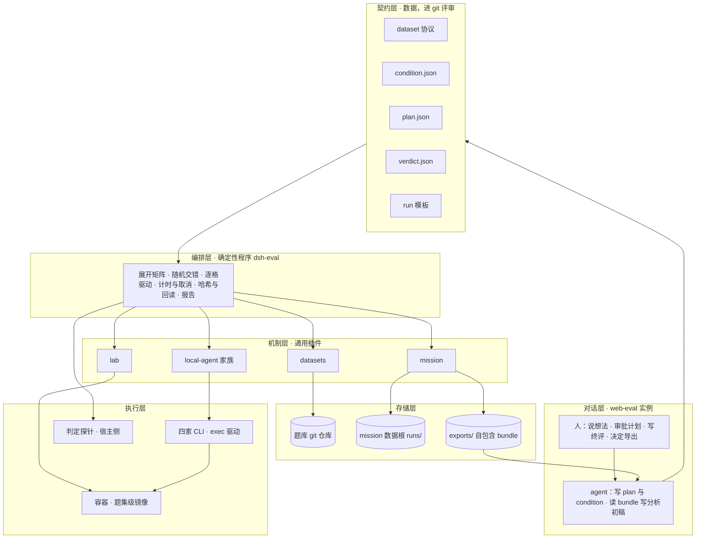
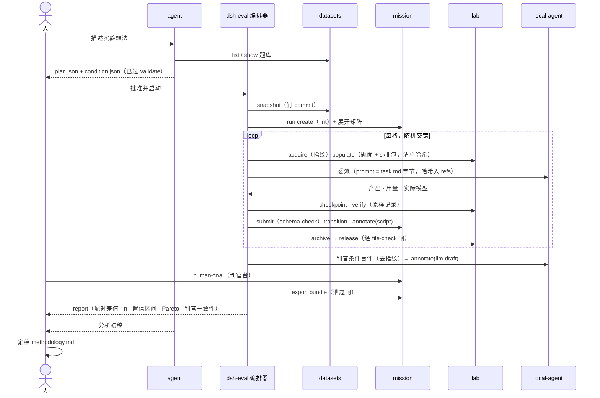

# dsh-web-eval

中文 | [English](README.en.md)

**在一个界面里跑对照实验：同一批题交给不同的 harness、模型、preset 或 skill，按题配对比较。** 题库、条件、计划进 git 评审；执行由确定性编排器驱动；判定分脚本、LLM 初评、人终评三源互不覆盖；结论随自包含 bundle 导出。基础体验与本地 Agent 家族全部内含。

> **状态**：I1 已手工走通一格，I2 进行中。编排器 `@khorsheed/dsh-eval` 的离线一半已落地（三份契约 schema、`dsh-eval validate`、`dsh-eval conditions hash`），执行半（run / report）按迭代推进。本文先把理想架构、依赖插件、理想流程与最终 UI 立住，再按迭代逼近，每个迭代的完成判据写死在[迭代计划](#迭代计划)里。路线图里的「dsh-eval 整合包」即本 profile。

## 定位

这是一个**因子设计的实验台**，不是流量 A/B 平台。因子是 harness、模型、preset 或 skill；题目是区组；每格是一次独立样本。它回答的问题形如「同一道题，换掉一个因子，结果差多少」，而不是「谁的总分高」。

三条与 [dsh-web-dev](../web-dev/README.md) 不同的纪律：

- **确定性归程序，判断归 agent，审批归人。** 起容器、物化题面、打 tag、跑判定、归档、销毁全部由编排器执行；agent 只把想法写成计划、把 bundle 写成分析初稿；人批准计划、写终评、决定导出。
- **每一个因子都可哈希。** 题面有快照 commit，环境有镜像 digest，输入有物化清单哈希，受试对象有条件哈希，prompt 有字节哈希。两格之间「只差一个因子」必须能被证明，而不是被声明。
- **插件不含评测词汇。** datasets、mission、lab、local-agent 是通用机制；评测语义全在契约层与编排器里。

## 理想架构



六层各自只做一件事：

| 层 | 职责 | 载体 |
|---|---|---|
| 对话层 | 想法进来、结论出去；人做三个决定：批准计划、写终评、导出 | web-eval 实例里的会话与 tab |
| 契约层 | 把评测语义写成可校验、可哈希的数据 | `docs/dataset-authoring-protocol.md` 与本 profile 的三份 schema |
| 编排层 | 唯一的执行者；每个动作确定性，可用假 exec 测试 | `@khorsheed/dsh-eval`（待建）：服务面 + CLI + skill |
| 机制层 | 通用动词：题库、状态机、单元、委派 | 四个现有插件 |
| 执行层 | 选手真正跑的地方；起点字节级一致 | 题集级镜像、各家 CLI、宿主侧探针 |
| 存储层 | 题库进 git，运行数据进数据根，分享物是 bundle | 三个目录 |

### 契约层的三份 schema

它们是本 profile 真正的设计工作，形状已在 I1 定稿并落成 `dataseek.condition/1`、`dataseek.plan/1`、`dataseek.verdict/1`（全文与哈希规则见[数据集作者协议 §6](../../docs/dataset-authoring-protocol.md)）。下面是意图。

**condition.json：受试对象。** 一个条件 = 一个 scoped home 的内容 + 一组 env 键 + 一个 argv 模板 + 一组可选物化包，整体内容哈希即条件 id。

```json
{
  "schema": "dataseek.condition/1",
  "harness": { "name": "claude-code", "version": "2.1.236", "drive": "exec" },
  "model": { "declared": "claude-opus-5", "endpoint": "proxy" },
  "reasoning": { "effort": "default" },
  "permissions": "skip",
  "instructions": "none",
  "preset": null,
  "skills": { "pack": null },
  "home": { "sha": "<scoped home 内容哈希>" },
  "env": { "keys": ["ANTHROPIC_BASE_URL"] }
}
```

**plan.json：一次 run 的全部输入。** 快照 × 条件 × rep × 阶段 × 顺序 × 预算 × 判官。agent 产出它，人批准它，编排器只认它。

```json
{
  "schema": "dataseek.plan/1",
  "dataset": { "repo": "<路径>", "commit": "<sha>", "id": "harness-comparison", "items": ["F2-multi-agent-room", "F3-self-restart-report"] },
  "conditions": ["<condition id>", "<condition id>"],
  "reps": 3,
  "stages": ["stage1", "stage2"],
  "order": { "seed": 42, "interleave": true },
  "budget": { "activeMinutes": 60, "turns": 10 },
  "judge": { "conditions": ["<judge condition id>"], "samples": 2 },
  "expectedNs": ["script", "llm-draft", "human-final"]
}
```

plan 的 `conditions` 与 `judge.conditions` 写**条件 id**（不写 sha；sha 由校验器从 `conditions/<id>.lock.json` 解析并随 run.meta 记录）；`judge` 可缺省，缺省时 `expectedNs` 不得含 `llm-draft`；plan 不含 template 字段。run 模板不由人或 agent 手写：它是题集 manifest 的 stages 加归档闸的确定性函数，validate 时生成、lint，随 plan 一起审阅。condition 是声明，`dsh-eval conditions provision` 把它变成实物 scoped home 并回算 `home.sha`，声明与实物不符即「未就绪」，validate 拦住。编排器版本与 plan 哈希一起写进 run.meta，同版本同 plan 即同一套程序。

**verdict.json：判定输出契约。** 探针脚本与判官都按它输出，编排器写进对应 ns，报告按它做表。

```json
{ "schema": "dataseek.verdict/1", "task": "F2-multi-agent-room", "criterion": "R3", "pass": true, "evidence": "<可查证事实>", "by": "probes/dispatch-trace.mjs" }
```

## 依赖插件

22 个成员，四组：

| 组 | 成员 | 状态 | 为本 profile 需要的改动 |
|---|---|---|---|
| 基础体验 | 与 web-dev 相同的 12 个 | ✅ / 🔶 | 无 |
| 本地 Agent 家族 | `local-agent` + kimi / codex / claude-code / dsh 四个 provider + `tool-subagent` | 🔶 | I1：评测 pin 配置（全 exec、codex 容器内 full-access、claude 与 kimi 的推理强度显式）。I2：模型回读，记录实际使用的模型。I3：容器内 exec 包装，或把 CLI 驱动抽成独立包。I4：每条件的模型参数与 scoped home 覆盖 |
| 评测机制 | `datasets` / `mission` / `lab` | 🔶 rc | `mission`：retry 带 reason；ns 报告带 writtenBy。`lab`：复合指纹（镜像 + 资源限制 + 挂载布局 + env 键）。`datasets`：金丝雀字段；item 级外部源指针 |
| 运维守护 | `ankh-guard` | ✅ | 无；评测实例独立 `$DSH_HOME` |

已建一半的：**`@khorsheed/dsh-eval`**（编排器）。离线核心已随 I2·T2 落地为 packages/eval：三份契约 schema、`validatePlan` / `hashCondition` / `hashHome` 服务面与 `dsh-eval` CLI（validate / conditions hash）。宿主插件 + `dsh-eval` CLI + `eval-planning` skill 的全貌是：读 plan，驱动四个服务面，管计时、取消、重试原因、prompt 哈希、模型回读，写 `script` 与 `orchestrator` 两个 ns，出报告。它是 `scripts/integration-triad.mts` 长大后的样子。执行动词按 I2 任务补齐。

`capability-catalog` 在这里多一个用途：它按 preset 的 standing scope 读注册表，是「这个条件下 agent 有哪些工具和 skill」的取证来源，I4 让它输出可哈希的能力清单。

### 工具按域开放

agent 只在规划期与分析期出现，需要的是读与起草；执行期没有 agent；判官是一次委派而不是带工具的会话。写类工具留给编排器的服务面和人的 CLI 与 tab。preset 挑不掉 profile 层注册的工具，所以由插件自己提供按组注册的 `tools` 配置项，默认 `all` 保持 dev 域行为，本 profile 设为下表（I2 落地）：

| 插件 | agent 工具（eval 域） | 编排器服务面 | 人 |
|---|---|---|---|
| datasets | 读类全开；`put_item` 留给出题 | snapshot、worktree_path、read（显式层） | bind、tab、validate |
| mission | 只开 `run_list` `run_status` `list` `get` | 全部写方法 | export、retry、human-final |
| lab | 不开 | 全部 | status、release |
| eval | `eval_conditions` `eval_plan_validate` `eval_run_status`；不开 run | 内核 | 批准、run、report |

能力全貌、自然语言到实现的逐步轨迹与生成文件清单见 [docs/architecture.md](docs/architecture.md)。

## 理想流程



每格的状态机由 run 模板声明、mission 冻结并强制。评测模板的形状：

```text
pending → ws-ready → stage-1 → stage-2 → iterating ⇄ checkpoint-N → judged → archived → releasable → released
                                  └→ halted（feasible = false）→ archived → releasable → released
```

进入 `releasable` 的转移带 `file-check`，失败路径同款，没有例外。

三种判定来源的分工不变：`script` 只由探针写；`llm-draft` 由判官条件写，判官本身是一个条件，模型不得是选手之一，至少两次采样并报告一致性；`human-final` 只从判官台写，`by` 若是 `tool:` 前缀在报告里标红。

## 最终 UI

七个面，四个已有，三个待建：

| 面 | 作用 | 状态 |
|---|---|---|
| **实验台 tab**（`eval`） | 矩阵板：题 × 条件，格内显示 rep 进度、阶段、桶、物化哈希是否一致、卡格告警；run 范围与五桶复用 missions tab 的投影 | ⬜ I5 |
| **条件注册表** | 条件列表、两条件 diff（只差哪一项）、哈希、来源（scoped home / 镜像 / skill 包） | ⬜ I4 数据、I5 界面 |
| **计划审阅** | agent 产出的 plan 呈现为「快照 @commit · N 条件 · M 题 · R rep · 顺序」+ validate 结果 + 批准按钮；批准是人的动作 | ⬜ I5 |
| **格子详情** | 成员子会话 transcript、verify 原样输出、checkpoint 与 tag、产物、三源注解分栏 | 🔶 missions tab 详情 + 成员 dock 已有大半 |
| **判官台** | 盲评队列、去指纹产物、llm-draft 与 human-final 并排、一致性统计；human-final 的唯一写入口 | ⬜ I5 |
| **报告视图** | 按题配对差值表、Pareto 图（完成度 × 成本）、n 与置信区间、样本不足时拒绝排名；导出走现有泄题闸对话框 | ⬜ I2 先出 CLI 表，I5 进界面 |
| **datasets tab / missions tab / 成员 dock** | 题库浏览与绑定、队列与释放检查、成员续聊 | ✅ 已有 |

实验台的样子：

```text
┌ eval · run 2026-09-20-pilot ─────────────────── 快照 harness-comparison@d1ac20a ┐
│ 条件: [A codex/…] [B claude/…] [C kimi/…] [D dsh/…]        rep 3 · 阶段 1-2  │
│──────────┬──────────────┬──────────────┬──────────────┬─────────────────────│
│ 题       │ A            │ B            │ C            │ D                   │
│──────────┼──────────────┼──────────────┼──────────────┼─────────────────────│
│ F2       │ ●●● judged   │ ●●○ stage-2  │ ●●● judged   │ ●○○ stage-1 ⚠ 47m  │
│ F3       │ ●●● judged   │ ●●● judged   │ ●●● halted×1 │ ●●● judged          │
│──────────┴──────────────┴──────────────┴──────────────┴─────────────────────│
│ 物化哈希 9f2c1a2b 全部一致 · 未释放单元 2 · 判官一致性 κ 0.71   [报告] [导出] │
└─────────────────────────────────────────────────────────────────────────────┘
```

CLI 与界面同语义：`dsh-eval conditions | plan validate | run | report`。

## 冻结决策

这些是装置的公平性基线，开跑前写进 run meta，跑完不改。改任何一条都要开新 run。

1. **rep 是独立 mission；attempt 只用于基础设施故障重跑。** retry 带原因枚举，报告分开计数。
2. **驱动全 exec。** live 是常驻进程，空闲回收、崩溃续跑、审批自动应答都是额外因子。
3. **沙箱交给容器边界。** codex 容器内 `danger-full-access`，claude `skip`，kimi 自动批准，dsh 无限制；四家一致。
4. **推理强度每家显式 pin 并记录。** 现状 kimi 由 provision 写死 high，其余各家默认，属未受控。
5. **模型显式 pin 且从输出回读。** 声明与实际不符即 fail loud；claude 走代理时代理地址进条件。
6. **prompt 是 visible 层文件的逐字节内容。** 母 agent 不参与 prompt 构造；prompt 哈希入 refs。
7. **超时与轮次上限归编排器。** provider 不管；取消原因记录。
8. **预算用选手活跃时长，不用墙钟。** 各次委派运行时长之和；墙钟只作解释变量。
9. **判官不得是选手之一；判前去指纹；双采样报一致性。**
10. **跨家效率用标价成本或活跃秒数；token 只在同模型内比。**
11. **运行顺序随机交错并记录种子。**
12. **销毁路径唯一。** 评测实例的 agent preset 不挂 Bash 与 docker；只有编排器持有 docker socket。

## 迭代计划

原则：**契约先于代码，走通一格先于放宽因子，结论先于界面。** 每个迭代的完成判据是可观察的状态，达不到不进下一个。

| 迭代 | 范围 | 交付物 | 完成判据 |
|---|---|---|---|
| **I0 骨架** | 本 profile 目录与本文 | package.json、脚本、README、冻结决策 | 目录存在；决策清单被下一迭代引用 |
| **I1 走通一格 + 三份契约** | P0 × dsh × 阶段一二，宿主上手工推，不进容器；同时定 condition / plan / verdict 的形状 | `dsh-eval validate`；local-agent 评测 pin 配置；mission retry reason；操作手册更新 | 操作手册里没有 ❌；P0 的 plan 过校验且两次哈希相同；一格的耗时与卡点有记录 |
| **I2 编排器 v0 + pilot A** | 宿主插件 + CLI，只覆盖阶段一二；F2 + F3 × 四家 × 3 rep，每格独立 cwd | `@khorsheed/dsh-eval` 进成员清单；模板由 manifest 生成；`script` 与 `llm-draft` 自动入库；模型回读；datasets 金丝雀字段；datasets 与 mission 的 `tools` 分组配置；bundle；`dsh-eval report` 配对表 | 一格全自动跑完；一份带保留条款的结论；判官一致性有数字 |
| **I3 容器化 + 阶段三四** | 验证题集级镜像；四家 Linux CLI；容器内 exec；复合指纹；verify 探针脚本 | lab 复合指纹；provider 容器包装或 CLI 驱动独立包；F2 阶段三的探针 | 容器内一格走完全流程，release 经闸；四家在容器内跑通同一题 |
| **I4 放宽因子** | 条件参数化：模型、preset、skill 包 | provider 的模型参数与每条件 scoped home 覆盖；`dsh-eval conditions provision`；条件注册表数据面；capability-catalog 能力清单哈希 | dsh × 两模型的配对结果；claude × 两模型验证参数路径；同 harness 两 preset 的配对结果 |
| **I5 agent 配实验 + 界面** | `eval-planning` skill；实验台 tab；计划审阅；判官台；报告视图 | 三个新面 + skill | 一句话 → 计划 → 批准 → 跑完 → 报告，人只做审批与终评 |
| **I6 外部评测集与开放** | SWE-bench / Terminal-Bench 适配脚本；item 级外部源指针；train/dev/test 标签；npm 发布 | 适配脚本；协议扩展；镜像仓 | 一个外部题集跑通一格；`dsh plugin add` 装齐 |

为什么放宽因子排在 I4 而不是 I1：条件哈希的**形状**在 I1 就定死，所以 I4 不需要改契约，只是让 provider 认识更多字段。先在四家 harness 上出一份结论，判官、rubric、去指纹的问题会在那一步全部暴露，比先做多因子更省。

本期（I0 到 I2）明确不做：新界面、lab 的模型工具面、agent 执行格子、外部评测集接入、npm 发布。

## 安装

> 编排器落地前，本 profile 只是插件组合。下面的流程与 web-dev 同款，可用于提前把评测实例立起来。

评测实例要独立的 `$DSH_HOME`，不与开发实例共享会话与凭据（环境隔离是评测的基本要求，见 `docs/ops.md` 的环境拓扑）。I1 到 I2 在宿主上直跑四家 CLI，只需要 node、git 与各家 CLI；I3 起需要 docker，题集级镜像、本地包镜像、白名单代理与凭证卷的清单见 [docs/architecture.md](docs/architecture.md) 的「运行环境」一节。

```sh
git clone https://github.com/Khorsheed/dsh-web-eval.git
DSH_HOME=~/.dsh-eval sh dsh-web-eval/scripts/install.sh
DSH_HOME=~/.dsh-eval sh dsh-web-eval/scripts/restart-into-web-eval.sh <端口>
```

`install.sh` 末尾打印组合的行数；`dsh --profile web-eval --dump-config | grep -c "@khorsheed"` 应为 22。成员里 `datasets` / `mission` / `lab` 与本地 Agent 家族尚未上架 npm，需从 [dsh-plugins](https://github.com/Khorsheed/dsh-plugins) 源码打 tarball 安装。

评测 pin 配置（冻结决策 2 到 4）属于装置而非个人偏好，I1 决定它们进 pack 自带的 patch 层还是 `cordis.patch.yml` 用户层。

## 更新、切换、装卸单个成员、卸载

与 [dsh-web-dev](../web-dev/README.md#更新) 同款：`update.sh` 只覆盖成员清单与 lockfile，不动 `cordis.patch.yml`；切换是同端口交接；`dsh --profile web-eval plugin rm/add <pkg>` 装卸单个成员；`rm -rf "$DSH_HOME/profiles/web-eval"` 卸载整个 profile。

## 相关文档

- 技术架构：能力地图、自然语言到实现的轨迹、生成文件清单：[docs/architecture.md](docs/architecture.md)
- 迭代文档：插件 × 层的落地矩阵、逐迭代任务与验收、I1 指引文案：[docs/iterations.md](docs/iterations.md)
- 数据集作者协议：`docs/dataset-authoring-protocol.md`
- 三个机制插件的提案：`proposals/active/2026-08-19-datasets-store.md`、`2026-08-19-mission-tasks.md`、`2026-08-19-lab-experiment-units.md`
- 三包联调（编排器的种子）：`scripts/integration-triad.mts`
- 路线图与分层模型：`docs/roadmap.md`

## 相关整合包

| 整合包 | 定位 |
|---|---|
| [dsh-web-basic](../web-basic/README.md) | 日常模式：只含基础体验 |
| [dsh-web-dev](../web-dev/README.md) | 开发模式：基础体验 + 本地 Agent 家族 + worktrees + room |

## 许可

[MIT](LICENSE)
