# dsh-web-eval 技术架构：能力、轨迹与文件

本文回答三个问题：每个插件向谁开放什么能力；一句自然语言怎么变成一次可复现的实验；过程中生成了哪些文件、住在哪。目标架构与迭代计划见 [README](../README.md)，逐层落地状态见 [iterations.md](iterations.md)。

一条贯穿全文的规则：**agent 改数据，人改程序，编排器只解释数据。** 每次实验不同的是 condition、plan、题集 manifest 三处数据的取值；编排器是固定的解释器，版本号与 plan 哈希一起记进 run.meta。

## 一、能力地图

每个插件有至多四个面：服务面（进程内合约，编排器用）、agent 工具（模型可调用）、CLI（脚本与人）、UI（Typert Remote + web tab）。下表按 eval 域标注**谁在用哪个面**；工具列只列 eval 域应当开放的子集，插件本身注册的全集见各包 README。

| 插件 | 服务面（编排器用） | agent 工具（eval 域开放） | CLI（人与脚本） | UI | 备注 |
|---|---|---|---|---|---|
| **datasets** | `snapshot` / `worktree_path` / `read`（显式层，operator scope） | 读类：`list` `show` `describe` `read` `validate` `snapshot`；作者：`put_item` | `dsh-datasets` 全动词 + `bind` | datasets tab：绑定条、层树、预览 | 判官要的 verify / grading 层由编排器经服务面显式取，绝不经会话白名单 |
| **mission** | 全部写方法：`runCreate` `transition` `submit` `annotate` `attest` `retry` `setRefs` `addArtifact` `addCheckpoint`；读：`get` `runStatus` `isReleasable` | 只读：`run_list` `run_status` `list` `get` | `dsh-mission` 全动词，`export` 带 TTY 泄题闸 | missions tab：五桶队列、详情、重跑、释放检查、导出对话框 | 写工具在 eval 域关闭（工具分组配置，I2） |
| **lab** | 全部：`acquire` `populate` `collect` `checkpoint` `verify` `archive` `release` `status` | 无（刻意） | `dsh-lab` 全动词，`status` 进度表 | 无自有 UI；单元状态进实验台（I5） | 只记录不判断；`release` 是闸的执行点 |
| **local-agent 家族** | `start` / `resume` / `cancel` 门面；`effectiveSettings`（I1）；每条件 home 覆盖（I4） | `subagent_<harness>`（规划 agent 不需要，判官委派由编排器发起） | slash：`status` `login` `records` | 设置卡、成员 dock、成员续聊 | 委派记录 `delegations.jsonl`、transcript 镜像、用量归一 |
| **capability-catalog** | 按 preset scope 读注册表 | `list_capabilities` | 无 | catalog tab | I4 输出可哈希的能力清单，作为 condition 的取证 |
| **eval** | `validatePlan` `hashCondition` `readiness` `generateTemplate` `run` `report` | 只读：`eval_conditions` `eval_plan_validate` `eval_run_status`；不开 `run` | `dsh-eval conditions | validate | run | report`，`provision`（I4） | 实验台、计划审阅、判官台、报告（I5） | 唯一的执行者；对四个上游用 `ctx.get` 探测，缺一即拒绝 `run`。服务键是 `dshEval`，不能叫 `eval`：loader 用 with(ctx) 求值 !!js 表达式，同名属性会遮蔽全局 eval |
| **ankh-guard** | 守卫重启 | 无 | `restart` | 无 | 不在实验流程内，负责评测实例的切换与看护 |

工具开放的原则：agent 只在规划期与分析期出现，需要的是**读**与**起草**；执行期没有 agent；判官是一次委派而不是一个带工具的会话。写类工具留给编排器（服务面）和人（CLI、tab）。

## 二、从自然语言到实现：一次实验的轨迹

以 pilot A 为例：「用 codex、claude code、kimi、dsh 四家跑 harness-comparison 的 F2 与 F3，各 3 次，比较效果」。四个条件都已就绪，所以本例不经过起草与 provision；「同一 harness 换模型」的例二放在表后，只多出第 4、5 两步。

```mermaid
flowchart LR
  subgraph P[规划期 · agent 起草，人批准]
    idea["想法（自然语言）"] -->|"datasets 工具 list / show / describe"| tasks["题目清单与元数据"]
    idea -->|"eval 工具 conditions"| reg["condition 注册表 conditions/*.json"]
    reg -->|"agent 起草（仅当条件不存在）"| cnew["新 condition 文件"]
    cnew -->|"dsh-eval conditions provision（I4）"| lock["conditions/*.lock.json（home.sha）"]
    tasks --> plan["plans/PLAN.json"]
    lock --> plan
    plan -->|"dsh-eval validate"| tpl["生成的 run 模板 + 校验报告"]
    tpl -->|"人批准"| go(("启动"))
  end
  subgraph X[执行期 · 编排器逐格]
    go -->|"datasets.snapshot"| snap["快照 repo + commit"]
    snap -->|"mission.runCreate"| run["runs/RUN.json（meta: planSha, evalVersion）"]
    run -->|"lab.acquire / populate"| unit["单元 + materialization.json"]
    unit -->|"localAgent.start / resume"| child["成员子会话 transcript + delegations.jsonl"]
    child -->|"lab.checkpoint / verify"| ev["git tag + lab ns 注解"]
    ev -->|"mission.submit / transition"| att["attempt-N/ submission + history"]
    att -->|"探针 → verdict.json"| sc["script ns"]
    sc -->|"lab.archive / release"| arch["archive/ + manifest.json"]
  end
  subgraph J[判定期]
    arch -->|"localAgent.start（判官条件，去指纹）"| draft["llm-draft ns"]
    draft -->|"判官台 / CLI annotate"| final["human-final ns"]
  end
  subgraph S[汇总期]
    final -->|"mission export（泄题闸）"| bundle["exports/RUN-bundle/"]
    bundle -->|"dsh-eval report"| rep["report/results.jsonl + summary.md"]
    rep -->|"agent 初稿 · 人定稿"| md["methodology.md"]
  end
```

逐步展开。「能力」列写成 `插件.面.方法`；「迭代」列是这一步**自动化**落地的迭代，在此之前由人手工执行同样的动作。

| # | 步骤 | 谁 | 用到的能力 | 产生的文件或记录 | 迭代 |
|---|---|---|---|---|---|
| 1 | 描述实验想法 | 人 | 对话 | 无 | — |
| 2 | 读题库：有哪些题、分级、阶段 | agent | `datasets.tool.list / show / describe` | 无 | ✅ 已有 |
| 3 | 读 condition 注册表：`codex-exec` `claude-exec` `kimi-exec` `dsh-exec` 四个已就绪，各自的 lock 哈希与 scoped home 一致 | agent | `eval.tool.conditions` | 无 | I2 |
| 4 | 起草新 condition（复制既有、只改一项）。**本例跳过**，见例二 | agent | 文件写入 | `conditions/<id>.json` | I2 起草，I5 由 skill 引导 |
| 5 | 把 condition 变成实物 scoped home 并回算哈希。**本例跳过**，见例二 | 编排器 / 人 | `eval.cli.conditions provision`；`localAgent.effectiveSettings` | `conditions/<id>.lock.json`，`$DSH_HOME/state/eval/homes/<sha>/` | I1 只做就绪检查（对既有 home），I4 才创建新 home |
| 6 | 写 plan：items [F2, F3]，conditions 四个 sha，reps 3，stages 取 manifest 的 stage1 与 stage2，order.seed，budget，judge 用既有判官条件 | agent | 文件写入 | `plans/2026-09-20-pilot-a.json` | I2 起草，I5 由 skill 引导 |
| 7 | 校验 plan：schema、条件就绪、题目存在、判官不是选手；生成 run 模板 | agent / 人 | `eval.tool.plan_validate` 或 `eval.cli.validate`；`eval.service.generateTemplate` 读题集 manifest | 校验报告（stdout）；`plans/<plan>.template.json` | I1 校验，I2 生成模板 |
| 8 | 批准并启动 | 人 | `eval.cli.run` 或计划审阅面板 | `runs/RUN.json` 的 meta 记 planSha、evalVersion、snapshot | I2 CLI，I5 面板 |
| 9 | 钉快照 | 编排器 | `datasets.service.snapshot` | run.meta.snapshot = {repo, commit, datasetId} | I2 |
| 10 | 建 run、lint、展开矩阵、随机交错 | 编排器 | `mission.service.runCreate`（模板 lint 在内） | `runs/RUN.json`：每格一个 mission，labels {task, condition, rep}；`runs/RUN/data/` | I2 |
| 11 | 取单元、记指纹 | 编排器 | `lab.service.acquire`（I3 前用宿主临时目录代替） | mission refs：resource、fingerprint | I2 宿主目录，I3 容器 |
| 12 | 物化题面与 skill 包，记清单哈希 | 编排器 | `datasets.service.worktree_path`（显式 visible 层）→ `lab.service.populate` | `attempt-N/materialization.json`（artifact kind materialization） | I2 |
| 13 | 委派一轮：prompt = 阶段提示词 + task.md 字节 | 编排器 | `localAgent.service.start / resume`（exec 驱动） | 成员子会话 transcript；`delegations.jsonl`；orchestrator ns 注解 {promptSha, model.observed, usage} | I2 |
| 14 | 每个返回点打 tag、跑验证 | 编排器 | `lab.service.checkpoint`、`lab.service.verify` | 单元内 git tag；mission checkpoint（ref = sha）；lab ns 注解（退出码、stdout、stderr、耗时） | I2 tag 由编排器在宿主目录打，I3 由 lab |
| 15 | 收产出、结构校验、推进状态 | 编排器 | `mission.service.submit`（schema-check）、`transition` | `attempt-N/` 下的 submission 文件；history | I2 |
| 16 | 跑探针，写硬指标 | 编排器 | `datasets.service.worktree_path`（verify 层）→ `lab.service.verify` → 解析 `dataseek.verdict/1` → `mission.service.annotate(script)` | `attempt-N/verdicts/script.json`；script ns | I2 手工探针，I3 脚本探针 |
| 17 | 归档、过闸、释放 | 编排器 | `lab.service.archive` → `mission.service.transition`（file-check）→ `lab.service.release` | `attempt-N/archive/` + `manifest.json`；released 状态 | I2 宿主目录，I3 容器 |
| 18 | 失败重跑 | 编排器 | `mission.service.retry(reason)` | 新 attempt；原 attempt 不动 | I1 加 reason，I2 策略 |
| 19 | 判官盲评 | 编排器 | 去指纹产物 + `datasets.service.read`（grading 层）→ `localAgent.service.start`（判官条件）→ 解析 verdict → `mission.service.annotate(llm-draft)` | `attempt-N/verdicts/llm-draft-<k>.json`；llm-draft ns | I2 |
| 20 | 人终评 | 人 | 判官台或 `dsh-mission annotate --ns human-final` | human-final ns | I2 CLI，I5 判官台 |
| 21 | 导出 bundle | 人 | `dsh-mission export`（TTY 泄题闸）或 missions tab 导出对话框 | `exports/RUN-bundle/`：manifest.json、run.json、missions/、dataset/、methodology.md 占位 | ✅ 已有 |
| 22 | 出报告 | 编排器 | `eval.cli.report` 读 bundle；因子由 condition diff 推出，本例四个条件只在 harness 一项不同，因子列即 harness | `exports/RUN-bundle/report/results.jsonl`（每行 = 条件 × 题 × rep × 判据）、`summary.md`（配对差值、n、置信区间、判官一致性）、`pareto.svg` | I2 表，I5 图与界面 |
| 23 | 写分析初稿 | agent | 读 bundle 与 report | `methodology.md` 草稿 | I5 由 skill 引导，I2 起可手工让 agent 读 |
| 24 | 定稿、决定分享 | 人 | 编辑；`export` 已过闸 | `methodology.md` 定稿 | — |

第 5 步值得单独说：condition 文件是**声明**，`provision` 把它变成一个真实的 scoped home 并回算 `home.sha`；声明与实物对不上就是「未就绪」，第 7 步的校验拦住。装 CLI 版本、放凭证、建镜像这些 provision 做不了的事仍是人的步骤，校验报告会说清缺什么。

第 13 步的 prompt 组成是固定的：题集级 visible 层 `prompts/<stage>.md` 的字节 + 该题 visible 层 `task.md` 的字节，中间一个换行。编排器算这个拼接结果的 sha256 写进 orchestrator ns。母 agent 不在这条路径上。

**例二：同一 harness 换模型**（I4 起可跑）。「dsh 用 V3 和 R1 在 F2、F3 上各跑 3 次」与例一的差别只在第 4、5 步：agent 复制 `conditions/dsh-exec.json` 为 `dsh-exec-r1.json`，只改 `model.declared`；`dsh-eval conditions provision dsh-exec-r1` 配置出新的 scoped home 并写 lock；plan 的 conditions 列两个 sha。报告里两个条件的 diff 只有 model 一项，因子列即 model。其余 22 步逐字相同，这正是「agent 改数据，编排器不改程序」的含义。

## 三、生成的文件住在哪

| 位置 | 内容 | 版本控制 | 谁写 |
|---|---|---|---|
| 题库仓库 `datasets/<id>/` | 题面、verify、grading 三层；`manifest.yml`；题集级 `prompts/` | git，人评审 | 人、出题 agent（经 `put_item`） |
| 题库仓库 `conditions/` | `<id>.json` 声明 + `<id>.lock.json` 实物哈希 | git | agent 起草、provision 写 lock |
| 题库仓库 `plans/` | `<plan>.json` + 生成的 `<plan>.template.json` | git，人批准即 commit | agent 起草、validate 生成模板 |
| `$DSH_HOME/state/eval/homes/<sha>/` | 每条件一个 scoped home（I4 起） | 不进 git | provision |
| `$DSH_HOME/state/mission/runs/` | `RUN.json` 账本 + `RUN/data/<mission>/attempt-N/` 运行数据 | 不进 git | mission，由编排器驱动 |
| `$DSH_HOME/state/datasets/worktrees/` | 按 (repo, commit, layers) 去重的只读 worktree | 不进 git，`prune` 清理 | datasets |
| `$DSH_HOME/sessions/` | 成员子会话 transcript 镜像 | 不进 git | local-agent |
| `$DSH_HOME/local-agent/<harness>/` | 各 harness 的 scoped home、`delegations.jsonl` | 不进 git | local-agent |
| 题库仓库 `exports/RUN-bundle/` | 自包含 bundle + `report/` | 不进 git；分享物 | mission export、eval report |

## 四、运行环境

环境定义住在题库仓库的题集级 `env/` 目录（Dockerfile、versions.lock），不在本 profile 里：**环境是题目的常量，不是实验的变量**，四家横比要求它字节级一致。本 profile 只规定评测实例的宿主要求与各组件的归属。

| 组件 | 内容 | 谁提供 | 落地 |
|---|---|---|---|
| 评测实例 | 独立 `$DSH_HOME`（建议 `~/.dsh-eval`）、web-eval profile、独立端口；与开发实例不共享会话与凭据 | `docs/ops.md` 规程 | I1 起 |
| 宿主前置 | node 与 pnpm（与宿主版本一致）、git；I1 到 I2 四家 CLI 直接装在宿主上；I3 起 docker CLI 与 daemon | 人 | I1 / I3 |
| 各家凭证 | 各 harness 的 scoped home：codex `auth.json`、claude 由 keychain 导出的凭证文件（必须可写，续期回写）、kimi `oauth/`、dsh 的 API key 经 env 注入；容器化后以专用可写卷挂进容器，跨格持久 | local-agent 家族 + 人 | I1 宿主，I3 卷 |
| 题集级镜像 | 题库 `env/Dockerfile` + `versions.lock`：node、pnpm、git、四家 CLI 版本 pin 死、harness 源码 pin commit 并预装依赖；构建 digest 进 `refs.fingerprint`；构建后断言镜像里没有参考实现 | 题库 + lab | I3 |
| 本地包镜像 | 断外网仍能装依赖：宿主起一个 registry 镜像，快照标识进 `versions.lock`，四家装到的是同一份 | 人 | I3 |
| 网络 | 容器无外网，白名单代理只放行各家模型端点；claude 的第三方代理地址进 condition 声明 | 人 | I3 |
| 资源限制 | CPU 与内存上限随 `acquire` 声明，进复合指纹；重阶段 `concurrency: exclusive` 串行 | lab | I3 |
| docker socket | 只有编排器所在进程持有；评测实例的 agent preset 不挂 Bash 与 docker（冻结决策 12） | profile preset | I3 |
| 判定环境 | 探针在宿主侧驱动，经 `lab.verify` 进容器执行；verify 层物化进临时目录，执行后移除，绝不进镜像 | lab | I3 |
| 归档 | 工作区、CLI 原生 session、部署实例的 `$DSH_HOME`、日志；排除 node_modules 与 pnpm store；先 `archive` 过闸再 `release` | lab | I3 |

I1 到 I2 在宿主上直跑，四家 CLI 用各自现有的 scoped home，隔离只到「每格独立 cwd」为止，结论只用于验证流程与判官，不用于发布。

## 五、四条不变量

编排器的每次 run 都要能证明这四件事，否则结果不可比：

1. **题面一致**：`materialization.json` 的整体哈希在同一 (题, 阶段) 的所有格子上相同。
2. **环境一致**：`refs.fingerprint` 在同一 run 内相同（I3 起为复合指纹）。
3. **受试对象一致**：`labels.condition` 指向的 lock 哈希与 provision 时一致；委派回读的实际模型等于 condition 声明的模型。
4. **程序一致**：`run.meta.evalVersion` 与 `run.meta.planSha` 记录；同版本同 plan 即同一套程序。

报告在开头逐条打印这四项的核对结果；任一项不成立，报告只输出事实不输出比较。
